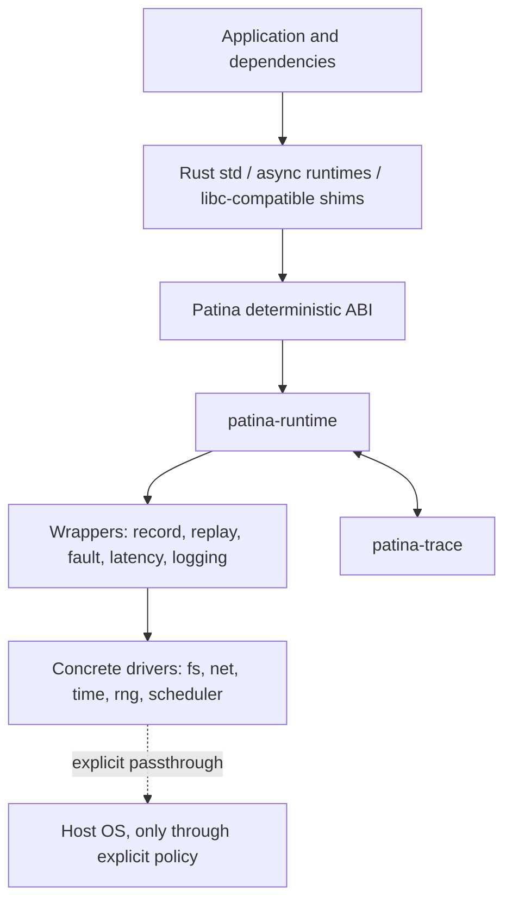
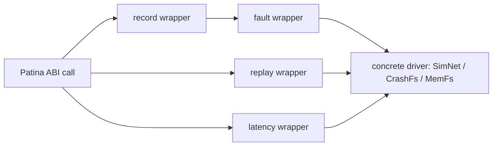
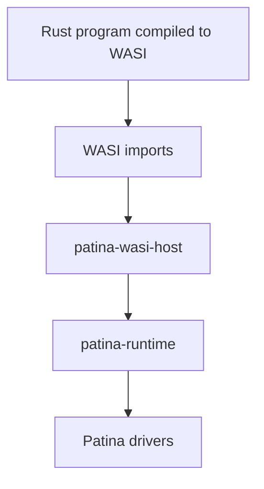

# Patina Architecture

Patina is a deterministic OS personality for Rust. `cargo patina` builds a program for a Patina target, routes platform effects through a stable deterministic ABI, installs virtual drivers, wraps those drivers with trace/replay/fault behavior, and runs the program under a deterministic scheduler.

`cargo dst` is an alias for the same CLI.

## System shape



Patina has three planes:

1. **Data plane**: minimal stable interfaces used by `std`, runtime shims, and compiled code.
2. **Construction plane**: typed Rust builders configure concrete drivers and domain behavior.
3. **Experiment plane**: CLI/runtime parameters control seeds, traces, record/replay modes, budgets, and run profiles.

## Targets

Patina supports deterministic targets rather than relying on ad hoc library substitution.

### WASI Patina

The WASI target is a clean Patina target because WASI already represents host effects as explicit imports. Rust code uses a WASI `std`; Patina supplies deterministic host implementations for clocks, random, filesystem, network capabilities, and process state.

WASI is useful when portability and a small host-effect surface matter. Its limitations include weaker native FFI support, less representative platform-specific behavior, immature threading semantics compared with native platforms, and possible performance/layout differences from native ARM64/x86_64 targets.

### Native Rust Patina

Native Linux and macOS Patina targets rebuild Rust `std` against the Patina platform layer. Standard Rust APIs route into Patina drivers instead of the host OS.

Native Rust Patina is the primary target for programs written mostly in Rust. It preserves more native behavior than WASI while still failing closed on unsupported escape hatches.

### Native ABI shim

The native ABI shim provides libc/pthread/syscall-compatible symbols that delegate to Patina. It extends compatibility for crates and dependencies that use C/POSIX APIs.

The shim is a compatibility layer, not the center of the system. It shares the Patina ABI, trace format, drivers, and scheduler with the Rust targets.

## Crate layout

```text
cargo-patina              # cargo subcommand; also exposes cargo-dst alias
patina-abi                # stable deterministic boundary contracts
patina-runtime            # runtime registry, driver installation, scheduling, params
patina-trace              # trace bundle format, event logs, branch metadata, replay matching
patina-minimize           # pluggable minimization interfaces and reducers for traces/scenarios
patina-target             # target specs and build integration
patina-std                # std/sys integration for Patina targets
patina-macros             # optional registration/test macros

patina-driver-api         # common driver traits and helper types
patina-fs-mem             # in-memory virtual filesystem
patina-fs-crash           # crash-consistency filesystem model
patina-net-sim            # deterministic virtual network
patina-time-virtual       # virtual clock and timers
patina-rng-seeded         # deterministic entropy source
patina-sched-det          # deterministic scheduler policies

patina-wrapper-record     # records boundary decisions
patina-wrapper-replay     # replays boundary decisions
patina-wrapper-fault      # generic fault injection wrappers
patina-wrapper-latency    # generic delay and jitter wrappers

patina-native-shim        # libc/pthread/syscall compatibility layer
patina-wasi-host          # deterministic WASI host implementation
```

The exact crate names are conventional, but the separation is intentional: the ABI and trace format are shared, drivers are modular, and native compatibility remains separate from the Rust-first core.

## Data plane: small stable interfaces

The data plane is intentionally narrow. It exposes effect-level operations that `std`, shims, and runtimes need. It does not expose driver-specific conveniences such as `route_host` or `mount_fixture`.

Conceptual interfaces:

```rust
trait FsDriver {
    fn open(&mut self, path: &Path, flags: OpenFlags) -> Result<Fd>;
    fn read(&mut self, fd: Fd, buf: &mut [u8]) -> Result<usize>;
    fn write(&mut self, fd: Fd, buf: &[u8]) -> Result<usize>;
    fn fsync(&mut self, fd: Fd) -> Result<()>;
    fn close(&mut self, fd: Fd) -> Result<()>;
}

trait NetDriver {
    fn bind(&mut self, addr: SocketAddr) -> Result<SocketId>;
    fn connect(&mut self, addr: SocketAddr) -> Async<Result<SocketId>>;
    fn send(&mut self, socket: SocketId, bytes: &[u8]) -> Async<Result<usize>>;
    fn recv(&mut self, socket: SocketId, buf: &mut [u8]) -> Async<Result<usize>>;
}

trait ClockDriver {
    fn now(&mut self, clock: ClockKind) -> Instant;
    fn sleep_until(&mut self, deadline: Instant) -> Async<()>;
}

trait EntropyDriver {
    fn fill(&mut self, dest: &mut [u8]) -> Result<()>;
}

trait SchedulerDriver {
    fn spawn(&mut self, task: Task) -> TaskId;
    fn park(&mut self, task: TaskId, reason: ParkReason);
    fn wake(&mut self, task: TaskId);
    fn next(&mut self) -> Option<TaskId>;
}
```

These traits are illustrative rather than final API text. The invariant is stable: common interfaces describe effects, not high-level service models.

## Construction plane: typed driver setup

Concrete drivers expose rich typed builders. Driver-specific configuration lives here, not in the common ABI.

```rust
#[cfg(patina)]
fn configure_patina(ctx: &mut patina::Context) {
    let net = patina_net_sim::SimNet::builder()
        .route_host("s3.amazonaws.com", fake_s3_http())
        .route_cidr("10.0.0.0/8", simulated_tcp())
        .build();

    let fs = patina_fs_crash::CrashFs::builder()
        .mount("/var/lib/app", patina_fs_mem::MemFs::new())
        .model_rename_atomicity(true)
        .build();

    ctx.install_net(net);
    ctx.install_fs(fs);
}
```

After installation, concrete drivers erase to the small data-plane interfaces. This lets Patina keep `NetDriver` minimal while allowing `SimNet` to expose routing, protocol handlers, latency zones, partitions, or other domain-specific features.

Code-first topology keeps driver-specific behavior close to the driver that implements it. Patina does not force every network, filesystem, or scheduler to expose the same configuration surface. Runtime parameters remain available for small externally varied knobs, but rich topology stays typed Rust code rather than a large declarative config language.

## Experiment plane: external controls

The experiment plane is controlled by `cargo patina` and runtime parameters.

Examples:

```sh
cargo patina test --seed 123
cargo patina test --seed 123 --record trace.patina
cargo patina test --replay trace.patina
cargo patina explore trace.patina --from <moment-id>
cargo dst test --seed 123
```

External controls include:

- seed;
- run budget;
- trace path;
- record/replay mode;
- replay mismatch policy;
- explicit host-capture allowlists;
- named scenario/profile selection;
- decision-policy selection and parameters;
- simple key/value parameters consumed by driver builders.

Driver-specific scenario logic remains Rust code. Parameters let CI vary knobs without requiring Patina to define every possible option:

```rust
let fs = CrashFs::builder()
    .torn_write_probability(ctx.param("fs.torn_write_probability").unwrap_or(0.001))
    .build();
```

## Seeds and decision policies

A seed is input to deterministic decision policies. A decision policy uses the seed, current simulated state, and configuration to choose outcomes for sources of nondeterminism.

Examples:

- a scheduler policy chooses the next runnable task;
- a network policy chooses packet delay, delivery, drop, or reorder behavior;
- a filesystem policy chooses injected errors and crash outcomes;
- an exploration policy chooses which recorded moment to branch from.

Seed-only reproducibility requires the same binary, runtime, drivers, decision policies, configuration, and deterministic effect boundary. Trace replay is stronger because it consumes the decisions that actually occurred instead of recomputing them from the seed.

## Drivers and wrappers

Patina distinguishes concrete drivers from wrapper drivers.



Concrete drivers implement capabilities:

- `MemFs`: deterministic in-memory filesystem.
- `CrashFs`: filesystem model with crash-consistency behavior.
- `SimNet`: deterministic virtual network.
- `VirtualClock`: controlled time source and timers.
- `SeededEntropy`: deterministic entropy source.
- `DetScheduler`: deterministic task/thread scheduler.
- `Deny*`: terminal drivers that error on use.

Wrapper drivers compose around concrete drivers:

- `Record`: logs boundary calls and decisions.
- `Replay`: consumes prior decisions and errors on mismatch.
- `Fault`: injects generic failures such as `EIO`, packet loss, resets, or wakeup perturbations.
- `Latency`: injects deterministic delay and jitter.
- `Logging`: emits human-readable debugging events.

Record and replay are wrappers because they operate at the boundary regardless of the underlying driver.

## Trace model

A Patina trace records decisions, not merely outputs. The seed explains how deterministic decisions are generated; the decision log records what actually happened.

Typical decision entries include:

- scheduler choices;
- virtual time advances;
- entropy bytes;
- network delivery/drop/reorder decisions;
- filesystem failure and crash decisions;
- host passthrough responses when explicitly permitted;
- replay checkpoints.

A `.patina` file is a trace bundle. It contains run metadata and one or more timelines. This pseudo-structure shows the logical contents, not the literal storage format:

```text
bundle:
  root_seed: 123
  decision_policy_metadata: ...
  fingerprints: ...
  timelines:
    main:
      parent: null
      decisions: [...]
    branch-1:
      parent: main
      from: <moment-id>
      branch_seed: 456
      decisions: [...]
```

A simple run contains one timeline. Trace-guided exploration can append additional timelines that branch from recorded moments in the same compatible build and environment. Minimization operates through pluggable reducers that can shrink seeds, schedules, inputs, fault choices, or timeline suffixes while preserving a failure.

Strict replay expects matching fingerprints and the same sequence of boundary events. Fingerprint mismatches and boundary-event mismatches are errors by default.

Within the same build and environment, a trace can be used to replay to a recorded moment and branch from there: explore different scheduler choices, vary injected faults, or play the run out longer. The prefix is replayed exactly. The suffix uses a branch seed and decision policy, and its decisions are recorded as a new timeline.

Captured host I/O is replayable only as part of the recorded sequence. If replay reaches an unrecorded host effect, Patina fails by default. It does not generically record on miss, because the real external resource may not have observed the replayed prefix and may now be in an incompatible state.

Existing events replay instantly in wall-clock time while preserving virtual effects. If a captured host network operation originally took five real seconds, replay advances virtual time by five seconds so other tasks observe the same timing relationship.

## Registration

Patina uses code-first registration for topology.

Registration may be explicit:

```rust
#[cfg(patina)]
fn main() {
    patina::run(|ctx| {
        configure_patina(ctx);
        app::main();
    });
}
```

or macro-assisted:

```rust
patina::register!(configure_patina);
```

The registration mechanism is deliberately small. It installs drivers and scenario hooks; it does not define a large declarative configuration system.

## Enforcement

Patina fails closed.

Compile-time checks reject known unsupported constructs where possible:

- unsupported target APIs;
- unsupported FFI declarations;
- inline assembly patterns that access clocks, entropy, or syscalls;
- direct platform intrinsics outside Patina support;
- native threading operations not routed through Patina.

Runtime checks catch effects that cannot be rejected statically:

- missing drivers;
- denied capabilities;
- dynamic library loading;
- unexpected host access;
- trace mismatch;
- unsupported syscalls in native shim mode.

Escape hatches are explicit:

- `cfg(patina)` and `cfg(dst)` allow deterministic replacement code;
- allowlists permit specific FFI or host access;
- passthrough drivers require declared policy.

## Native ABI shim

The native ABI shim provides compatibility symbols such as:

```text
open, read, write, close, fsync
socket, bind, connect, send, recv
clock_gettime, gettimeofday, nanosleep
getrandom
pthread_create, pthread_mutex_*, pthread_cond_*
```

These symbols delegate to Patina drivers and scheduler operations. Direct syscalls, dynamic loading, and platform-specific APIs are denied unless explicitly supported.

This layer improves compatibility with crates that use `libc` or native libraries, but it does not weaken the deterministic boundary. Unsupported native behavior remains an error.

## WASI host

The WASI host implements WASI imports using Patina drivers. WASI’s explicit import model makes it a clean expression of the Patina architecture:



## Invariants

Patina maintains these architectural invariants:

1. `std` and shims do not access the host directly.
2. Core driver traits remain smaller than concrete driver builders.
3. Record and replay are wrappers, not mandatory features of every driver.
4. Seeds and traces are experiment-plane concerns.
5. Topology and service behavior are code-first.
6. Unsupported nondeterminism fails loudly.
7. The native ABI shim extends compatibility without defining core semantics.
