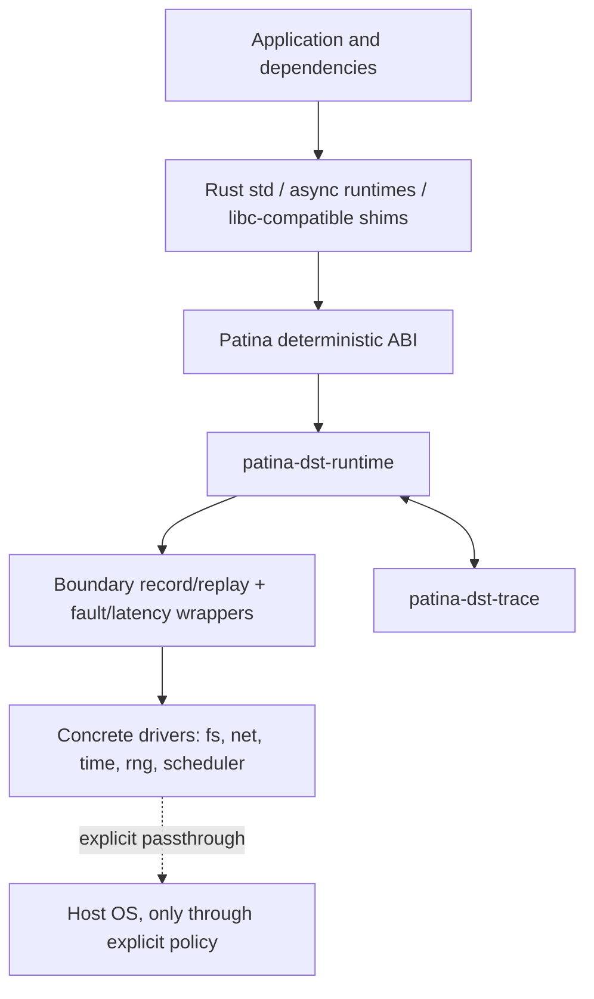
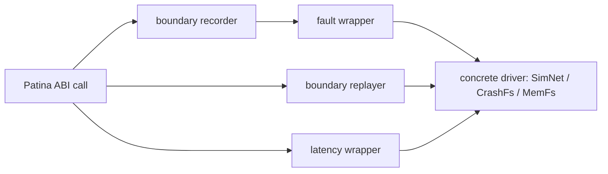
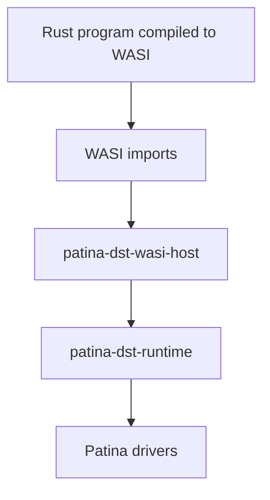

# Patina Architecture

Patina is a deterministic OS personality for Rust. `cargo patina` builds a program for a Patina target, routes platform effects through a stable deterministic ABI, installs virtual drivers, wraps those drivers with trace/replay/fault behavior, and runs the program under a deterministic scheduler.

Find your subsystem:

| You care about… | Section | Main crates |
|---|---|---|
| the overall model and its three planes | [System shape](#system-shape) | — |
| how programs reach the runtime (WASI / native / Cargo) | [Targets](#targets) | `patina-dst-target`, `patina-dst-native-shim`, `patina-dst-wasi-host` |
| what crate does what | [Crate layout](#crate-layout) | all |
| the effect interfaces `std`/shims call | [Data plane](#data-plane-small-stable-interfaces) | `patina-dst-abi`, `patina-dst-driver-api` |
| configuring drivers in code | [Construction plane](#construction-plane-typed-driver-setup) | `patina-dst-runtime`, driver crates |
| seeds, budgets, record/replay control | [Experiment plane](#experiment-plane-external-controls) | `cargo-patina` |
| the drivers and fault/latency wrappers | [Drivers and wrappers](#drivers-and-wrappers) | `patina-dst-fs-*`, `patina-dst-net-sim`, `patina-dst-wrapper-*` |
| trace format, branching, minimization | [Trace model](#trace-model) | `patina-dst-trace`, `patina-dst-minimize` |
| fail-closed enforcement and the audit | [Enforcement](#enforcement) | `patina-dst-target` (and its `ESCAPE-CLASSES.md`) |
| the libc/pthread interposition layer | [Native ABI shim](#native-abi-shim) | `patina-dst-native-shim` |
| how the shim reaches the host without leaking symbols | [Host-alias doctrine](#host-alias-doctrine) | `patina-dst-native-shim` |
| the WASI host | [WASI host](#wasi-host) | `patina-dst-wasi-host` |
| the buggify/oracle SDK | [Cooperative-SUT SDK](#cooperative-sut-sdk) | `patina-dst` |

## System shape



Patina has three planes:

1. **Data plane**: minimal stable interfaces used by `std`, runtime shims, and compiled code.
2. **Construction plane**: typed Rust builders configure concrete drivers and domain behavior.
3. **Experiment plane**: CLI/runtime parameters control seeds, traces, record/replay modes, budgets, and run profiles.

## Targets

One CLI serves three artifact families, inferred from the argument: a **Cargo package/test** (directory or `Cargo.toml`), a **native binary** (Mach-O/ELF), and a **WASI module** (`wasm32-wasip1`). All three drive the same runtime, drivers, and trace format.

### Native (linked shim)

The primary family for programs written mostly in Rust. `cargo patina build` compiles the guest with the **stock host target and prebuilt `std`** (not a recompiled deterministic `std`) and statically links the native ABI shim below it. Link-time interposition — strong shim definitions of the libc/pthread/dispatch/syscall surface — routes what `std` and C dependencies actually call into the deterministic runtime; real host threads are gated one-at-a-time through the deterministic scheduler. On x86_64 Linux, syscall-user-dispatch (SUD) additionally traps raw *inline* syscall instructions (rustix's default `linux_raw` backend, hand-written asm) into the same runtime entry points via a `SIGSYS` handler, so even importless raw syscalls stay in-model.

Before a native guest runs, a default-deny audit over its imports (plus an instruction scan for raw syscall/clock/entropy opcodes) refuses anything the shim does not model — see [Enforcement](#enforcement).

### WASI

The WASI target is a clean Patina target because WASI already represents host effects as explicit imports. Rust code uses the stock `wasm32-wasip1` `std`; `patina-dst-wasi-host` supplies deterministic implementations of the entire audited Preview 1 import surface (clocks, entropy, filesystem, configured datagram sockets, process state) over the same drivers.

WASI is useful when portability and a small host-effect surface matter. Its limitations include weaker native FFI support, less representative platform-specific behavior, immature threading semantics compared with native platforms, and possible performance/layout differences from native ARM64/x86_64 targets.

### Cargo package (in-process boundary)

`cargo patina run`/`test` on a package with no `--target` runs it in-process at the explicit `patina_dst_runtime::Context` boundary (usage mode 3): the code performs effects through the context rather than through interposed `std`. This is the family the explicit-context API, branch replay, and the workspace's own examples use.

## Crate layout

Package names are `patina-dst-*`; workspace directories drop the `-dst-`
(shown in parentheses where they differ).

```text
cargo-patina                # the CLI: build/run/test/audit/replay/explore/campaign/sites/minimize
patina-dst (crates/patina)  # cooperative-SUT SDK (dependency-free)
patina-dst-harness          # configure-then-run harness for ordinary app code under the shim
patina-dst-abi              # stable deterministic boundary contracts (typed operations/outcomes)
patina-dst-runtime          # runtime context, driver installation, record/replay orchestration,
                            #   params; explicit-context `run`/`run_with`/`Context`
patina-dst-async            # deterministic futures executor over the explicit boundary
patina-dst-trace            # trace bundle format, migration, branch metadata, strict replay matching
patina-dst-minimize         # pluggable failure-oracle reducers for traces/schedules/scenarios
patina-dst-target           # target metadata, import audit + escape classes, instruction scan
patina-dst-proptest         # proptest compatibility: case generation from the run's seeded entropy

patina-dst-driver-api       # common driver traits (Fs/Net/Clock/Entropy/SchedulerDriver)
patina-dst-fs-mem           # in-memory virtual filesystem
patina-dst-fs-crash         # crash-consistency filesystem model
patina-dst-fs-host          # explicit allowlisted read-only host capture
patina-dst-net-sim          # deterministic virtual network (datagrams + TCP streams)
patina-dst-time-virtual     # virtual clock and timers
patina-dst-rng-seeded       # deterministic entropy source
patina-dst-sched-det        # deterministic scheduler policies (uniform, PCT, starvation)

patina-dst-wrapper-fault    # generic fault injection wrapper drivers
patina-dst-wrapper-latency  # generic delay and jitter wrapper drivers

patina-dst-native-shim      # libc/pthread/dispatch/syscall interposition layer + SUD dispatcher
patina-dst-wasi-host        # deterministic WASI Preview 1 host

patina-dst-bench            # performance qualification workload and budget gates
```

Record and replay are not separate crates: `patina-dst-trace` provides the
`Recorder`/`Replayer` machinery and `patina-dst-runtime` drives it at the
boundary, so recording composes around any driver stack (see
[Drivers and wrappers](#drivers-and-wrappers)). The separation above is
intentional: the ABI and trace format are shared, drivers are modular, and
native compatibility remains separate from the Rust-first core.

### Shim-backed harness (`patina-dst-harness`)

`patina-dst-harness` is the configure-then-run harness for driving ordinary
application code under Patina (usage mode 2 of `USAGE-MODES.md`). A harness
binary calls `patina_dst_harness::run`/`run_with`, configures the run through a
`HarnessBuilder`, and then executes normal `std`-using application code whose
effects are interposed by the native shim — the SAME global runtime context the
shim installs for a transparent run, not a second explicit `Context`. It is
built and run through `cargo patina run <manifest> --target native --harness`,
which sets `PATINA_DEFER_INIT=1`: the packaged constructor captures and scrubs
the control plane and registers finalization but leaves the runtime uninstalled,
and the harness installs it (`patina_harness_install`) after applying its
configuration overlay. The overlay flows through the same `PATINA_*` control-plane
values and `RuntimeConfig` fields the CLI env path sets, so there is no separate
harness fingerprint component and the runtime's `reconcile_replay_*` checks catch
overlay conflicts on replay. Fail-closed throughout: run without Patina and it
returns `NotUnderPatina` before any application code runs; an interposed effect
before the harness installs aborts loudly rather than auto-initializing. WASI is
out of scope for v1 (the WASI supervisor owns run configuration there).

## Data plane: small stable interfaces

The data plane is intentionally narrow. It exposes effect-level operations that `std`, shims, and runtimes need. It does not expose driver-specific conveniences such as `route_host` or `mount_fixture`.

Conceptual interfaces:

```rust
trait FsDriver {
    fn open(&mut self, path: &Path, flags: OpenFlags) -> Result<Fd>;
    fn read(&mut self, fd: Fd, buf: &mut [u8]) -> Result<usize>;
    fn write(&mut self, fd: Fd, buf: &[u8]) -> Result<usize>;
    fn fsync(&mut self, fd: Fd) -> Result<()>;
    fn close(&mut self, fd: Fd) -> Result<()>;
}

trait NetDriver {
    fn bind(&mut self, addr: SocketAddr) -> Result<SocketId>;
    fn connect(&mut self, addr: SocketAddr) -> Async<Result<SocketId>>;
    fn send(&mut self, socket: SocketId, bytes: &[u8]) -> Async<Result<usize>>;
    fn recv(&mut self, socket: SocketId, buf: &mut [u8]) -> Async<Result<usize>>;
}

trait ClockDriver {
    fn now(&mut self, clock: ClockKind) -> Instant;
    fn sleep_until(&mut self, deadline: Instant) -> Async<()>;
}

trait EntropyDriver {
    fn fill(&mut self, dest: &mut [u8]) -> Result<()>;
}

trait SchedulerDriver {
    fn spawn(&mut self, task: Task) -> TaskId;
    fn park(&mut self, task: TaskId, reason: ParkReason);
    fn wake(&mut self, task: TaskId);
    fn next(&mut self) -> Option<TaskId>;
}
```

These traits are illustrative rather than final API text. The invariant is stable: common interfaces describe effects, not high-level service models.

The `Async<...>` returns sketched above are realized by the `patina-dst-async` crate: a deterministic single-threaded executor whose TCP/UDP and timer futures drive these effect operations through the recorded boundary, so `block_on`/`spawn`/`sleep_until`/`timeout` compose over the same scheduler, network, and clock decisions without introducing new operations. It is an explicit-boundary executor, not an interposition of third-party async runtimes.

## Construction plane: typed driver setup

Concrete drivers expose rich typed builders. Driver-specific configuration lives here, not in the common ABI.

```rust
patina_dst_runtime::run_with(
    |builder| {
        let net = patina_dst_net_sim::SimNet::builder()
            .base_latency_nanos(50_000)
            .jitter_nanos(0, 20_000)
            .partition("10.0.0.1:9000", "10.0.0.2:9000")
            .build()
            .expect("valid network configuration");

        let fs = patina_dst_fs_crash::CrashFs::builder()
            .filesystem(patina_dst_fs_mem::MemFs::new())
            .seed(7)
            .torn_write_probability(0.5)
            .model_rename_atomicity(false)
            .build()
            .expect("valid crash-model configuration");

        builder.with_network(net).with_filesystem(fs)
    },
    |ctx| app_scenario(ctx),
)
```

Both builders match the implemented API (`SimNetBuilder`, `CrashFsBuilder`, and
`RuntimeBuilder::with_*`). Richer routing — named host routes, per-CIDR
protocol handlers — is the intended growth direction for `SimNet` builders,
not yet implemented.

After installation, concrete drivers erase to the small data-plane interfaces. This lets Patina keep `NetDriver` minimal while allowing `SimNet` to expose routing, protocol handlers, latency zones, partitions, or other domain-specific features.

Code-first topology keeps driver-specific behavior close to the driver that implements it. Patina does not force every network, filesystem, or scheduler to expose the same configuration surface. Runtime parameters remain available for small externally varied knobs, but rich topology stays typed Rust code rather than a large declarative config language.

## Experiment plane: external controls

The experiment plane is controlled by `cargo patina` and runtime parameters.

Examples:

```sh
cargo patina test --seed 123
cargo patina test --seed 123 --record trace.patina
cargo patina replay . trace.patina
cargo patina explore run ./guest --seeds 100 --seed-start 0
```

External controls include:

- seed;
- run budget (`--budget`);
- trace path (`--record`, the `replay` verb);
- explicit host-capture allowlists (`--mount`);
- fault knobs (`--fs-crash-at`, `--net-drop-permille`, …) and buggify knobs;
- exploration-policy selection (`--sched-pct`, `--starve`, `--swarm`);
- liveness oracles (`--liveness-watchdog`, `--converge-within`);
- simple key/value parameters (`--param`, exposed through `Context::param`).

Named scenario/profile selection remains a planned experiment-plane convenience.

Driver-specific scenario logic remains Rust code. Parameters let CI vary knobs without requiring Patina to define every possible option:

```rust
let fs = CrashFs::builder()
    .torn_write_probability(ctx.param("fs.torn_write_probability").unwrap_or(0.001))
    .build();
```

## Seeds and decision policies

A seed is input to deterministic decision policies. A decision policy uses the seed, current simulated state, and configuration to choose outcomes for sources of nondeterminism.

Examples:

- a scheduler policy chooses the next runnable task;
- a network policy chooses packet delay, delivery, drop, or reorder behavior;
- a filesystem policy chooses injected errors and crash outcomes;
- an exploration policy chooses which recorded moment to branch from.

Seed-only reproducibility requires the same binary, runtime, drivers, decision policies, configuration, and deterministic effect boundary. Trace replay is stronger because it consumes the decisions that actually occurred instead of recomputing them from the seed.

## Drivers and wrappers

Patina distinguishes concrete drivers from wrapper drivers.



Concrete drivers implement capabilities:

- `MemFs`: deterministic in-memory filesystem.
- `CrashFs`: filesystem model with crash-consistency behavior (checkpoints, seeded torn writes, rename atomicity, directory durability).
- `SimNet`: deterministic virtual network (datagrams and TCP streams, partitions, seeded stream faults).
- `VirtualClock`: controlled time source and timer queue.
- `SeededEntropy`: deterministic entropy source.
- `DetScheduler`: deterministic task/thread scheduler with selectable exploration policies (uniform, PCT, starvation intervals).

A runtime built without a requested driver returns `missing_driver`; it never falls through to the host.

Wrapper drivers compose around concrete drivers:

- `FaultNet` (`patina-dst-wrapper-fault`): seeded packet loss and duplication decisions.
- `LatencyNet` (`patina-dst-wrapper-latency`): deterministic fixed delay, seeded jitter, and reorder.

Record and replay compose the same way but live at the runtime boundary rather than in per-driver wrappers: `patina-dst-runtime` records every boundary operation/outcome through `patina-dst-trace`'s `Recorder`, and replay consumes the recorded decisions through its `Replayer`, erroring on any mismatch — so they operate identically regardless of which drivers (or wrappers) are installed.

## Trace model

A Patina trace records decisions, not merely outputs. The seed explains how deterministic decisions are generated; the decision log records what actually happened.

Typical decision entries include:

- scheduler choices;
- virtual time advances;
- entropy bytes;
- network delivery/drop/reorder decisions;
- filesystem failure and crash decisions;
- host passthrough responses when explicitly permitted;
- replay checkpoints.

A `.patina` file is a trace bundle. It contains run metadata and one or more timelines. This pseudo-structure shows the logical contents, not the literal storage format:

```text
bundle:
  root_seed: 123
  decision_policy_metadata: ...
  fingerprints: ...
  timelines:
    main:
      parent: null
      decisions: [...]
    branch-1:
      parent: main
      from: <moment-id>
      branch_seed: 456
      decisions: [...]
```

A simple run contains one timeline. Trace-guided exploration can append additional timelines that branch from recorded moments in the same compatible build and environment. Minimization operates through pluggable reducers that can shrink seeds, schedules, inputs, fault choices, or timeline suffixes while preserving a failure.

Strict replay expects matching fingerprints and the same sequence of boundary events. Fingerprint mismatches and boundary-event mismatches are errors by default.

Bundles written by older supported format versions are migrated losslessly in memory when loaded; the file on disk is never rewritten, and Patina only ever writes the current format version.

Within the same build and environment, a trace can be used to replay to a recorded moment and branch from there: explore different scheduler choices, vary injected faults, or play the run out longer. The prefix is replayed exactly. The suffix uses a branch seed and decision policy, and its decisions are recorded as a new timeline.

Captured host I/O is replayable only as part of the recorded sequence. If replay reaches an unrecorded host effect, Patina fails by default. It does not generically record on miss, because the real external resource may not have observed the replayed prefix and may now be in an incompatible state.

Existing events replay instantly in wall-clock time while preserving virtual effects. If a captured host network operation originally took five real seconds, replay advances virtual time by five seconds so other tasks observe the same timing relationship.

## Registration

Patina uses code-first registration for topology; there is no declarative
configuration language. Two shapes exist today:

- **Explicit context** (usage mode 3): `patina_dst_runtime::run(|ctx| …)` runs a
  closure against a default-driver `Context`; `run_with(configure, operation)`
  lets `configure` swap drivers on the `RuntimeBuilder` first (the construction
  plane example above).
- **Harness** (usage mode 2): `patina_dst_harness::run_with(configure, entry)`
  configures the run in code, installs the process-global runtime, then executes
  ordinary interposed `std` code (see USAGE-MODES.md).

The registration mechanism is deliberately small. It installs drivers and scenario hooks; it does not define a large declarative configuration system.

## Enforcement

Patina fails closed. Enforcement is layered:

Static, pre-run checks reject a native binary before it executes:

- a **default-deny import audit**: every externally resolved symbol must be
  interposed, provably effect-free, or explicitly `--allow`ed; anything unknown
  is a refusal (`cargo patina audit` reports the same surface `run` enforces);
- an **instruction scan** for raw syscall/clock/entropy opcodes (`svc`/`syscall`,
  `rdtsc`/`rdrand`, aarch64 `CNTVCT`/`RNDR`) and the x86_64 vsyscall-page
  address; on x86_64 Linux a raw-syscall finding is downgraded to
  *SUD-managed* (trapped at runtime) instead of refused, never silently;
- WASI module imports are audited against the host's explicit allowlist before
  instantiation.

Runtime checks catch effects that cannot be rejected statically:

- missing drivers and denied capabilities;
- deny-trap interposers (e.g. the process-spawn family) that abort
  deterministically if a dormant escape path is actually reached;
- dynamic library loading (`dlopen` refused; `dlsym` neutered on Linux);
- SUD-trapped syscalls outside the dispatch table (a named, deterministic abort);
- trace fingerprint or operation mismatch on replay.

The full per-class taxonomy — what each escape class is, how it is detected,
and the honest residuals a symbol audit cannot see — lives in
[`crates/patina-target/ESCAPE-CLASSES.md`](./crates/patina-target/ESCAPE-CLASSES.md).

Escape hatches are explicit:

- `cfg(patina)` and `cfg(dst)` allow deterministic replacement code;
- `--allow` / `--allow-unsupported-symbols` permit named symbols, loudly and
  recorded beside the trace;
- host capture (`patina-dst-fs-host`, `--mount`) is read-only, allowlisted, and
  fingerprinted — never ambient.

## Native ABI shim

The native ABI shim provides compatibility symbols such as:

```text
open, read, write, close, fsync
socket, bind, connect, send, recv
clock_gettime, gettimeofday, nanosleep
getrandom
pthread_create, pthread_mutex_*, pthread_cond_*
```

These symbols delegate to Patina drivers and scheduler operations. Direct syscalls, dynamic loading, and platform-specific APIs are denied unless explicitly supported.

This layer improves compatibility with crates that use `libc` or native libraries, but it does not weaken the deterministic boundary. Unsupported native behavior remains an error.

Three control-plane concerns are deliberately separated from the interposed data plane:

- **Trace channel.** When ordinary file symbols are interposed, the runtime must not open trace files through them: record finalization would recurse into the deterministic filesystem. A supervisor instead passes an inherited host descriptor through `PATINA_TRACE_FD`; the shim reads replay bundles from it and writes record bundles to it using the real, non-interposed host `read`/`write`. On macOS these are reached through the host-alias table below (resolving `read$NOCANCEL`/`write$NOCANCEL`); on glibc they still bind the distinct `__read`/`__write` aliases.
- **Captured stdio.** Writes to file descriptors 1 and 2 are captured deterministically in the shim, mirroring the WASI host, and flushed to the real host descriptors at shutdown.
- **Environment policy.** The ambient environment is a nondeterminism source, so interposed `getenv` returns no value, except for the supervisor-provided `PATINA_*` experiment protocol, which passes through.

### Host-alias doctrine

The shim is statically linked *into* the guest binary, so any host symbol the shim names as an undefined external appears in the **guest's** import table. The pre-run audit is default-deny over that table, so every such name must be `--allow`ed — and a name-based allowance covers the guest's own use of the same symbol just as much as the shim's. That is exactly how the worst escape found got past the gate: the execution baton blocked on the public `dispatch_semaphore_*` symbols, so allowing them for the shim also allowed std's `Parker` to reach the real host semaphore and block a thread off-scheduler. The vehicle symbol *was* the escape symbol. The first hotfix moved the baton to a Mach semaphore, which only made the collision unlikely (std does not currently use Mach semaphores), not impossible — an invariant held by luck. The doctrine below dissolves the collision entirely, which is precisely what lets the baton go *back* to the canonical libdispatch semaphore (the same primitive std's `Parker` uses).

The doctrine eliminates the class structurally: **shim-internal code never names a public, interposable host symbol as an undefined external.** Every host vehicle the shim needs — the trace-fd descriptor I/O, the execution-baton semaphore, and the managed host-thread creation vehicle (`pthread_create_suspended_np` + `thread_resume`) — is resolved once, by string, through a single primitive and cached in a `HostApi` table (`crates/patina-native-shim/src/lib.rs`, `mod hostapi`). On macOS that primitive is `dlsym(RTLD_NEXT, ...)`. The consequences:

- **Reachability, not naming, is what the guest is judged on.** Because the vehicle names never enter the import table, the audit denies a guest that imports `semaphore_wait`, `pthread_create_suspended_np`, or `read$NOCANCEL` — the shim's own use of the same functions is invisible to the symbol namespace. `shim_control_plane_symbols` collapses on macOS from the nine vehicle names to a single residue, `dlsym`.
- **`RTLD_NEXT`, not `RTLD_DEFAULT`.** `RTLD_NEXT` resolves against the images *after* the caller's, so it reaches the real libSystem definition even for a name the shim itself interposes. This is verified empirically: from the main executable image `dlsym(RTLD_NEXT, "dispatch_semaphore_wait")` returns libdispatch's implementation, not the shim's strong definition. This is not hypothetical — it is exactly how the baton works today: the baton blocks on the *real* libdispatch semaphore (resolved via `RTLD_NEXT`) while the shim's public `dispatch_semaphore_*` strong defs route a *guest* `Parker`'s calls through the scheduler. The shim and the guest use the same public name and never collide.
- **Internal vehicles use the canonical platform primitive** — whatever native code would normally use — so the shim matches the native implementation as closely as possible. Deviation requires a documented *functional* requirement (e.g. `pthread_create_suspended_np`, because deterministic thread creation needs a born-suspended thread that parks on the baton before running any guest code); **namespace avoidance is never a valid reason** to pick a non-canonical primitive, because the doctrine already removes the vehicle name from the guest's namespace. Reusing the canonical primitive is also a robustness win: the baton exercises the shim-vs-guest caller discrimination on every context switch, so any doctrine regression deadlocks a threaded test immediately instead of lying dormant.
- **Two-level namespace is what makes interposition local.** On macOS a strong definition in the main executable image interposes references only from *within that image* (the guest's own code plus the linked shim); libSystem's internal calls bind to their own libraries under the two-level namespace and are unaffected. So interposing a public name captures the guest's use without capturing libSystem internals, and — combined with `RTLD_NEXT` — the shim reaches the genuine host function underneath its own interposer.
- **Pre-init window.** The `HostApi` table is resolved lazily, behind a race-free `OnceLock`, on first use. Every entry point that reaches it — the baton, thread creation, trace-fd I/O — runs well after the dynamic loader has mapped libSystem (the baton only exists once threads are active; trace-fd I/O only at init and shutdown), so no interposer is reached before the table can be resolved. A failed resolution of a core libSystem symbol fails the process closed rather than continuing with a null vehicle.

Static enforcement makes this a standing rule rather than a convention: `scripts/validate-native-shim.sh` scans the shim's own compiled object members and fails on any undefined external the audit would classify as an escape, holding the shim to the exact standard it enforces on guests (`shim_objects_name_no_undeclared_host_escape` in `crates/cargo-patina/tests/shim_host_alias.rs`, with a planted-leak fixture that keeps the scan non-vacuous). Red→green: the pre-doctrine shim, which named `semaphore_wait`/`read$NOCANCEL`/... directly, fails the scan; the swept shim passes with `dlsym` as the only escape-surface residue.

Linux is swept onto the same table, with one wrinkle: the shim interposes `dlsym` itself there (to neuter std's optional-symbol probing), so a plain `dlsym`-based table would resolve to the shim's own NULL stub, and glibc's flat namespace means the shim's own strong `read`/`write`/`sem_*` definitions would satisfy any reference the shim made to those names. The Linux primitive is therefore `__real_dlsym`, the real glibc resolver reached through `-Wl,--wrap=dlsym`. Guest and std `dlsym` references bind to the shim's neutering `__wrap_dlsym`; only the shim's `hostapi` table names `__real_dlsym`, and `dlsym(RTLD_NEXT, ...)` reaches the genuine glibc `read`/`write`/`sem_init`/`sem_wait`/`sem_post`/`pthread_create` (RTLD_NEXT searches the images after the main executable, so it skips the shim's own strong defs — verified empirically on glibc 2.39/aarch64). Thread creation is swept onto that same table: the shim interposes `pthread_create` with a plain strong def (routing guest/std threads through the scheduler) and resolves the real glibc creator through `dlsym(RTLD_NEXT, ...)`, so it needs no `-Wl,--wrap=pthread_create` — which matters because gcc ships its own `__wrap_pthread_create` in libgcc's x86 split-stack support, and a wrap flag `multiple definition`-clashes with it at link on x86_64. So `__read`/`__write`, `sem_*`, and `pthread_create` all leave the guest import table entirely, and the Linux `shim_control_plane_symbols` collapses from six vehicles to the single `dlsym` resolution primitive, matching macOS. The `shim_host_alias` static check runs on both platforms (`macho = cfg!(target_os = "macos")`), scanning the shim's ELF objects on Linux with the Linux allow set, so the doctrine is now enforced structurally on Linux too, with the planted-leak fixture keeping the scan non-vacuous.

## WASI host

The WASI host implements WASI imports using Patina drivers. WASI's explicit import model makes it a clean expression of the Patina architecture:



## Cooperative-SUT SDK

The `patina-dst` crate (at `crates/patina`) is a dependency-light cooperative-SUT SDK; the explicit-context API lives separately in `patina-dst-runtime`. The SDK — `buggify!`/`buggify_with_prob!`/`buggify_delay!`/`buggify_knob!`, the `always!`/`sometimes!`/`reachable!` oracles, `is_simulated()`/`rng()`, and the `lifecycle` markers — expands to calls into hidden crate functions, not to `cfg(patina)` in adopter code. Those functions bridge to the runtime only under `cfg(patina_shim)`, an internal cfg injected exclusively by the shim-linked native `build` paths (never by `run`/`test`/`build --target wasi`, which also set `cfg(patina)`); everywhere else they compile to no-ops or plain fallbacks, so a plain `cargo build` links no runtime.

Under a native build the bridge is a thin prefixed C ABI (`patina_buggify`, `patina_always`, `patina_rng`, …) the shim exports and resolves against the auto-initialized global `Context`. All randomness is a pure deterministic function of the root seed and the site's explicit label: per-run activation and per-evaluation firing derive from a splitmix PRF and are **never recorded per evaluation**, so replay re-derives them from the seed and the trace's recorded config with no trace bloat. The realized config, active-site set, knob picks, and virtual-time cutoff live in an additive `buggify` field of the trace metadata (old traces migrate clean; conflicting replay knobs fail closed like the fault knobs), and enabling buggify folds a `+buggify` fingerprint component so a buggify trace never cross-replays with a non-buggify build. Fatal signals — an `always!` violation, a duplicate label — flush captured output, emit a distinct marker line, and abort; per-run coverage and firing counts surface in a one-line `PATINA_SDK_REPORT`.

## Invariants

Patina maintains these architectural invariants:

1. `std` and shims do not access the host directly.
2. Core driver traits remain smaller than concrete driver builders.
3. Record and replay operate at the runtime boundary, not inside each driver.
4. Seeds and traces are experiment-plane concerns.
5. Topology and service behavior are code-first.
6. Unsupported nondeterminism fails loudly.
7. The native ABI shim extends compatibility without defining core semantics.
