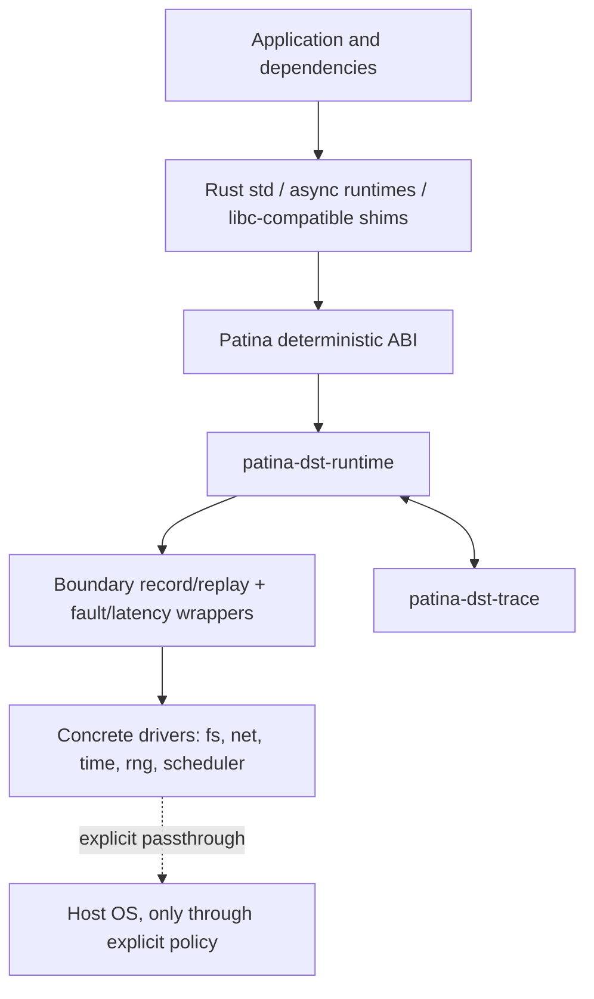
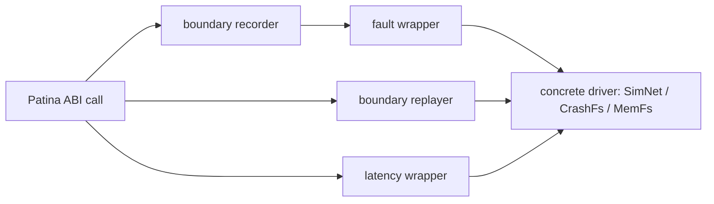
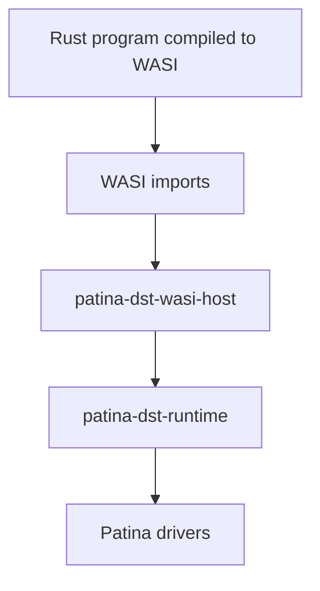

# Patina Architecture

Patina is a deterministic OS personality for Rust. `cargo patina` builds a program for a Patina target, routes platform effects through a stable deterministic ABI, installs virtual drivers, wraps those drivers with trace/replay/fault behavior, and runs the program under a deterministic scheduler.

Find your subsystem:

| You care about… | Section | Main crates |
|---|---|---|
| the overall model and its three planes | [System shape](#system-shape) | — |
| how programs reach the runtime (WASI / native / Cargo) | [Targets](#targets) | `patina-dst-target`, `patina-dst-native-shim`, `patina-dst-wasi-host` |
| what crate does what | [Crate layout](#crate-layout) | all |
| the effect interfaces `std`/shims call | [Data plane](#data-plane-small-stable-interfaces) | `patina-dst-abi`, `patina-dst-driver-api` |
| configuring drivers in code | [Construction plane](#construction-plane-typed-driver-setup) | `patina-dst-runtime`, driver crates |
| seeds, budgets, record/replay control | [Experiment plane](#experiment-plane-external-controls) | `cargo-patina` |
| the drivers and fault/latency wrappers | [Drivers and wrappers](#drivers-and-wrappers) | `patina-dst-fs-*`, `patina-dst-net-sim`, `patina-dst-wrapper-*` |
| trace format, branching, minimization | [Trace model](#trace-model) | `patina-dst-trace`, `patina-dst-minimize` |
| fail-closed enforcement and the audit | [Enforcement](#enforcement) | `patina-dst-target` (and its `ESCAPE-CLASSES.md`) |
| the libc/pthread interposition layer | [Native ABI shim](#native-abi-shim) | `patina-dst-native-shim` |
| how the shim reaches the host without leaking symbols | [Host-alias doctrine](#host-alias-doctrine) | `patina-dst-native-shim` |
| the WASI host | [WASI host](#wasi-host) | `patina-dst-wasi-host` |
| the buggify/oracle SDK | [Cooperative-SUT SDK](#cooperative-sut-sdk) | `patina-dst` |

## System shape



Patina has three planes:

1. **Data plane**: minimal stable interfaces used by `std`, runtime shims, and compiled code.
2. **Construction plane**: typed Rust builders configure concrete drivers and domain behavior.
3. **Experiment plane**: CLI/runtime parameters control seeds, traces, record/replay modes, budgets, and run profiles.

## Targets

One CLI serves three artifact families, inferred from the argument: a **Cargo package/test** (directory or `Cargo.toml`), a **native binary** (Mach-O/ELF), and a **WASI module** (`wasm32-wasip1`). All three drive the same runtime, drivers, and trace format.

### Native (linked shim)

The primary family for programs written mostly in Rust. `cargo patina build` compiles the guest with the **stock host target and prebuilt `std`** (not a recompiled deterministic `std`) and statically links the native ABI shim below it. Link-time interposition — strong shim definitions of the libc/pthread/dispatch/syscall surface — routes what `std` and C dependencies actually call into the deterministic runtime; real host threads are gated one-at-a-time through the deterministic scheduler. On x86_64 Linux, syscall-user-dispatch (SUD) additionally traps raw *inline* syscall instructions (rustix's default `linux_raw` backend, hand-written asm) into the same runtime entry points via a `SIGSYS` handler, so even importless raw syscalls stay in-model.

A guest binary is never stale with respect to the shim it links. Package builds inject the shim link arguments through `CARGO_ENCODED_RUSTFLAGS`, and Cargo fingerprints that *string*, not the files it names — so the injected flags also carry a hash of the link inputs' bytes. Rebuild the shim or the runtime beneath it and the flags change, which is what makes Cargo relink; leave them alone and the flags are byte-identical, so an unchanged rebuild stays a cache hit.

The shim is built on the user's machine, from source that travels inside the `cargo-patina` binary. A prebuilt staticlib is not an option, because the shim must be compiled by the exact rustc that compiles the guest; a source checkout is not assumed, because an installed binary (`cargo install`, a git checkout that is gone, CI) has none. `cargo-patina`'s build script therefore embeds the shim's whole workspace dependency closure — twelve crates, discovered through each crate's `links` metadata so the same channel works in-tree, from the crates.io registry, and from a git checkout — plus the `Cargo.lock` that pins their third-party dependencies. At guest-build time the bundle is unpacked, content-addressed by its own digest, into a per-user cache (`$XDG_CACHE_HOME/patina`, else `~/.cache/patina` on Linux and `~/Library/Caches/patina` on macOS) as a self-contained Cargo workspace. The shim staticlib is built below `<cache>/shim-target/patina-native-shim/<key>` by default; with an explicit `CARGO_TARGET_DIR`, that directory is honored as the base and Patina still creates the `patina-native-shim/<key>` namespace beneath it. The key includes the embedded shim source-bundle digest and the verified compiler identity, while Cargo's normal `debug/` and `release/` subdirectories keep profiles apart. A bundle directory is written atomically and never rewritten; a new `cargo-patina` build with different shim sources lands beside it under a new digest and builds into a different target namespace.

Both halves of that link use the guest's verified concrete compiler. The shim's Cargo build runs in the unpacked bundle so `-p patina-dst-native-shim` always resolves, while the guest builds in the caller's working directory. Directory-scoped selectors (rustup, mise, or other proxies) can select different compilers there; linking their two standard libraries causes `duplicate symbol: rust_eh_personality` on Linux and can silently succeed on macOS. Instead of requiring an ambient toolchain override, the build queries the guest compiler's sysroot and verifies that its absolute `bin/rustc` reports the guest's full `rustc -vV` identity from both directories. Native compiler probes, metadata, shim builds, and guest builds then use that invocation, with `RUSTC` set explicitly for Cargo children. Cargo comes from the same sysroot unless explicitly supplied through `CARGO`; explicit `RUSTC` selects the guest identity to materialize, and relative tool paths are anchored to the guest directory. Missing sysroot binaries, failed queries, or identity mismatches refuse before compilation with a concrete-binary remedy, never an ambient fallback. No toolchain file or version-manager configuration is written into the shared bundle. The shim build directory is keyed by the source bundle and the verified guest's complete identity, so concurrent stable/MSRV supervisors and different installed Patina builds cannot publish same-named archives into one path.

Before a native guest runs, a default-deny audit over its imports (plus an instruction scan for raw syscall/clock/entropy opcodes) refuses anything the shim does not model — see [Enforcement](#enforcement).

### WASI

The WASI target is a clean Patina target because WASI already represents host effects as explicit imports. Rust code uses the stock `wasm32-wasip1` `std`; `patina-dst-wasi-host` supplies deterministic implementations of the entire audited Preview 1 import surface (clocks, entropy, filesystem, configured datagram sockets, process state) over the same drivers.

WASI is useful when portability and a small host-effect surface matter. Its limitations include weaker native FFI support, less representative platform-specific behavior, immature threading semantics compared with native platforms, and possible performance/layout differences from native ARM64/x86_64 targets.

### Cargo package (in-process boundary)

`cargo patina run`/`test` on a package with no `--target` runs it in-process at the explicit `patina_dst_runtime::Context` boundary (usage mode 3): the code performs effects through the context rather than through interposed `std`. This is the family the explicit-context API, branch replay, and the workspace's own examples use.

## Crate layout

Package names are `patina-dst-*`; workspace directories drop the `-dst-`
(shown in parentheses where they differ).

```text
cargo-patina                # the CLI: build/run/test/audit/replay/explore/campaign/sites/minimize
patina-dst (crates/patina)  # cooperative-SUT SDK (dependency-free)
patina-dst-harness          # configure-then-run harness for ordinary app code under the shim
patina-dst-abi              # stable deterministic boundary contracts (typed operations/outcomes)
patina-dst-runtime          # runtime context, driver installation, record/replay orchestration,
                            #   params; explicit-context `run`/`run_with`/`Context`
patina-dst-async            # deterministic futures executor over the explicit boundary
patina-dst-trace            # trace bundle format, migration, branch metadata, strict replay matching
patina-dst-minimize         # pluggable failure-oracle reducers for traces/schedules/scenarios;
                            #   oracles may declare a batch width and judge a speculative window
patina-dst-target           # target metadata, import audit + escape classes, instruction scan
patina-dst-proptest         # proptest compatibility: case generation from the run's seeded entropy

patina-dst-driver-api       # common driver traits (Fs/Net/Clock/Entropy/SchedulerDriver)
patina-dst-fs-mem           # in-memory virtual filesystem
patina-dst-fs-crash         # crash-consistency filesystem model
patina-dst-fs-host          # explicit allowlisted read-only host capture
patina-dst-net-sim          # deterministic virtual network (datagrams + TCP streams)
patina-dst-time-virtual     # virtual clock and timers
patina-dst-rng-seeded       # deterministic entropy source
patina-dst-sched-det        # deterministic scheduler policies (uniform, PCT, starvation)

patina-dst-wrapper-fault    # generic fault injection wrapper drivers
patina-dst-wrapper-latency  # generic delay and jitter wrapper drivers

patina-dst-native-shim      # libc/pthread/dispatch/syscall interposition layer + SUD dispatcher
patina-dst-wasi-host        # deterministic WASI Preview 1 host

patina-dst-bench            # performance qualification workload and budget gates
```

Record and replay are not separate crates: `patina-dst-trace` provides the
`Recorder`/`Replayer` machinery and `patina-dst-runtime` drives it at the
boundary, so recording composes around any driver stack (see
[Drivers and wrappers](#drivers-and-wrappers)). The separation above is
intentional: the ABI and trace format are shared, drivers are modular, and
native compatibility remains separate from the Rust-first core.

### Shim-backed harness (`patina-dst-harness`)

`patina-dst-harness` is the configure-then-run harness for driving ordinary
application code under Patina (usage mode 2 of `USAGE-MODES.md`). A harness
binary calls `patina_dst_harness::run`/`run_with`, configures the run through a
`HarnessBuilder`, and then executes normal `std`-using application code whose
effects are interposed by the native shim — the SAME global runtime context the
shim installs for a transparent run, not a second explicit `Context`. It is
built and run through `cargo patina run <manifest> --target native --harness`,
which sets `PATINA_DEFER_INIT=1`: the packaged constructor captures and scrubs
the control plane and registers finalization but leaves the runtime uninstalled,
and the harness installs it (`patina_harness_install`) after applying its
configuration overlay. The overlay flows through the same `PATINA_*` control-plane
values and `RuntimeConfig` fields the CLI env path sets, so there is no separate
harness fingerprint component and the runtime's `reconcile_replay_*` checks catch
overlay conflicts on replay. Fail-closed throughout: run without Patina and it
returns `NotUnderPatina` before any application code runs; an interposed effect
before the harness installs aborts loudly rather than auto-initializing. WASI is
out of scope for v1 (the WASI supervisor owns run configuration there).

## Data plane: small stable interfaces

The data plane is intentionally narrow. It exposes effect-level operations that `std`, shims, and runtimes need. It does not expose driver-specific conveniences such as `route_host` or `mount_fixture`.

Conceptual interfaces:

```rust
trait FsDriver {
    fn open(&mut self, path: &Path, flags: OpenFlags) -> Result<Fd>;
    fn read(&mut self, fd: Fd, buf: &mut [u8]) -> Result<usize>;
    fn write(&mut self, fd: Fd, buf: &[u8]) -> Result<usize>;
    fn fsync(&mut self, fd: Fd) -> Result<()>;
    fn close(&mut self, fd: Fd) -> Result<()>;
}

trait NetDriver {
    fn bind(&mut self, addr: SocketAddr) -> Result<SocketId>;
    fn connect(&mut self, addr: SocketAddr) -> Async<Result<SocketId>>;
    fn send(&mut self, socket: SocketId, bytes: &[u8]) -> Async<Result<usize>>;
    fn recv(&mut self, socket: SocketId, buf: &mut [u8]) -> Async<Result<usize>>;
}

trait ClockDriver {
    fn now(&mut self, clock: ClockKind) -> Instant;
    fn sleep_until(&mut self, deadline: Instant) -> Async<()>;
}

trait EntropyDriver {
    fn fill(&mut self, dest: &mut [u8]) -> Result<()>;
}

trait SchedulerDriver {
    fn spawn(&mut self, task: Task) -> TaskId;
    fn park(&mut self, task: TaskId, reason: ParkReason);
    fn wake(&mut self, task: TaskId);
    fn next(&mut self) -> Option<TaskId>;
}
```

These traits are illustrative rather than final API text. The invariant is stable: common interfaces describe effects, not high-level service models.

The `Async<...>` returns sketched above are realized by the `patina-dst-async` crate: a deterministic single-threaded executor whose TCP/UDP and timer futures drive these effect operations through the recorded boundary, so `block_on`/`spawn`/`sleep_until`/`timeout` compose over the same scheduler, network, and clock decisions without introducing new operations. It is an explicit-boundary executor, not an interposition of third-party async runtimes.

## Construction plane: typed driver setup

Concrete drivers expose rich typed builders. Driver-specific configuration lives here, not in the common ABI.

```rust
patina_dst_runtime::run_with(
    |builder| {
        let net = patina_dst_net_sim::SimNet::builder()
            .base_latency_nanos(50_000)
            .jitter_nanos(0, 20_000)
            .partition("10.0.0.1:9000", "10.0.0.2:9000")
            .build()
            .expect("valid network configuration");

        let fs = patina_dst_fs_crash::CrashFs::builder()
            .filesystem(patina_dst_fs_mem::MemFs::new())
            .seed(7)
            .torn_write_probability(0.5)
            .model_rename_atomicity(false)
            .build()
            .expect("valid crash-model configuration");

        builder.with_network(net).with_filesystem(fs)
    },
    |ctx| app_scenario(ctx),
)
```

Both builders match the implemented API (`SimNetBuilder`, `CrashFsBuilder`, and
`RuntimeBuilder::with_*`). Richer routing — named host routes, per-CIDR
protocol handlers — is the intended growth direction for `SimNet` builders,
not yet implemented.

After installation, concrete drivers erase to the small data-plane interfaces. This lets Patina keep `NetDriver` minimal while allowing `SimNet` to expose routing, protocol handlers, latency zones, partitions, or other domain-specific features.

Code-first topology keeps driver-specific behavior close to the driver that implements it. Patina does not force every network, filesystem, or scheduler to expose the same configuration surface. Runtime parameters remain available for small externally varied knobs, but rich topology stays typed Rust code rather than a large declarative config language.

## Experiment plane: external controls

The experiment plane is controlled by `cargo patina` and runtime parameters.

Examples:

```sh
cargo patina test --seed 123
cargo patina test --seed 123 --record trace.patina
cargo patina replay . trace.patina
cargo patina explore run ./guest --seeds 100 --seed-start 0
```

External controls include:

- seed;
- run budget (`--budget`);
- trace path (`--record`, the `replay` verb);
- explicit host-capture allowlists (`--mount`);
- fault knobs (`--fs-crash-at`, `--fs-error-permille`, `--fs-short-permille`, `--fs-latency-nanos`, `--net-drop-permille`, `--net-latency-nanos`, `--dns-fail-permille`, `--dns-latency-nanos`, …) and buggify knobs, accepted uniformly by every family that has the surface (DNS is a documented wasip1 exception);
- the DNS host table (`--dns-entry`), semantic configuration recorded and reconciled like the fault knobs;
- exploration-policy selection (`--sched-pct`, `--starve`, `--swarm`);
- liveness oracles (`--liveness-watchdog`, `--converge-within`);
- simple key/value parameters (`--param`, exposed through `Context::param`).

On native seeded runs, `--fs-crash-at` is a crash boundary: the selected successful open/write/write_at/sync/close call records its ordinary result, the runtime exports a recovered `FsSnapshot`, the shim writes a sealed handoff on a supervisor-owned descriptor and exits via `_exit`, and the native supervisor starts one fresh incarnation with clean descriptors and the crash selector consumed. Cargo-family and WASI runs refuse `--fs-crash-at` until they have equivalent restart semantics. Native record/replay of crash-restart lifecycle traces is still fail-closed by name rather than falling back to rollback-and-continue. Targeted live I/O failure remains the `--fs-error-permille` fault class and does not roll the image back.

Named scenario/profile selection remains a planned experiment-plane convenience.

Driver-specific scenario logic remains Rust code. Parameters let CI vary knobs without requiring Patina to define every possible option:

```rust
let fs = CrashFs::builder()
    .torn_write_probability(ctx.param("fs.torn_write_probability").unwrap_or(0.001))
    .build();
```

## Seeds and decision policies

A seed is input to deterministic decision policies. A decision policy uses the seed, current simulated state, and configuration to choose outcomes for sources of nondeterminism.

Examples:

- a scheduler policy chooses the next runnable task;
- a network policy chooses packet delay, delivery, drop, or reorder behavior;
- a filesystem policy chooses injected errors and crash outcomes;
- an exploration policy chooses which recorded moment to branch from.

Seed-only reproducibility requires the same binary, runtime, drivers, decision policies, configuration, and deterministic effect boundary. Trace replay is stronger because it consumes the decisions that actually occurred instead of recomputing them from the seed.

## Virtual time

The virtual clock runs at exactly one tick per nanosecond and moves only when the runtime moves it, through a recorded `SleepUntil`. Three mechanisms move it, and nothing else does:

- **A guest wait.** A sleep is a recorded advance to its deadline.
- **The deadlock rescue.** When every task is parked and a timer pends, `scheduler_next` advances to the single earliest deadline and wakes the tasks due there, in `(deadline, registration)` order.
- **Advance-on-spin.** The two above cover a guest that *waits*. A guest that is *runnable* and does nothing but read the clock would otherwise observe frozen time forever — the shape of a startup calibration loop, which measures a counter against the OS clock over a fixed window and performs no wait while it does. After 1024 consecutive clock observations at unchanged virtual time with no intervening progress operation, the runtime advances the clock by a token amount through the same recorded `SleepUntil`. The token starts at 1 µs and doubles per rescue up to a 1 ms ceiling, so a hard poll is barely perturbed while a real wedge converges in tens of rescues. The advance never steps over a still-future timer deadline; that boundary belongs to the deadlock rescue.

Advance-on-spin is a semantic commitment, not a heuristic escape hatch: repeated `Instant::now()` at frozen virtual time is *not* idempotent, and the advance is recorded so a replay reproduces it from the trace rather than re-deciding it. Because the trigger is a pure function of the recorded operation stream and the driver's monotonic value — both maintained identically on record and replay — the rescue re-fires at the same operation on replay.

Its backstop is the **frozen-clock churn abort**: once 256 rescues have bought no genuine progress, the guest is in a loop that ignores the clock it reads rather than waiting for it, and no further advancing will free it. The run stops with a named `PATINA_VIOLATION liveness detail=frozen-clock-churn` diagnostic and a flushed (truncated but valid) trace — a named abort, never a hang. The generic liveness watchdog also regains traction on this class, because its no-progress window is measured in virtual nanoseconds and advance-on-spin now supplies them. Whichever mechanism trips first stops the run.

## Drivers and wrappers

Patina distinguishes concrete drivers from wrapper drivers.



Concrete drivers implement capabilities:

- `MemFs`: deterministic in-memory filesystem. It models regular files, hard links, inert symlink leaves, directories, and named pipes. A FIFO is the one entry kind whose NAME is filesystem state while its BYTES are not: `mkfifo` creates an inode-backed name that stats, lists, chmods, renames, hard-links and unlinks like any other, reports `S_IFIFO`/`DT_FIFO`, and carries no contents — the transfer belongs to the pipe its openers share, above this boundary, keyed by that inode, so a second hard link to a FIFO is a second name for one pipe. Entries carry POSIX permission bits, and a creating call brings its OWN: `open`'s third argument, `mkdir`'s, and `mkfifo`'s all cross the driver boundary and are stored verbatim; the process umask is applied above the driver, where a kernel applies it (the native shim's modeled `umask` state, the WASI host's fixed `0o022`), so the ordinary `0o666`/`0o777` requests arrive as the familiar `0o644`/`0o755` while a caller asking for `0o400` gets `0o400`. An `open` of an EXISTING entry never touches its mode (POSIX does not read the argument on that branch), and symlink leaves are the conventional `0o777`. Those bits are enforced against the single non-root identity the runtime models (uid/gid 1000, what the shim's `getuid` reports), which owns every entry: read needs `r`, write needs `w`, resolving a path through a directory needs `x` on it, listing needs `r`, and creating/removing/renaming a name inside one needs `w` and `x`. A search check runs before existence, so an unsearchable directory answers the same refusal for a name that is there and one that is not. An open descriptor is bound to the NODE, not to the name it was opened under: a rename moves the descriptor with its inode, which is what makes a directory descriptor a capability rather than a path prefix, and a descriptor the filesystem does not itself hold — a FIFO endpoint — reads its metadata BY inode, so a `chmod` after the open is visible through `fstat` exactly as it is for a regular file. Nodes are reference-counted by NAMES and by DESCRIPTORS, exactly as a kernel counts `i_nlink` and `i_count`: `unlink` removes the name and the node lives on behind every descriptor still holding it, so `fstat`, reads, writes and `fchmod` on an unlinked-but-open entry answer from the live node (link count 0) rather than from a copy taken when it was opened, and the node is freed only when its last reference of either kind goes. A FIFO endpoint is a pipe rather than a filesystem handle, so it takes and drops that reference explicitly. `O_PATH` is part of the vocabulary, because the two directory opens cost different things: a path-only open opens nothing — the kernel charges nothing on the entry, only the `x` walk of the prefix — and yields a descriptor that resolves `*at` paths and answers `fstat` but refuses every read, write, seek, `fsync`, `fchmod` and listing, while a plain `O_RDONLY|O_DIRECTORY` open opens the directory for reading and charges `r`. Iteration through such a descriptor is therefore unenforced: the access was charged once, at open, so a `chmod` afterwards cannot reach back into a walk already under way (the path-taking `read_directory` is the fused `opendir`+`readdir` an in-process guest issues and charges the `r` its open would have). Permission bits gate the GUEST, not the storage layer: the crash model reads the image through an unenforced inventory, so an unreadable directory can never look empty to the journal that decides what a crash keeps.
- `CrashFs`: filesystem model with crash-consistency behavior (checkpoints, seeded torn writes, rename atomicity, and directory-fd `fsync` as the namespace-durability barrier). Metadata a crash cannot undo comes back with the entry: a surviving name keeps its permission bits and timestamps rather than being rebuilt at a per-kind constant, and names that share an inode — hard-linked files and hard-linked FIFOs alike — come back as one node. Descriptors survive a crash because they are the process's objects, so each one is re-bound to the node its name has in the rebuilt image; a descriptor whose entry has no name at all — one unlinked while open, which the journal never enumerated — is re-bound to a fresh anonymous node carrying what it last held, never to a number an unrelated entry might reuse.
- `SimNet`: deterministic virtual network (datagrams and TCP streams, partitions, seeded stream faults).
- `VirtualClock`: controlled time source and timer queue.
- `SeededEntropy`: deterministic entropy source.
- `DetScheduler`: deterministic task/thread scheduler with selectable exploration policies (uniform, PCT, starvation intervals).

A runtime built without a requested driver returns `missing_driver`; it never falls through to the host.

Filesystem timestamp sampling occurs after each operation's modeled latency.
`FsTime::Now` resolves there, alongside the mutation's ctime; concrete values
cross the recorded boundary. Filesystem execution requires a clock driver,
including for custom builders (install `VirtualClock`); it never silently uses
epoch. Runtime reads use fixed relatime; alternative atime policies are only
explicit driver-level `FsClock` inputs, not a runtime configuration knob.
File fsync stages timestamp metadata by inode, and directory fsync stages the
directory's timestamps; crash reconstruction restores them without manufacturing
new effects, includes symlinks, and preserves surviving new entries' birth times.
Zero-count I/O is timestamp- and size-inert. Guest-sized growth reserves storage
fallibly, and reports ENOSPC on capacity failure. Allocation extents are not
modeled: statx omits STATX_BLOCKS rather than claiming length-derived allocation.
The unsigned-nanosecond timestamp ABI refuses negative/overflowing seconds with
EINVAL; signed/wide kernel timestamps remain an explicit registry gap.


Wrapper drivers compose around concrete drivers:

- `FaultNet` (`patina-dst-wrapper-fault`): seeded packet loss and duplication decisions.
- `LatencyNet` (`patina-dst-wrapper-latency`): deterministic fixed delay, seeded jitter, and reorder.

Record and replay compose the same way but live at the runtime boundary rather than in per-driver wrappers: `patina-dst-runtime` records every boundary operation/outcome through `patina-dst-trace`'s `Recorder`, and replay consumes the recorded decisions through its `Replayer`, erroring on any mismatch — so they operate identically regardless of which drivers (or wrappers) are installed.

## Trace model

A Patina trace records decisions, not merely outputs. The seed explains how deterministic decisions are generated; the decision log records what actually happened.

Typical decision entries include:

- scheduler choices;
- virtual time advances;
- entropy bytes;
- network delivery/drop/reorder decisions;
- filesystem failure and crash decisions;
- host passthrough responses when explicitly permitted;
- replay checkpoints.

A `.patina` file is a trace bundle. It contains run metadata and one or more timelines. This pseudo-structure shows the logical contents, not the literal storage format:

```text
bundle:
  root_seed: 123
  decision_policy_metadata: ...
  fingerprints: ...
  timelines:
    main:
      parent: null
      lifecycle: [Start(incarnation=0), ..., End(incarnation=0)]
      decisions: [{sequence, order, incarnation, operation, outcome}, ...]
    branch-1:
      parent: main
      from: <operation-sequence>
      branch_seed: 456
      lifecycle: [...]
      decisions: [...]
```

A simple run contains one timeline. Trace-guided exploration can append additional timelines that branch from recorded moments in the same compatible build and environment. Minimization operates through pluggable reducers that can shrink seeds, schedules, inputs, fault choices, or timeline suffixes while preserving a failure.

Trace format v5 gives lifecycle markers and operation events one logical order namespace per timeline. That is enough to represent a crash-restart boundary without rewriting the triggering operation: `Start(0)`, the successful boundary operation, `Crash(0, snapshot_digest)`, `Restart(0 -> 1, snapshot_digest)`, `Start(1)`, subsequent operations in incarnation 1, and final `End(1)`. Older v1-v4 traces still migrate for non-crash runs, but a legacy trace containing `Operation::FsCrash` is refused with `LegacyCrashSemantics` instead of being reinterpreted as v5 crash-restart.

Strict replay expects matching fingerprints and the same sequence of boundary events. Fingerprint mismatches and boundary-event mismatches are errors by default.

A fingerprint describes the run that happened, not the one that was requested. Seed-derived exploration can retract a capability the supervisor declared from the command line: `--swarm` masks the enabled fault classes down to a per-generation subset, and when it drops a class whose capability is a fingerprint component (`+buggify`), the runtime strips that component and resets the class's configuration before anything derives the fingerprint or the trace metadata. So a masked generation records the effective state — and a flag-free replay, which reconstructs the component set from the metadata, recomputes the identical fingerprint. The trace's swarm record keeps the requested-but-dropped fact machine-readable: the class appears among the candidates but not among the selections, which is what distinguishes it from a class that was never asked for. A swarm draw with an empty candidate set is a different case: `--swarm` over a run that enabled no fault class selects nothing and explores the plain configuration, so the run reports the draw as vacuous and warns, and the campaign and sweep classifiers treat such a generation as a coverage failure rather than a clean run.

A fingerprint belongs to a recorded artifact. A seeded run writes no trace, so it carries no fingerprint and accepts no fingerprint label: `--fingerprint` names the label a recording writes, and requires `--record`.

Bundles written by older supported format versions are migrated losslessly in memory when loaded; the file on disk is never rewritten, and Patina only ever writes the current format version.

A trace is bounded: a bundle over `MAX_TRACE_BYTES` (256 MiB) or a timeline over `MAX_TIMELINE_EVENTS` is refused rather than written, on the read side as well as the write side, so a bundle that would be too large to load back is never produced. Blowing that budget is the one finalization failure that does **not** fail the run. It is detected after the guest has already exited, so the run's verdict is final and known; only the replay artifact is lost. The recorder writes an abandoned-trace marker in place of the bundle, the run reports `PATINA_INFRA trace=incomplete reason=resource-limit bytes=<n> limit=<n>` plus a human sentence, and the guest's own exit status stands. Every other finalization failure — an unwritable path, an I/O error, a bundle that will not serialize — still aborts, and a trace that is simply missing or truncated with no marker still fails the run: those mean the recorder is broken rather than merely out of budget. No incomplete artifact survives either way; the abandoned scratch file is removed, and a marker that is loaded anyway is refused by name ("the recorder abandoned this trace"), never replayed as if it were a recording.

Within the same build and environment, a trace can be used to replay to a recorded moment and branch from there: explore different scheduler choices, vary injected faults, or play the run out longer. The prefix is replayed exactly. The suffix uses a branch seed and decision policy, and its decisions are recorded as a new timeline.

Captured host I/O is replayable only as part of the recorded sequence. If replay reaches an unrecorded host effect, Patina fails by default. It does not generically record on miss, because the real external resource may not have observed the replayed prefix and may now be in an incompatible state.

Existing events replay instantly in wall-clock time while preserving virtual effects. If a captured host network operation originally took five real seconds, replay advances virtual time by five seconds so other tasks observe the same timing relationship.

## Registration

Patina uses code-first registration for topology; there is no declarative
configuration language. Two shapes exist today:

- **Explicit context** (usage mode 3): `patina_dst_runtime::run(|ctx| …)` runs a
  closure against a default-driver `Context`; `run_with(configure, operation)`
  lets `configure` swap drivers on the `RuntimeBuilder` first (the construction
  plane example above).
- **Harness** (usage mode 2): `patina_dst_harness::run_with(configure, entry)`
  configures the run in code, installs the process-global runtime, then executes
  ordinary interposed `std` code (see USAGE-MODES.md).

The registration mechanism is deliberately small. It installs drivers and scenario hooks; it does not define a large declarative configuration system.

## Enforcement

Patina fails closed. Enforcement is layered:

Static, pre-run checks reject a native binary before it executes:

- a **default-deny import audit**: every externally resolved symbol must be
  interposed, provably effect-free, or explicitly `--allow`ed; anything unknown
  is a refusal (`cargo patina audit` reports the same surface `run` enforces);
- an **instruction scan** for raw syscall/clock/entropy opcodes (`svc`/`syscall`,
  `rdtsc`/`rdtscp`/`rdrand`/`rdseed`, aarch64 `CNTVCT`/`RNDR`) and the x86_64
  vsyscall-page address; each finding carries its decoded mnemonic, because two
  of them are trap-managed rather than refused on x86_64 Linux — a raw-syscall
  finding is downgraded to *SUD-managed*, and a `rdtsc`/`rdtscp` finding to
  *TSC-trap-managed* (the shim arms `prctl(PR_SET_TSC, PR_TSC_SIGSEGV)` and
  answers the counter from the virtual clock). Both downgrades require the
  matching shim marker and a live platform probe, and both are reported, never
  silent. The rest of the class (`rdrand`/`rdseed`/`CNTVCT`) has no trap and is
  refused everywhere;
- WASI module imports are audited against the host's explicit allowlist before
  instantiation.

Runtime checks catch effects that cannot be rejected statically:

- missing drivers and denied capabilities;
- deny-trap interposers (e.g. the process-spawn family) that abort
  deterministically if a dormant escape path is actually reached;
- dynamic library loading (`dlopen` refused; on Linux `dlsym` resolves only the shim's own deterministic entropy implementations, and NULL for every other name);
- SUD-trapped syscalls whose registry row is a `Trap` (a named, deterministic
  abort carrying the row's class and reasoning), and numbers the vendored
  kernel table does not list at all (a distinct abort);
- trace fingerprint or operation mismatch on replay.

The full per-class taxonomy — what each escape class is, how it is detected,
and the honest residuals a symbol audit cannot see — lives in
[`crates/patina-target/ESCAPE-CLASSES.md`](./crates/patina-target/ESCAPE-CLASSES.md).

Escape hatches are explicit:

- `cfg(patina)` and `cfg(dst)` allow deterministic replacement code;
- `--allow` / `--allow-unsupported-symbols` permit named symbols, loudly and
  recorded beside the trace;
- host capture (`patina-dst-fs-host`, `--mount`) is read-only, allowlisted, and
  fingerprinted — never ambient.

## Native ABI shim

The native ABI shim provides compatibility symbols such as:

```text
open (including read-only directories), read, write, close, fsync
chmod, fchmod, fchmodat (permission bits, modeled and enforced)
chown, fchown, lchown, fchownat (ownership is the one modeled identity: its own ids succeed, any other is EPERM)
utimensat, futimens, utimes, futimes, lutimes, utime, futimesat (explicit times, UTIME_NOW/UTIME_OMIT; every entry carries atime/mtime/ctime/btime stamped by the kernel's rules on the virtual clock)
truncate, ftruncate, fallocate, posix_fallocate (sizes by name and by descriptor; reserve, KEEP_SIZE, PUNCH_HOLE, ZERO_RANGE)
stat, fstat, fstatat, statx (kind, mode, link count, owner, the four timestamps, an honest statx mask)
mkdir, mkdirat (creation mode carried, umask applied)
getcwd, chdir, fchdir, umask (modeled process state: the working directory is a node, the umask applies to every creating call)
mkfifo, mkfifoat, mknod/mknodat with S_IFIFO (named pipes)
socket, bind, connect, send, recv
clock_gettime, gettimeofday, nanosleep
getrandom, getentropy, /dev/urandom reads (and `dlsym`-resolved getrandom on Linux)
pthread_create, pthread_mutex_*, pthread_cond_*
```

These symbols delegate to Patina drivers and scheduler operations. Direct syscalls, dynamic loading, and platform-specific APIs are denied unless explicitly supported.

**The syscall registry.** Every kernel syscall number the shim's Linux targets can dispatch has a row in `crates/patina-native-shim/src/registry/` (`syscalls.rs`: one row per number in the vendored x86_64 table, arm64 numbers carried by name; `symbols.rs`: every public symbol the C layer defines, mapped onto the rows it serves, plus the known ABI spellings it deliberately does not define). A row's disposition — `Modeled`, `Passthrough`, `Constant`, `SoftDeny`, `Trap(class)`, `Absent` — is what the runtime does today, with its reasoning, the arc that changes it, the conformance probe that host-checks it, and (for numbers newer than the table's baseline) the kernel release that introduced it. The registry declares the virtual kernel's ABI level (`registry::VIRTUAL_ABI`); a row whose `since` is newer than that level is `Absent` and answers `ENOSYS`, exactly as a kernel of the declared level does, so a newer host's syscalls are never half-modeled. The syscall-user-dispatch dispatcher is generated from the rows at compile time (a routed row without a handler, or a trap row with one, does not compile); the libc `syscall(2)` interposer forwards every number into that same dispatcher, so the libc wrapper, `syscall(2)`, and a raw instruction cannot answer one number differently; and `cargo patina syscalls` prints the live rows (`patina.syscalls/v1`). The rows are gated against verbatim copies of the upstream kernel tables under `crates/patina-native-shim/abi/` (`scripts/refresh-syscall-tables.sh` re-fetches and diffs them): every table number has exactly one row, every row's numbers are in the table, every symbol row is defined by the compiled shim objects (and every `Absent` row is not), every defined public symbol has a row, `patina-target`'s deny-trap list is exactly the registry's `Deny` rows, and the rows agree both ways with the conformance testbed's `probes.toml` (every probe id a row names is a probe that covers it; every row the manifest names exists with the right disposition; a `Modeled` row without a probe is reported, and refused under `PATINA_CONFORMANCE_STRICT=1`). The testbed reads the virtual ABI level and each row's `since` from `cargo patina syscalls --format json`, never from a constant of its own. The C layer is one translation unit, `c/patina_posix.c`, assembled from per-family slices under `c/posix/`; the Rust dispatcher's handlers live in per-family modules under `src/sud/`.

**The descriptor table.** The shim owns one guest descriptor table (`crates/patina-native-shim/src/fdtable.rs`), shaped like the kernel's: guest numbers are allocated lowest-free with holes and refcount an open file *description* — the kind of object (captured stdin/stdout/stderr, a deterministic-filesystem file, directory or `O_PATH` handle, the `/dev/urandom` device, a virtual socket, a pipe/socketpair/FIFO endpoint, an eventfd, an epoll instance or kqueue), its class handle, and its status flags (access mode, `O_APPEND`, `O_NONBLOCK`) — while `FD_CLOEXEC` is a bit on the number. `dup`/`dup2`/`dup3`/`F_DUPFD[_CLOEXEC]` bind a second number to one description (`F_DUPFD` honors its minimum; `dup2`/`dup3` bind a chosen number, closing what it named), `close` frees the number and the description with its last number, `close_range` covers a range (or marks it close-on-exec), and `EMFILE` falls at `RLIMIT_NOFILE` — the one number `getrlimit`, `sysconf(_SC_OPEN_MAX)` and the table agree on. The class handle a description names (the driver `Fd`, the net module's socket or pipe-end key, a reactor's registry id) is internal: traces record driver handles exactly as before, and a guest number is a pure function of the deterministic call sequence, never recorded. Every descriptor operation — `read`, `write`, `pread`/`pwrite`, `lseek`, `fsync`, `ftruncate`, `flock`, `fcntl`, `close`, the `dup` family — is one universal `patina_*` entry that resolves the number once and dispatches on what it names (a pipe's `lseek` is `ESPIPE`, its `fsync` `EINVAL`, an empty slot `EBADF`, exactly as the kernel answers); the C interposers and the SUD rows call that entry and decide nothing by kind themselves, and `patina_fd_kind` is the single oracle for the few calls whose meaning depends on the kind (a socket op on a file is `ENOTSOCK`, a `*at` dirfd must be a directory, `mmap` of a pipe is `ENODEV`). Redirecting a standard stream works the Linux way: `dup2(fd, 2)` makes number 2 name the file, and a `close(2)` followed by an `open` makes 2 an ordinary file; the runtime's own diagnostics write to the capture *sinks* directly, so a guest cannot redirect them away from the supervisor. A file-backed mapping holds a hidden reference on its description, so its writeback survives the guest closing the number. Standard input is a stream at EOF; the conformance probe `fd/table` host-checks all of it.

This layer improves compatibility with crates that use `libc` or native libraries, but it does not weaken the deterministic boundary. Unsupported native behavior remains an error.

Three control-plane concerns are deliberately separated from the interposed data plane:

- **Trace channel.** When ordinary file symbols are interposed, the runtime must not open trace files through them: record finalization would recurse into the deterministic filesystem. A supervisor instead passes an inherited host descriptor through `PATINA_TRACE_FD`; the shim reads replay bundles from it and writes record bundles to it using the real, non-interposed host `read`/`write`. On macOS these are reached through the host-alias table below (resolving `read$NOCANCEL`/`write$NOCANCEL`); on glibc they still bind the distinct `__read`/`__write` aliases.
- **Captured stdio.** The descriptions numbers 1 and 2 name at startup are capture sinks: writes to them are captured deterministically in the shim, mirroring the WASI host, and flushed to the real host descriptors at shutdown (and before any fatal abort, so a dying guest's output is not lost). The numbers themselves are ordinary descriptor-table entries — a guest may `dup` them, `dup2` a file over them, or close and reopen them — while the runtime's diagnostics reach the sinks directly.
- **Environment policy.** The ambient environment is a nondeterminism source, so the live host environment is scrubbed and never leaks in. Scrubbing empties the *original* host array in place rather than merely repointing the `environ` global, because `main`'s third `envp` parameter keeps pointing at that original array for the life of the process. Native `run --env KEY=VALUE` supplies the deterministic guest environment map the run starts from; record mode stores that startup map in trace metadata and replay restores it without re-supplying flags. Guest mutation is *modeled*, not refused: `setenv`/`unsetenv` (and glibc `clearenv`) update the map, which is the run's single source of truth. Both readers stay coherent — the `getenv` interposer consults the map, and the process `environ` array is rebuilt from it after every mutation, so a direct `environ` walk (`std::env::vars`) and a key lookup can never disagree. Mutation is derived from guest control flow, so it is deterministic by construction: nothing is recorded per mutation, replay reproduces the sequence by re-executing the guest, and only the startup map is metadata. Rebuilding leaks the replaced array and its entry strings, glibc-style, because a guest may still hold a `getenv` result from before the mutation. `putenv` is the one member that stays fail-closed: its entry must remain *aliased* to caller-owned memory the runtime does not own, so honoring it would mean tracking guest memory rather than an owned map, and the divergence would surface as a silently stale value rather than an error — it refuses with `ENOSYS` and a diagnostic naming `setenv` as the modeled path. WASI reaches the same observable semantics for free, since `wasm32-wasip1` std keeps a process-local map seeded from `environ_get` and guest mutation never crosses the host boundary; its startup map is a re-supplied fingerprinted host input rather than recorded metadata. The working directory and the umask are the same kind of process state, modeled the same way: native `run --cwd PATH` names the directory the run starts in (default `/`; it must exist in the deterministic image, or the run is refused by name), record mode stores it in trace metadata and replay restores it flag-free, and `chdir`/`fchdir`/`umask` are guest-driven mutations that are reproduced by re-executing the guest rather than recorded. The working directory is held as a NODE (a path-only handle on the deterministic filesystem), so `getcwd` reports its current name after a rename of an ancestor and `ENOENT` once it is unlinked, as Linux does.
- **Knob resolution time.** Because the environment is scrubbed and `getenv` is interposed, the runtime never reads the process environment after installation. Every `PATINA_*` knob — fault, buggify, schedule, liveness, DNS, guest argv/env, and the end-of-run report suppressors — is resolved once, at configuration time, from whatever control plane the family supplies: the constructor's pre-scrub snapshot on native, the process environment for the cargo family, the supervisor's own environment for WASI. A knob read at finalization instead comes back NULL on native, which is indistinguishable from "not set" and therefore silent. The report suppressors additionally travel one enumerable table (`patina_dst_runtime::Report`), iterated by the native child's environment, a campaign's pinned generation diagnostics, and the help registry alike, so a report cannot be carried by one family and dropped by another. Suppression is presentation: not a fingerprint input, never recorded, and no part of replay reconciliation.
- **Startup order.** The packaged constructor installs the runtime before ordinary guest code. If a guest/static constructor reaches an effectful interposed API first, Patina fails closed with a distinct ctor diagnostic; pre-startup `getenv` is the narrow exception and returns NULL so Rust/libc startup probes cannot leak host environment. A pre-startup `setenv` gets no such exception — silently dropping a write would leave the guest and the runtime disagreeing about the environment for the rest of the run, so it takes the ctor abort. Cfg-gate such constructors out of DST builds and move setup into `main` or the harness closure.

### Host-alias doctrine

The shim is statically linked *into* the guest binary, so any host symbol the shim names as an undefined external appears in the **guest's** import table. The pre-run audit is default-deny over that table, so every such name must be `--allow`ed — and a name-based allowance covers the guest's own use of the same symbol just as much as the shim's. That is exactly how the worst escape found got past the gate: the execution baton blocked on the public `dispatch_semaphore_*` symbols, so allowing them for the shim also allowed std's `Parker` to reach the real host semaphore and block a thread off-scheduler. The vehicle symbol *was* the escape symbol. The first hotfix moved the baton to a Mach semaphore, which only made the collision unlikely (std does not currently use Mach semaphores), not impossible — an invariant held by luck. The doctrine below dissolves the collision entirely, which is precisely what lets the baton go *back* to the canonical libdispatch semaphore (the same primitive std's `Parker` uses).

The doctrine eliminates the class structurally: **shim-internal code never names a public, interposable host symbol as an undefined external.** Every host vehicle the shim needs — the trace-fd descriptor I/O, the execution-baton semaphore, and the managed host-thread creation vehicle (`pthread_create_suspended_np` + `thread_resume`) — is resolved once, by string, through a single primitive and cached in a `HostApi` table (`crates/patina-native-shim/src/lib.rs`, `mod hostapi`). On macOS that primitive is `dlsym(RTLD_NEXT, ...)`. The consequences:

- **Reachability, not naming, is what the guest is judged on.** Because the vehicle names never enter the import table, the audit denies a guest that imports `semaphore_wait`, `pthread_create_suspended_np`, or `read$NOCANCEL` — the shim's own use of the same functions is invisible to the symbol namespace. `shim_control_plane_symbols` collapses on macOS from the nine vehicle names to a single residue, `dlsym`.
- **`RTLD_NEXT`, not `RTLD_DEFAULT`.** `RTLD_NEXT` resolves against the images *after* the caller's, so it reaches the real libSystem definition even for a name the shim itself interposes. This is verified empirically: from the main executable image `dlsym(RTLD_NEXT, "dispatch_semaphore_wait")` returns libdispatch's implementation, not the shim's strong definition. This is not hypothetical — it is exactly how the baton works today: the baton blocks on the *real* libdispatch semaphore (resolved via `RTLD_NEXT`) while the shim's public `dispatch_semaphore_*` strong defs route a *guest* `Parker`'s calls through the scheduler. The shim and the guest use the same public name and never collide.
- **Internal vehicles use the canonical platform primitive** — whatever native code would normally use — so the shim matches the native implementation as closely as possible. Deviation requires a documented *functional* requirement (e.g. `pthread_create_suspended_np`, because deterministic thread creation needs a born-suspended thread that parks on the baton before running any guest code); **namespace avoidance is never a valid reason** to pick a non-canonical primitive, because the doctrine already removes the vehicle name from the guest's namespace. Reusing the canonical primitive is also a robustness win: the baton exercises the shim-vs-guest caller discrimination on every context switch, so any doctrine regression deadlocks a threaded test immediately instead of lying dormant.
- **Two-level namespace is what makes interposition local.** On macOS a strong definition in the main executable image interposes references only from *within that image* (the guest's own code plus the linked shim); libSystem's internal calls bind to their own libraries under the two-level namespace and are unaffected. So interposing a public name captures the guest's use without capturing libSystem internals, and — combined with `RTLD_NEXT` — the shim reaches the genuine host function underneath its own interposer.
- **Pre-init window.** The `HostApi` table is resolved lazily, behind a race-free `OnceLock`, on first use. Every entry point that reaches it — the baton, thread creation, trace-fd I/O — runs well after the dynamic loader has mapped libSystem (the baton only exists once threads are active; trace-fd I/O only at init and shutdown), so no interposer is reached before the table can be resolved. A failed resolution of a core libSystem symbol fails the process closed rather than continuing with a null vehicle.

Static enforcement makes this a standing rule rather than a convention: `scripts/validate-native-shim.sh` scans the shim's own compiled object members and fails on any undefined external the audit would classify as an escape, holding the shim to the exact standard it enforces on guests (`shim_objects_name_no_undeclared_host_escape` in `crates/cargo-patina/tests/shim_host_alias.rs`, with a planted-leak fixture that keeps the scan non-vacuous). Red→green: the pre-doctrine shim, which named `semaphore_wait`/`read$NOCANCEL`/... directly, fails the scan; the swept shim passes with `dlsym` as the only escape-surface residue.

Linux is swept onto the same table, with one wrinkle: the shim interposes `dlsym` itself there (so guest and std dynamic lookups reach the deterministic answer, not the host), so a plain `dlsym`-based table would resolve through the shim's own interposer, and glibc's flat namespace means the shim's own strong `read`/`write`/`sem_*` definitions would satisfy any reference the shim made to those names. The Linux primitive is therefore `__real_dlsym`, the real glibc resolver reached through `-Wl,--wrap=dlsym`. Guest and std `dlsym` references bind to the shim's `__wrap_dlsym`, which answers from one curated entropy routing table (`getrandom`, `getentropy` → the shim's own internal-linkage deterministic implementations) and NULL for every other name — never a host symbol. That table exists because the `getrandom` crate resolves its Linux backend through `dlsym(RTLD_DEFAULT, "getrandom")` rather than by linking: a flat NULL there is read as "this kernel has no getrandom" and demotes every dependency RNG to the crate's `use_file` fallback, which opens and `poll()`s the unmodeled `/dev/random`. Routing to the shim's own implementation hands the caller the same code the static linker would have bound it to, so it cannot widen the guest's reach. Only the shim's `hostapi` table names `__real_dlsym`, and `dlsym(RTLD_NEXT, ...)` reaches the genuine glibc `read`/`write`/`sem_init`/`sem_wait`/`sem_post`/`pthread_create` (RTLD_NEXT searches the images after the main executable, so it skips the shim's own strong defs — verified empirically on glibc 2.39/aarch64). Thread creation is swept onto that same table: the shim interposes `pthread_create` with a plain strong def (routing guest/std threads through the scheduler) and resolves the real glibc creator through `dlsym(RTLD_NEXT, ...)`, so it needs no `-Wl,--wrap=pthread_create` — which matters because gcc ships its own `__wrap_pthread_create` in libgcc's x86 split-stack support, and a wrap flag `multiple definition`-clashes with it at link on x86_64. So `__read`/`__write`, `sem_*`, and `pthread_create` all leave the guest import table entirely, and the Linux `shim_control_plane_symbols` collapses from six vehicles to the single `dlsym` resolution primitive, matching macOS. The `shim_host_alias` static check runs on both platforms (`macho = cfg!(target_os = "macos")`), scanning the shim's ELF objects on Linux with the Linux allow set, so the doctrine is now enforced structurally on Linux too, with the planted-leak fixture keeping the scan non-vacuous.

## WASI host

The WASI host implements WASI imports using Patina drivers. WASI's explicit import model makes it a clean expression of the Patina architecture:



## Cooperative-SUT SDK

The `patina-dst` crate (at `crates/patina`) is a dependency-light cooperative-SUT SDK; the explicit-context API lives separately in `patina-dst-runtime`. The SDK — `buggify!`/`buggify_with_prob!`/`buggify_delay!`/`buggify_knob!`, the `always!`/`sometimes!`/`reachable!` oracles, `verdict()`, `custom_op_bytes()`, `is_simulated()`/`rng()`, and the `lifecycle` markers — expands to calls into hidden crate functions, not to `cfg(patina)` in adopter code. Those functions bridge to the runtime only under `cfg(patina_shim)`, an internal cfg injected exclusively by the shim-linked native `build` paths (never by `run`/`test`/`build --target wasi`, which also set `cfg(patina)`); everywhere else they compile to no-ops or plain fallbacks, so a plain `cargo build` links no runtime.

Under a native build the bridge is a thin prefixed C ABI (`patina_buggify`, `patina_always`, `patina_rng`, …) the shim exports and resolves against the auto-initialized global `Context`. All randomness is a pure deterministic function of the root seed and the site's explicit label: per-run activation and per-evaluation firing derive from a splitmix PRF and are **never recorded per evaluation**, so replay re-derives them from the seed and the trace's recorded config with no trace bloat. The realized config, active-site set, knob picks, and virtual-time cutoff live in an additive `buggify` field of the trace metadata (old traces migrate clean; conflicting replay knobs fail closed like the fault knobs), and enabling buggify folds a `+buggify` fingerprint component so a buggify trace never cross-replays with a non-buggify build. Fatal signals — an `always!` violation, a duplicate label — flush captured output, emit a distinct marker line, and abort. Literal-label SDK macro calls also emit a dependency-free link-time site table under `cfg(patina)`; the native shim and WASI host enumerate it before execution and add `declared_site` rows to the one-line `PATINA_SDK_REPORT`, so never-reached oracles are visible without constructors or trace/fingerprint changes.

### The verdict ABI

A guest reports what it concluded about its own run through **one** verb — `patina_verdict(kind, label+len, detail+len)` natively, the matching `patina_sdk` `verdict` import on wasip1, `Context::verdict` in process — and `patina_dst::verdict(kind, label, detail)` in the SDK. The `kind` is a closed enum (`VIOLATION`, `PASS`, `ABORT_INTENT`) carried as data, so a new kind is one enum value the compiler walks to every consumer rather than a new symbol; an unrecognized kind is refused, never defaulted. `label` aggregates verdicts and shares the site-label namespace of `sometimes!`/`sites.json`, but a verdict registers no site: the duplicate-label rule does not apply to it, and reporting one label many times in a run is the point. `detail` is optional UTF-8 (JSON by convention), recorded verbatim.

Each call is a recorded boundary operation (`Operation::Verdict`), so replay reproduces the verdict stream and a divergent one fails closed like any other operation mismatch. The runtime performs no I/O of its own mid-run: it queues each verdict's `PATINA_VERDICT` line and the embedder drains it into the captured stderr stream (so lines interleave with guest output and survive an abort's flush), while an in-process guest's undrained lines print at `Context::finish`. `cargo patina <verb> --format json` folds them into the envelope's `verdicts[]`. An `always!` violation lowers to a `VIOLATION` verdict on the invariant's label, and that verdict is the violation's only announcement: the embedder drains the line and aborts, printing no marker of its own.

### The custom-operation ABI

A guest extends the set of mediated operations itself, without waiting for Patina to model an effect, by wrapping that effect at a boundary it controls. On the record pass the wrapper runs and its result bytes are recorded; on replay the recorded bytes are returned and the wrapper is **not** run. Determinism is by construction: the runtime, not the guest, decides which pass it is on.

The ABI is three verbs, one per phase — `patina_custom_op_begin(label+len, key+len, fault_eligible, out_len)` returning "record", "replay", or "fault" (a seeded custom-op fault fired: the guest returns the failure its own `on_fault` declares — nothing about the failure crosses the boundary), then either `patina_custom_op_record(result+len)` or `patina_custom_op_replay_result(out, out_cap)`. The matching `patina_sdk` imports (`custom_op_begin`, `custom_op_replay_result`, `custom_op_record`) cover wasip1, and `Context::custom_op*` covers an in-process guest. The phases are separate verbs rather than one verb with a phase argument — the shape the verdict ABI uses for its kinds — because they carry three different argument shapes and two directions of data flow, and a folded signature would mean arguments that are ignored on two of three phases. What the verdict doctrine protects is intact: the op *class* is the `label`, which is data, so no custom operation ever grows the export surface.

`label` names the op class and shares the site-label namespace, registering no site (so the duplicate-label rule does not apply, and one label naming many calls in a run is the point). `key` is the operation's logical input. Both, and the result, are **opaque bytes at the ABI**: pinning a serialization format into the boundary would couple every trace consumer to a Rust-side encoding. Typing lives one layer up, in `patina_dst::custom_op` (the default-off `custom-ops` feature) and `Context::custom_op`, which encode with `serde_json`; that choice is part of the guest's build, not the ABI, and a trace only ever replays against the binary that recorded it.

Each call is a recorded boundary operation (`Operation::CustomOp`) whose outcome is the result bytes — or an `Outcome::Error` for an injected custom-op fault, so triage can tell an injected failure from one the guest really saw — so a replay whose custom-op stream diverges — a changed label, a changed key, a missing or extra call — is refused by name rather than answered from a recording of a different question. Every custom-op refusal is fatal: the native shim emits `PATINA_CUSTOM_OP_REFUSED` and aborts, and the WASI host traps, because none of them has an answer the guest could safely be handed.

Two limits are deliberate and enforced rather than documented away. A custom op does **not** exempt the wrapped effect from interposition: `perform` runs for real on the record pass, so an un-modeled raw effect inside it still refuses or audits exactly as it would anywhere else — recording is not the determinism-guaranteed mode, replay is. And `perform` must not perform effects Patina *does* model: replay skips `perform`, so those operations could never be reproduced, and the runtime refuses at record time (naming the label and the count) instead of writing a trace that fails on some later replay at an unrelated-looking index. Nested and unclosed operations are refused on the same grounds.

## Invariants

Patina maintains these architectural invariants:

1. `std` and shims do not access the host directly.
2. Core driver traits remain smaller than concrete driver builders.
3. Record and replay operate at the runtime boundary, not inside each driver.
4. Seeds and traces are experiment-plane concerns.
5. Topology and service behavior are code-first.
6. Unsupported nondeterminism fails loudly.
7. The native ABI shim extends compatibility without defining core semantics.
