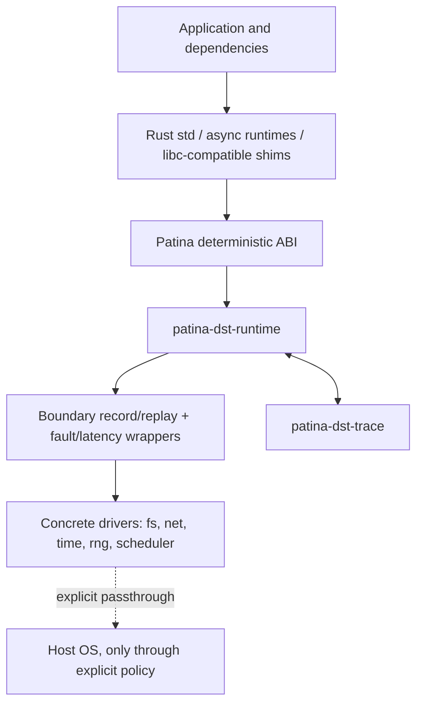
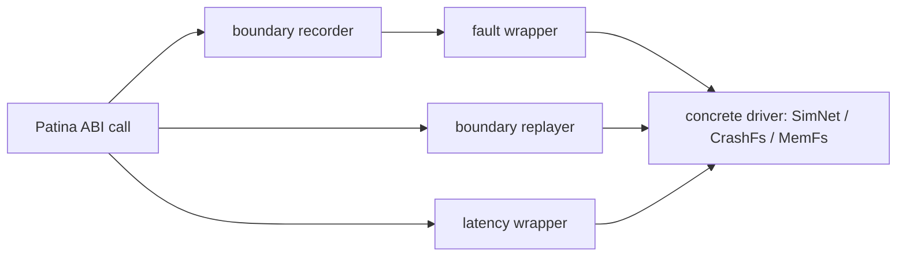
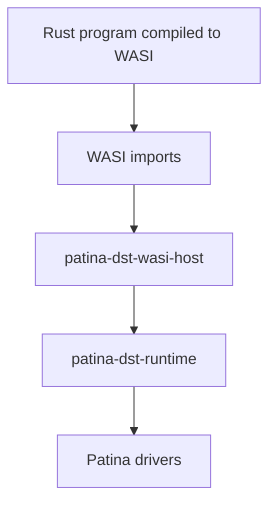

# Patina Architecture

Patina is a deterministic OS personality for Rust. `cargo patina` builds a program for a Patina target, routes platform effects through a stable deterministic ABI, installs virtual drivers, wraps those drivers with trace/replay/fault behavior, and runs the program under a deterministic scheduler.

Find your subsystem:

| You care about… | Section | Main crates |
|---|---|---|
| the overall model and its three planes | [System shape](#system-shape) | — |
| how programs reach the runtime (WASI / native / Cargo) | [Targets](#targets) | `patina-dst-target`, `patina-dst-native-shim`, `patina-dst-wasi-host` |
| what crate does what | [Crate layout](#crate-layout) | all |
| the effect interfaces `std`/shims call | [Data plane](#data-plane-small-stable-interfaces) | `patina-dst-abi`, `patina-dst-driver-api` |
| configuring drivers in code | [Construction plane](#construction-plane-typed-driver-setup) | `patina-dst-runtime`, driver crates |
| seeds, budgets, record/replay control | [Experiment plane](#experiment-plane-external-controls) | `cargo-patina` |
| the drivers and fault/latency wrappers | [Drivers and wrappers](#drivers-and-wrappers) | `patina-dst-fs-*`, `patina-dst-net-sim`, `patina-dst-wrapper-*` |
| trace format, branching, minimization | [Trace model](#trace-model) | `patina-dst-trace`, `patina-dst-minimize` |
| fail-closed enforcement and the audit | [Enforcement](#enforcement) | `patina-dst-target` (and its `ESCAPE-CLASSES.md`) |
| the libc/pthread interposition layer | [Native ABI shim](#native-abi-shim) | `patina-dst-native-shim` |
| how the shim reaches the host without leaking symbols | [Host-alias doctrine](#host-alias-doctrine) | `patina-dst-native-shim` |
| the WASI host | [WASI host](#wasi-host) | `patina-dst-wasi-host` |
| the buggify/oracle SDK | [Cooperative-SUT SDK](#cooperative-sut-sdk) | `patina-dst` |

## System shape


```mermaid
flowchart TD
    App[Application and dependencies]
    Std[Rust std / async runtimes / libc-compatible shims]
    ABI[Patina deterministic ABI]
    Runtime[patina-dst-runtime]
    Wrappers[Boundary record/replay + fault/latency wrappers]
    Drivers[Concrete drivers: fs, net, time, rng, scheduler]
    Host[Host OS, only through explicit policy]
    Trace[patina-dst-trace]

    App --> Std
    Std --> ABI
    ABI --> Runtime
    Runtime --> Wrappers
    Wrappers --> Drivers
    Drivers -. explicit passthrough .-> Host
    Runtime <--> Trace
```

Patina has three planes:

1. **Data plane**: minimal stable interfaces used by `std`, runtime shims, and compiled code.
2. **Construction plane**: typed Rust builders configure concrete drivers and domain behavior.
3. **Experiment plane**: CLI/runtime parameters control seeds, traces, record/replay modes, budgets, and run profiles.

## Targets

One CLI serves three artifact families, inferred from the argument: a **Cargo package/test** (directory or `Cargo.toml`), a **native binary** (Mach-O/ELF), and a **WASI module** (`wasm32-wasip1`). All three drive the same runtime, drivers, and trace format.

### Native (linked shim)

The primary family for programs written mostly in Rust. `cargo patina build` compiles the guest with the **stock host target and prebuilt `std`** (not a recompiled deterministic `std`) and statically links the native ABI shim below it. Link-time interposition — strong shim definitions of the libc/pthread/dispatch/syscall surface — routes what `std` and C dependencies actually call into the deterministic runtime; real host threads are gated one-at-a-time through the deterministic scheduler. On x86_64 Linux, syscall-user-dispatch (SUD) additionally traps raw *inline* syscall instructions (rustix's default `linux_raw` backend, hand-written asm) into the same runtime entry points via a `SIGSYS` handler, so even importless raw syscalls stay in-model.

The guest archive enables Rust libc entry points with the private
`patina_posix_exports` compiler cfg; ordinary dependency rlibs and bare
prefixed-ABI archives omit them. `src/variadic/` owns the variadic `fcntl`,
`open`, `ioctl`, `mremap`, `ptrace`, `prctl` and printf-family doors and their
applicable aliases. Rust also owns their fixed flag, errno and record-lock
layout adapters. `src/posix/` owns ordinary entropy, memory, privileged,
scheduler/identity, descriptor, readiness, network, filesystem and signal/process
adapters; `src/posix_env.rs` owns the guest environment. The printf doors pass a
`VaList` through a fixed bridge to the
C modeled stream engine, which formats with `vsnprintf` and writes captured
output. Linux's `syscall` entry captures raw ABI words in architecture-specific
assembly in the Rust module, then calls a fixed Rust dispatcher; it preserves
the guest-stack restoration path. These entries retain the registry's platform
scope and use the existing models.

The POSIX object's unique anchor extracts the Rust member even when libc has
already supplied the public name. Guest archive compilation uses one codegen
unit to keep that anchor, the definitions and Linux's hidden route aliases
together; no whole-archive link is needed. C retains the modeled stdio engine,
acting cancellation and thread-exit frames, guest callback frames, clock stores,
host-resolution vehicles and Darwin platform adapters. Linux abort retains a C
entry so its Rust model can inspect caller panic ownership before entering its
guard. The [C-to-Rust design](docs/arcs/c-to-rust.md) lists the retained seams;
the [variadic interposer design](docs/arcs/c-variadic-interposers.md) describes
raw capture and formatter boundaries.

A guest binary is never stale with respect to the shim it links. Package builds inject the shim link arguments through `CARGO_ENCODED_RUSTFLAGS`, and Cargo fingerprints that *string*, not the files it names — so the injected flags also carry a hash of the link inputs' bytes. Rebuild the shim or the runtime beneath it and the flags change, which is what makes Cargo relink; leave them alone and the flags are byte-identical, so an unchanged rebuild stays a cache hit.

The shim is built on the user's machine, from source that travels inside the `cargo-patina` binary. A prebuilt staticlib is not an option, because the shim must be compiled by the exact rustc that compiles the guest; a source checkout is not assumed, because an installed binary (`cargo install`, a git checkout that is gone, CI) has none. `cargo-patina`'s build script therefore embeds the shim's whole workspace dependency closure — twelve crates, discovered through each crate's `links` metadata so the same channel works in-tree, from the crates.io registry, and from a git checkout — plus the `Cargo.lock` that pins their third-party dependencies. At guest-build time the bundle is unpacked, content-addressed by its own digest, into a per-user cache (`$XDG_CACHE_HOME/patina`, else `~/.cache/patina` on Linux and `~/Library/Caches/patina` on macOS) as a self-contained Cargo workspace. Native shim caches live below `<cache>/shim-target/patina-native-shim` by default; an explicit `CARGO_TARGET_DIR` remains the authoritative base, with the same `patina-native-shim` namespace beneath it (relative bases are anchored to the caller). The `builds/` entries share Cargo scratch state across bundles, keyed only by the complete compiler identity; Cargo keeps debug and release outputs side by side. Each has a stable source-workspace path; on a bundle switch the workspace is replaced and Cargo cleans just the bundled packages before rebuilding. Registry dependencies remain reusable. Cargo's locked mode preserves the embedded dependency lockfile. Incremental compilation is disabled for this private build; `CARGO_PROFILE_DEV_DEBUG=1` keeps backtraces and source locations without the disk cost of full type information. Source bundles and private source copies are trusted only after a completion marker written last.

Guest links never read that mutable scratch state. Only the final archive is copied (reflink where supported, plain copy otherwise, never a hard link) and atomically renamed into an `artifacts/` entry keyed by bundle, complete compiler identity, profile, archive bytes, C compiler identity and instrumentation variant. C helper objects are content-addressed and atomically published below that same entry. Sources, workspaces and artifacts have kernel-held leases acquired under their catalog lock before exposing any path; guest builders retain the artifact lease until linking finishes, and waiting builders pin scratch state before taking its build lock. Consuming subprocesses inherit only shared leases, protecting their entries from eviction after parent death. Build and catalog locks stay close-on-exec: long-lived compiler-wrapper daemons must not block later builds. The shared lock helpers use `std::fs::File` locking, translating `TryLockError::WouldBlock` into the callers' I/O contention result and retrying interrupted acquisitions. These locks require working advisory `flock` semantics; NFS configurations that do not provide them are unsupported cache locations. Pruning under the catalog lock cannot unlink a leased entry or replace its lock inode. An evicted entry is first atomically renamed to a hidden tombstone, so interrupted deletion cannot leave a partial cache hit. Tombstones and staging directories never count toward retention and are swept on later accesses. Cleanup failures warn and leave retryable garbage rather than failing a build. Publication uses bounded, lock-protected staging files; a retry clears an abandoned partial rather than accumulating more.

On use, entries are touched and least-recently-used entries are pruned: four artifacts and four source bundles keep a short upgrade/rollback window; two build entries keep two compiler identities warm. Live leases may temporarily exceed these counts; the next access reclaims released excess entries. Scratch targets over a 2 GiB high-water mark are reset before their next build, bounding accumulated Cargo configurations without imposing a mid-build quota. Old 64-hex-named target directories are garbage-collected only after an hour without observed use, honoring their old build locks; they are not a compatibility layout. Finish all commands from pre-lease cargo-patina versions before upgrading: those versions neither pin their archives and sources nor coordinate lock-file discovery with eviction. Automatic legacy cleanup assumes that migration is quiescent; it cannot retroactively protect uncoordinated old processes.

Both halves of that link use the guest's verified concrete compiler. The shim's Cargo build runs in a private copy of the unpacked bundle so `-p patina-dst-native-shim` always resolves, while the guest builds in the caller's working directory. Directory-scoped selectors (rustup, mise, or other proxies) can select different compilers there; linking their two standard libraries causes `duplicate symbol: rust_eh_personality` on Linux and can silently succeed on macOS. Instead of requiring an ambient toolchain override, the build queries the guest compiler's sysroot and verifies that its absolute `bin/rustc` reports the guest's full `rustc -vV` identity from both directories. Native compiler probes, metadata, shim builds, and guest builds then use that invocation, with `RUSTC` set explicitly for Cargo children. Cargo comes from the same sysroot unless explicitly supplied through `CARGO`; explicit `RUSTC` selects the guest identity to materialize, and relative tool paths are anchored to the guest directory. Missing sysroot binaries, failed queries, or identity mismatches refuse before compilation with a concrete-binary remedy, never an ambient fallback. No toolchain file or version-manager configuration is written into the shared bundle. Concurrent supervisors using different compilers and different installed Patina builds publish into distinct immutable artifact entries. Cargo may rewrite its own copy of the staticlib even on a fresh build, so a build lock covers Cargo execution through archive publication; the separate artifact lease then protects concurrent guest links from eviction. That lock is the one every cargo-patina Cargo build takes: the shim, a native package or harness, and a WASI module each hold an exclusive `.patina-build.lock` in their Cargo target directory from before the Cargo invocation until they have read back what they consume, so a concurrent build's Cargo can never rewrite a guest executable while it is copied out.

Native source, package and libtest builds retain the final artifact's symbol
table by overriding Rust/Cargo stripping with `-C strip=none` at the final link.
The source-first audit/run paths consume that same symbol-bearing executable;
Cargo exposes no separate pre-strip artifact to audit. Optimization is unchanged
and dependency codegen is not altered. Explicit linker stripping or a post-link
tool can still remove metadata; such inputs get the conservative whole-section
scan rather than an inferred pre-strip sibling or an audit bypass.

Before a native guest runs, a default-deny audit over its imports (plus an instruction scan for raw syscall/clock/entropy opcodes) refuses anything the shim does not model — see [Enforcement](#enforcement).

#### Linux signals and thread lifecycle

Signal dispositions and shared pending instances belong to the process; masks,
private pending instances belong to managed tasks. SIGSYS has a guest disposition
stored and queried through the ordinary action table, but it never replaces the
host containment handler. No modeled kernel effect raises guest SIGSYS; explicit
sends and timer notifications of it stop by name, irrespective of disposition.
Its existing always-unblocked host-mask policy is unchanged. A guest's alternate
stack is per-thread state kept by the shim with 6.8's rules (see Private signal
frames below). Generation
records `SignalGenerated` and selects the leader when eligible, otherwise the
lowest eligible live task (the leader has the first TaskId). Delivery runs on that
task under the baton, from kernel-built frames, never on the generating
helper's behalf. Instances blocked by an earlier handler's mask remain virtual
and visible to pending queries and signalfd until eligible.

##### Private signal frames

Every host signal handler the shim owns is installed `SA_ONSTACK`: the syscall
trap (SIGSYS), the counter trap (SIGSEGV on x86_64), and the front handler,
which is the host action of every signal the guest has a handler for and of
every signal an instruction raises. Each managed thread registers a guarded
shim-owned mapping (65 nesting levels of 128 KiB plus `AT_MINSIGSTKSZ` each,
about 8.4 MiB reserved but not committed) as
its host alternate stack, `SS_AUTODISARM`, before any guest code runs on it
(`src/thread/signals/frames.rs`). So the kernel builds every signal frame —
siginfo, ucontext and the CPU's extended state — in shim memory, never on a
guest stack. A native frame's size is the host CPU's xsave area (AVX-512 hosts
write much larger frames); a frame on the guest's stack would make the
guest's stack use, and so its behavior near a stack's end, differ from host to
host, which is a determinism leak. With private frames a trapped raw syscall
or counter read uses none of the guest's stack, recording included (a
dispatch takes tens of KiB), which a runtime with 2 KiB thread stacks needs.

The contract a guest handler sees:

- It runs on the stack its action asks for, chosen as 6.8's `get_sigframe`
  chooses: the top of its alternate stack under `SA_ONSTACK` when that stack is
  registered and not already in use, else below the interrupted stack pointer
  (x86_64: below its 128-byte red zone). A runtime that checks that its handler
  runs inside the alternate stack it registered finds it there. The handler's
  frames are below a 16-byte slot of the shim's and, on x86_64, its return
  address; that is all a delivery takes of the guest's stack, the same on
  every host and route.
- `siginfo` and `ucontext` are the kernel's frame and valid for the handler's
  duration. Edits the handler makes to the ucontext — registers, program
  counter, stack pointer (as a runtime's asynchronous preemption injects a
  call), the saved mask, `uc_stack` — are honoured at its return exactly as
  `rt_sigreturn` honours them, since it is that frame the kernel's
  `rt_sigreturn` restores (the containment signals stay out of the mask, as
  from every mask).
- `uc_stack` shows the guest's own registration as the kernel saved it, and an
  `SS_AUTODISARM` registration is disabled for the handler and registered again
  from `uc_stack` at its return, as 6.8 does; `sigaltstack` inside the handler
  answers `SS_ONSTACK`/`EPERM` by where the guest's stack pointer is.
- Observable divergences from 6.8: the `siginfo`/`ucontext` addresses are not
  on the guest's stack (a handler that locates its frame from its own stack
  pointer, or walks from the ucontext to the stack, sees shim memory); the
  handler returns into the shim, not into its action's `sa_restorer`, which does
  not run (a restorer that is `rt_sigreturn` and nothing else, as runtimes'
  are, is indistinguishable); a delivery takes from its stack's top (or the
  red zone's bottom) to the handler's frame 24 to 39 bytes on x86_64 (the
  slot and the return address, 24 or 32 below the red zone as the stack
  pointer falls modulo 16, up to 39 at an unaligned alternate stack's top) and
  16 to 31 on arm64 (no return address is pushed), not a kernel frame, so a stack too small for a native frame still
  runs the handler; and the interrupted context of a delivery the shim makes at
  a boundary is shim code (as before), on the private stack for the syscall
  trap's boundaries.

Nesting. The private stack is 65 levels of one fixed budget each (128 KiB
plus `AT_MINSIGSTKSZ`, sized for a recording dispatch with margin, which a
containment test measures). A trap from guest code lands at the top of the
level the host registration names, and everything the shim runs for it stays
in that level. While a guest handler runs, its record owns the level its frame
is in, and the registration names the highest level no running handler owns,
where every trap the handler takes lands; at the handler's return the kernel's
`rt_sigreturn` installs the registration its frame names. So a running
handler's frames are never built over, whatever its guest code does meanwhile:
it may swapcontext to a coroutine on any stack (a mapping, a local array of a
caller's frame, an `alloca`), make syscalls there, and come back, which is what
`SS_AUTODISARM` exists for. A handler that leaves by `siglongjmp`, `longjmp` or
`setcontext` skips its return, so its level is freed only on proof it was left,
which no stack pointer gives (a coroutine may run anywhere): the word the shim
wrote to its slot overwritten, found at each trap from guest code and before a
libc door delivers, or a later delivery whose slot overlaps it. Until then the
level stays reserved; at worst the 65th running handler is a named stop, the
same on every host, recording or not. A handler left over and over from the
same place frees the last one's level each time, so the levels alternate and
nothing accumulates. The divergence this leaves: handlers left by `siglongjmp`
from ever shallower points of a stack, whose slots nothing writes again, each
keep a level, and the 65th stops by name where natively the run goes on. A
jump's target above a slot is no proof (a coroutine stack carved from a frame
above the handler is above its slot, and a handler on an alternate stack left
for an older context can still be resumed from its coroutine and return), nor
is the guest's `siglongjmp` the shim's to see. While a running handler owns a
level, the bottom page of the level directly above it is inaccessible, so shim
code that overran its own level faults there instead of writing over a
suspended handler's frames; the fault ends the run by SIGSEGV, not a named
stop (the kernel has no room left to build its frame), and the level budget
keeps it from happening. After a managed thread's teardown nothing of its handlers
survives: a thread-local destructor's trap finds no private stack and no
records. The mapping is unmapped at managed thread completion, except after a
raw `exit` the syscall trap serves on it, which leaves it mapped with the dead
thread.

An internal stop is the host's default SIGABRT, never a delivery: the front
handler would otherwise run a guest SIGABRT handler (a runtime's, whose raw
syscalls re-enter the stopping shim) inside it. A signal from outside the run
reaching a guest handler is a named stop.

macOS has no syscall-user-dispatch or counter trap and keeps host-owned guest
handlers and kernel frames; this is a Linux mechanism behind the same signal
seam. Linux arm64 (no SUD there) runs the same front handler and private stack,
with its own stack-switch call.

`raise` is interposed on both platforms. Linux uses the virtual thread-directed
signal queue. Darwin's `thread/signals_darwin.rs` records `SignalGenerated` for
the calling managed task, then uses the private current-thread delivery vehicle
with no shim locks held and callback ownership suspended. It supports unblocked
self delivery to ordinary handlers (including reset, nodefer and alternate-stack
flags), ignored signals, and default termination with trace finalization. It
refuses deferred delivery, `SA_SIGINFO` (whose host sender/context would leak),
reserved SIGSYS and default process-stop actions before generation. The registry
therefore marks the cross-platform entry partial. This is not an allowance for
host `raise`, process-directed signals or ambient delivery. The unchanged
watchdog guest's SIGABRT probe exercises this admitted path; the self-signal
fixture supplies the broader class evidence required by [scope](docs/SCOPE.md#rules-for-new-surface).

Lock order is ThreadRuntime → context slot. Generation records and selects under
ThreadRuntime, then releases it before scheduler wake; host frame release never
holds either lock. Host masks describe nested handlers, so no in-delivery flag
suppresses legitimate re-entry. A dirty mask flag gates SIGSYS-frame fixup;
frame release saves and restores the enclosing frame's dirty bits so an inner
SIGSYS return cannot consume them. A no-pending syscall return needs no host
signal syscall. Startup registration
and immediately resolved descriptor queries do not install Context or activate
the scheduler; this preserves deferred-harness setup. Captured runtime diagnostics
skip scheduling while shim locks are held, without bypassing the captured sink.

Every interruptible park registers its class, queue locations and optional
virtual deadline. A signal removes only its recipient's registrations before
waking it; an ordinary wake or timer rescue removes those registrations too.
Resumed I/O and untimed futex waits obey `SA_RESTART`; timed futex waits, sleeps
and readiness waits return `EINTR` after delivery. Relative sleeps report the
virtual unslept time; absolute sleeps leave the remaining-time pointer untouched.
Pthread locks, condition variables and joins also allow handler execution while
parked, but never report EINTR. Unlike syscall waits, their semantic queue entries
remain registered during handler execution to preserve FIFO ownership and
condvar→mutex handoff. They resume the original wait/deadline unless ordinary
completion arrived meanwhile; a runnable handler does not receive a duplicate wake.
A handler interrupting a pthread wait may acquire uncontended locks, but attempting
another blocking pthread wait is a named fatal refusal, before queue mutation or
condvar unlock. Nested pthread parks are not modeled: one task's retained outer
wait must not consume an inner wait's grant.

A signalfd is one kind on the unified descriptor table, with shared-description
mask replacement, ordinary duplication/close and reader-local pending visibility.
Signal consumption selects one waiter. Readiness notification is separate: every
matching signalfd reactor watcher is unlinked and notified once, without marking
additional tasks interrupted. Thus multiple readiness `TaskWake` events do not
mean multiple signal recipients. Poll/ppoll and select/pselect adapt the same
readiness predicates and wait queues as epoll; temporary masks cover the complete
wait and are restored on return. Raw timeout writes and libc's preserved
ppoll/pselect timeouts remain distinct at the adapters.

Default Term/Core delivery finalizes the trace and captured output, restores the
host default disposition, then signals the calling host thread. The guest really
dies by that signal; the native supervisor reports the observed wait-status
`signal` and `core` in `guest_exit` (no `core` key on normal exit). Default Stop
signals are named fatal traps rather than hangs; catchable Stop signals still
run an installed handler. Broken pipes and closed stream peers generate a
thread-directed SIGPIPE before EPIPE, unless a socket send uses MSG_NOSIGNAL.
An ignored SIGPIPE is recorded but dropped. A guest `abort()` is glibc's staged
one: it unblocks SIGABRT and raises it through the virtual kernel, so an installed
handler runs; if the handler returns, it restores `SIG_DFL` and raises SIGABRT
again, and the default action finalizes the run and ends it by the signal. Once
`main` has returned (an `abort` from an atexit handler, a static destructor or a
thread's TLS teardown) no handler runs, and neither does it when no runtime is
installed: the run finalizes directly before calling the resolved host abort
alias. A SIGABRT handler that `siglongjmp`s out is the unverified nonlocal escape
described below. Shim-internal fatal paths use private Rust/C host-abort vehicles
and leave the trace incomplete.
POSIX startup installs a production panic hook independently of Context setup.
Thread-local Rust ABI ownership, suspended for guest callbacks, distinguishes
shim panics from guest panics; owned panics report through host writes and private
abort. Guest panics retain the prior hook and can be caught. Guard-unwind and
panic-time abort checks preserve the private-abort policy if the guest replaces
the hook. Bare prefixed-C/staticlib links have no public abort interposer and do
not install this policy or require the POSIX host aliases. Libtest retains its
own panic handling.
A default-fatal batch releases only its fatal signal, never another queued handler
after finalization.

The libc signal symbols add glibc's wrapper semantics over the rows they share
with the raw door. `sigtimedwait`/`sigwaitinfo` report a signal `raise` sent
(`SI_TKILL`) as `SI_USER`; `sigqueue` names the caller as its sender; `signal`
blocks the signal in its handler and sets `SA_RESTART` unless `siginterrupt(sig, 1)`
named the signal; and glibc's reserved signals 32 and 33 are never blocked by
`sigprocmask`/`pthread_sigmask` and are `EINVAL` to `sigaction`, `signal`,
`siginterrupt`, `raise` and `pthread_kill`. The raw rows keep the kernel's answers.

Thread-directed generation queues privately and delivers on the named task's
host thread. `pthread_kill` resolves the managed pthread handle to that task.
`set_tid_address` stores a guest word per task, separately from glibc's host
thread bookkeeping; thread completion clears the word and wakes a futex waiter.
Each task also holds a virtual robust-futex list head: glibc's, read back from
the host when the task starts (glibc registers it from its own text, before the
shim runs), until the guest sets another; `pthread_create` returns once the new
thread has taken it over. A managed thread completes after its thread-local
destructors (its completion is the first one it registers), and completion
walks the list first, as the kernel's exit does: a futex word the task still
owns gains `FUTEX_OWNER_DIED` and wakes a waiter by the word's shared key.
glibc's restartable-sequence registration of each thread is
taken off the host when the task starts, since the host kernel would keep
writing host CPU ids into the area, and kept as the task's virtual
registration: the area reads the one virtual CPU (0, node 0, concurrency id 0),
and `rseq` answers from the virtual registration. Tasks switch only at boundary
calls, which a restartable sequence never contains, so none is ever aborted.
Raw `exit` completes only the calling task, including the leader; another live
task can subsequently end the process with `exit_group`. Raw `exit_group`
finalizes without running guest atexit handlers; normal libc exit retains its
atexit chain. The last worker returning normally exits zero; an explicit raw exit
retains its requested status.

The main thread is task 1 from the startup constructor on; the scheduler
registers it lazily, on first thread-subsystem use (the first `pthread_create`,
but also a pipe, an eventfd, a FIFO open, a futex wait or a signal-state call).
Whatever records a thread's identity before that — a mutex or write-lock owner —
therefore names the same task after it.

Pthread mutexes keep glibc's types: the type comes from the `pthread_mutex_init`
attribute or, for a mutex never initialized, from its static initializer's
`__kind`. An error-checking mutex's relock is `EDEADLK`, a recursive one counts,
and a normal (default) one's owner waits behind itself, so the run ends as a
deadlock, before the first thread too (the wait activates the thread runtime).
`trylock` of a held mutex is `EBUSY`, from its owner too unless the mutex is
recursive. Unlocking a normal mutex checks no owner, as glibc's does: another
thread's unlock frees it, and unlocking it unlocked is 0; the other types, and
a robust or priority-inheriting normal one, answer `EPERM`. A recursive mutex
held more than once stays held across `pthread_cond_wait`, and the wait's
re-lock counts it again. On macOS every mutex is error-checking. Reader/writer
locks keep glibc's kinds the same way: by default a new reader acquires the lock
whenever no writer holds it, and a releasing writer hands it to the waiting
readers first; `PTHREAD_RWLOCK_PREFER_WRITER_NP` admits readers alike but hands a
releasing writer's lock to the next waiting writer first;
`PTHREAD_RWLOCK_PREFER_WRITER_NONRECURSIVE_NP` hands over writer to writer too and
makes a new reader wait behind a waiting writer (the only policy on macOS). The
writer's own `rdlock`/`wrlock` are `EDEADLK` and its try-locks `EBUSY`.
`pthread_cond_timedwait` judges its deadline on the condition's clock
(`pthread_condattr_setclock`: `CLOCK_REALTIME` by default, or `CLOCK_MONOTONIC`);
a deadline already reached, or before the epoch, is `ETIMEDOUT` at once, the mutex
released and re-acquired. `pthread_cond_clockwait` is not interposed, so the audit
refuses a guest that imports it.
A thread's name (`comm`) is per thread: by default the basename of `argv[0]`,
truncated to 15 bytes — the supervisor's fixed `patina-guest`, never the host
binary's name, which the kernel would take from the file `execve` ran — until
`prctl(PR_SET_NAME)` or `pthread_setname_np` changes it, and a new thread inherits
its creator's. A join of a detached thread is `EINVAL`, and then one that could
never end — of the caller itself, or of a thread waiting to join the caller — is
`EDEADLK`.
On Linux `pthread_exit` ends a thread the guest created as a return from its
start routine does, with the value a join answers: the model records the value,
then the C interposer calls glibc's own `pthread_exit`, whose forced unwind runs
the cleanup handlers and returns into `start_thread` for the thread-local and
`pthread_key` destructors. From the guest's own frames the unwind crosses only
those and C ones (the host start routine is the C layer's `patina_thread_body`);
the shim's guarded Rust frames cannot be crossed by glibc forced unwind. A guest signal handler runs above the shim's
Rust delivery frames, so a `pthread_exit` inside one is a named fatal (the
per-task delivery depth, `src/thread/signals.rs`); a handler that leaves by
`siglongjmp` leaves that depth raised, so a later `pthread_exit` on the thread
stops the same way. An init routine `pthread_once` runs that exits instead of
returning resets the control (a cleanup record around it, glibc's
`clear_once_control`), and a waiting or later caller runs the init. C's
`pthread_cleanup_push` macro compiles to imports of `__sigsetjmp`,
`__pthread_register_cancel` and `__pthread_unwind_next`, which the pre-run audit
refuses (only the old-style `_pthread_cleanup_push`/`_pop` are allowlisted), so a
C guest using it runs only outside `cargo patina run` (as `native_abi`'s probe does). glibc's unwinder is `libgcc_s`, which it opens on first use; every
shim-linked guest already links it (the shim's Rust half needs it), so the open
finds it loaded rather than reading it through syscall-user-dispatch. The main
thread's `pthread_exit` unwinds out of `main` as glibc's does; the
`__libc_start_main` wrapper's cleanup record, the outermost, then tells the model
the main thread has ended. With another thread running, the main task completes
as a leader's raw `exit` completes it, and the process ends when its last thread
does, through glibc's `exit(0)`: the atexit handlers run and the status is 0 (a
main thread's raw `exit` instead leaves the last thread's end to be the process's,
with no atexit handler, as the kernel does). The last thread stays the running
task through that `exit(0)`, and waits for every other host thread to leave
glibc's thread count (`__nptl_nthreads`) first, so the `exit(0)` is always its
own; that wait is for host teardown outside the model, so it is bounded in wall-clock
time (10 s, then a named stop) and decides nothing the run records. Every `pthread_exit` on macOS is a named fatal.
The `pthread_key` destructors run after the thread's completion, since they follow
the thread-local ones in `start_thread` (the main thread's follow its cleanup
handlers): a joiner waits for them, but a detached thread's, and those of a main
thread that left others running, run beside the next task.
Cancellation on Linux keeps glibc 2.39's per-thread state (`src/thread/cancel.rs`):
`pthread_setcancelstate`/`pthread_setcanceltype` switch it, `pthread_cancel` records
the request, and acting on it is `pthread_exit(PTHREAD_CANCELED)` from the C
wrapper. A deferred request acts at the sleeps (`nanosleep`, `clock_nanosleep`,
`sleep`: at the entry when it is already pending, and at once when it arrives
inside, before any virtual time passes, the cancel ending the wait) and at
`pthread_testcancel`; making the thread asynchronous acts on a pending one at
once. Every other glibc cancellation point a guest can reach is a C wrapper that
checks at its entry, or an import the audit refuses, and the list is glibc's own
(`crates/patina-syscalls/src/cancellation.rs`, gated against the shim's C and the
audit): a thread reaching one with a cancel to act on stops the run by name, as it
does when it would block in such a wait, when a cancel would have to end a thread
blocked in one, when a cancel reaches a thread running a signal handler inside a
sleep, and for an asynchronous cancel of another thread. `pthread_join` is a
cancellation point only where it waits, as in glibc: the join of a thread that
has ended returns with the request still pending. On macOS `pthread_cancel` answers `ENOSYS`.

On x86_64 Linux the timestamp-counter trap owns the host SIGSEGV disposition,
so a guest's SIGSEGV action is virtual, reported back by `sigaction`. The trap's
handler answers a kernel-sent `rdtsc`/`rdtscp` in the main executable's text; a
counter read it does not answer (outside that text, or prefixed) is a named
stop, since natively it reads the counter and runs on. It sends every other
SIGSEGV where the kernel would under the guest's action: the guest handler runs
from the trap's own kernel-built frame (the kernel's siginfo and the faulting
context, so a return retries the instruction, an edited context resumes and
`siglongjmp` leaves), `SA_RESETHAND` resets the virtual handler, the handler
runs on the stack its action asks for (Private signal frames, above), and a
default or ignored action takes the fault as the default action does. A
SIGSEGV sent from outside the run is a named stop. A SIGSEGV patina delivers
itself (`kill`, `raise`) is dequeued as 6.8 dequeues it (synchronous signals
first, a thread's own before the process's) and runs the action its dequeue
captured. A delivery batch whose re-queued frames the host would build in
another order than 6.8's (or whose signals repeat, or whose handlers run under
different SIGSEGV blocks) queues and releases them one at a time, last dequeued
first, each under the mask its frame saves natively and with the action its
dequeue captured, so the handlers run in 6.8's frame order: nothing waits on the
host meanwhile, so a handler that leaves by `siglongjmp` loses the frames below
it and a handler that changes a later member's action leaves that frame its
dequeued one, both as natively. For a signal an instruction raises the shim's
fault handler gives the host the current action back as that frame enters, so
a genuine fault never meets the dequeued one; any other signal's stays on the
host until the member's handler returns (after a `siglongjmp`, until the next
delivery point), and nothing but a delivery raises it there. A handler that edits its frame's saved mask while frames of its batch
are still to run is a named stop: natively the next handler starts under the
edit. A counter read is answered on the private stack wherever the guest
read it, a handler's own stack included, and a handler a delivery point inside
the read runs goes to the stack it asks for, as any other. A
SIGSEGV the kernel sends itself that the guest's action takes as the default
is taken at once rather than retried, since retrying need not raise it again;
a core dump then records a sent SIGSEGV (`SI_TKILL`, no address) where natively
it records the kernel's, with the same wait status. A SIGSEGV while shim code owns
the thread (an entry, a shim lock, the trap's own glue) is a named stop, never
the guest's. The host never blocks
SIGSEGV (nor SIGSYS: an action's `sa_mask`, which the kernel blocks while its
handler runs, is installed without them, as every host mask is; a SIGSYS it
names is dropped as from any mask the guest installs, so the handler runs and
reads its mask back with SIGSYS unblocked, with no notice, where natively it
is blocked), so the guest's block is kept per thread (`src/thread/signals/fault.rs`):
visible mask changes set it, and a handler, delivery batch or temporary mask
restores it on return. A scope the guest left by `siglongjmp` is found by the
kernel's own stack test (off its alternate stack, above its frame, or its frame
overwritten), which compares stack pointers on one stack only: the alternate
stacks the guest registered are known by their bounds (an `SS_AUTODISARM` one
too, which the kernel forgets while a handler runs on it), and more of them
registered inside handlers than the shim tells apart is a named stop; below a trap-run handler's intact frame on an ordinary stack, a
fault, pending SIGSEGV or mask read whose answer depends on whether the handler
is still running is a named stop. With the block known, a blocked fault takes
the default action and a blocked sent SIGSEGV stays pending, as in 6.8. Left
by `longjmp` (no mask restore) a handler's block is taken as restored, and a
`setcontext` onto another stack is outside the stack test. On every Linux arch
the other signals an instruction raises (SIGBUS, SIGFPE, SIGILL, SIGTRAP), and
SIGSEGV where the trap is not armed (arm64), have a front handler instead: its
host action carries the guest's flags, mask and restorer, so the
kernel builds and blocks as for the guest's handler, and the front handler
takes the thread for the shim first, so a fault in the shim's own code is a
named stop there too, then runs the guest's virtual action from the frame.
Under the counter trap, whose host masks never hold SIGSEGV, a SIGSEGV that
action's mask names is blocked virtually while its handler runs, as for a
handler the trap runs, and the handler's return goes through the same hook
(its frame's saved mask kept free of the containment signals, what that mask
unblocks delivered). A trace or breakpoint trap while the shim owns the
thread (single-stepping through an entry) is named as such. The front handler needs stack where a
native default action needs none: the front handler requires 4 KiB below its
frame, with its route's measured high-water and C frame sizes gated on both
Linux architectures on the pinned toolchain. It checks room before any call, even
`errno` access. A short stack stops through tiny C-only code: one raw host
write, then a private SIGABRT through the pre-resolved host syscall alias,
never Rust formatting, panic scopes, or guest handlers. Where the kernel
cannot fit the front frame at all (an exhausted ordinary stack, an alternate
stack too small for the frame) it forces SIGSEGV, so a fault the guest
leaves to the default action dies by SIGSEGV, unnamed, where natively it
dies by its own signal.
A host-installed handler that interrupted shim code runs with the thread still
the shim's, and leaves it so by `siglongjmp`: relocking a shim lock it left
held is the lock's self-deadlock stop, and a later fault is the shim's (a named
stop). On macOS guest handlers are still the host's own.

A handler installed with the caller's own `SA_RESTORER` (a raw action, as Go's
runtime installs) returns into the caller's stub, and the stub's `rt_sigreturn`
(trapped by SUD, or a tail call into the shim's `syscall(2)` entry) resumes at
the host kernel's own `rt_sigreturn`, issued from glibc text with the guest's
stack pointer, so the kernel restores the interrupted context and the frame's
mask, less the containment signals. Handlers installed through glibc return
through its restorer without a trap. A guest's `restart_syscall` answers
`EINTR`: a restart block is pending only after a wait the kernel interrupted
without running a handler (a stop, a tracer), which the virtual kernel never
does; a handler that interrupts a wait ends it at the wait's own resumption.
`process_vm_readv`/`process_vm_writev` aimed at the guest's own process (its
pid or a thread's tid) are the host kernel's copies on this process, so their
refusals, faults and short counts are the kernel's; any other pid is refused
after the checks the kernel makes first (`ESRCH`, or `EPERM` for init).
A pidfd is a descriptor-table kind naming the guest's process or init
(`src/sud/pidfd.rs`): `pidfd_send_signal` generates for its process as `kill`
does, `pidfd_getfd` duplicates one of the guest's own descriptors (init's need
`CAP_SYS_PTRACE`), and `process_mrelease` finds no exiting process. Ambient
host signals are outside the deterministic model and can execute a handler
off-baton. Nonlocal `siglongjmp` escape from a handler is unverified, including
mask/frame restoration; neither case carries a reproducibility claim.

### Native compute-only starvation

A call-free loop cannot hand over the native execution baton. When another
managed task is runnable, a private host observer stops the run with
`PATINA_VIOLATION liveness detail=compute-bound`, the task id, boundary count,
and `known_limit=true`. This is a limitation of cooperative execution, not a
verdict that the guest is buggy. Campaigns retain the finding but classify its
`known_limit` bit as infrastructure, not a novel guest bug (an independent
safety verdict still counts). It never preempts, wakes a task, advances
virtual time, or supplies a host-derived answer to the guest. The anonymous
spin/setter MRE in `testbeds/native-boundary/compute_watchdog.rs` supplies the
workload evidence required by [the scope rules](docs/SCOPE.md#rules-for-new-surface).

`--compute-watchdog-ms MS` sets the host monotonic no-boundary-progress window:
10,000 ms by default, positive values up to one day. It overrides
`PATINA_COMPUTE_WATCHDOG_MS`; native `run`, `replay`, and harness `test` forward it
through the scrubbed control plane. Campaigns persist the explicit flag as
`compute_watchdog_ms` and carry it into both reproduction forms. An env-only
setting remains inherited host configuration, not a portable campaign input. Ten seconds tolerates ordinary
compute bursts and host contention while bounding an otherwise infinite wedge;
raise it for deliberately longer compute with runnable peers. This is wall time,
not a CPU-time claim: host descheduling counts. A baton holder blocked in an
untracked host call with the shim locks released can also exceed this window;
the diagnostic means **no scheduling point**, not proven CPU computation. Such
host blocking is not currently excluded. Polling adds up to two sampling
periods (each at most 100 ms), plus host dispatch/export time; it is not a
real-time deadline. A lone compute task and compute with every peer parked are
exempt regardless of duration.

The observer starts on first managed thread creation, uses the single HostApi
alias table (Linux private futex waits; Darwin dispatch semaphore waits), and
adds no clock read, atomic, or counter to scheduling points. Darwin's private
wait semaphore is prepared before either helper starts; helper waits only read
it. A contended Rust `Once` would park through guest dispatch interposers, so
private helper threads must never initialize shared wait state lazily. Both private helpers
block all blockable signals through the host pthread mask at entry, before taking
runtime locks. No initialized POSIX semaphore is moved by these waits. No `sem_clockwait`
or recent-glibc symbol is required. It try-locks ThreadRuntime then Context,
observes existing boundary counts and scheduler bookkeeping, and resets its
window only on confirmed progress or ineligibility. A failed try-lock retains
the previous observation; contention cannot continually restart the timer. It is not a detector for a shim stuck
holding its own locks. At commitment these locks prevent further modeled
effects. The native trace transport serializes a borrowed prefix through fixed
storage, including streamed base64 byte fields; diagnostic and finding emission
also avoid the guest allocator, which the stopped thread may own. An already
abandoned recorder returns an allocation-free `trace-overflow` infrastructure
refusal, not a fabricated empty prefix or a boxed serialization error.
On the off-baton path, already-captured output is salvaged only if its lock is
free; C stream callbacks and finish-time report enrichment are skipped. A
synchronous, baton-held compute refusal instead uses the ordinary refusal flush,
including buffered C stdout salvage, before private abort. Shared internal fatal termination
resets SIGABRT to default through HostApi on both OS families before private libc
abort unblocks and raises it; no guest abort handler is called. If that reset
fails, a named infrastructure diagnostic and private immediate exit replace the
signal termination, never a callback-capable abort or guest finalization.

The additive trace metadata `compute_stop` records the committed decision count
and task, not the admitted-operation count: an open custom operation has no
recorded outcome and is excluded. Replay stops before requesting that missing
outcome. Replay disables host-time detection, strictly consumes that prefix,
and stops either from the observer or the existing boundary-budget guard before
any further operation; finalization cannot turn it into success. A faster replay
therefore cannot continue past the recorded refusal. The guarantee is the same
**boundary prefix and named stop**, not an exact instruction or elapsed time.
Seed-only repetitions need not stop at the same prefix: any eligible gap,
including host thread startup or descheduling before an intended infinite spin,
can exhaust the host-time bound. Their overlapping modeled decisions agree;
each recorded terminal prefix replays its own exact task and count. Branching
terminal traces is explicitly refused; combining a
terminal segment into a crash-restart lifecycle trace is also refused by the
metadata agreement check, not silently replayed without its stop. Host-time
detection is also disabled for branch sessions created from ordinary traces;
branch-prefix export is not implemented. A fork child would inherit the once-only
startup state but not the observer threads, so there is no post-fork watchdog
rearm. Guest process creation is deny-trapped; fork is not a supported way to
carry this runtime into a child.

Only after committing and exporting the stop does the observer borrow SIGSYS
for a bounded, best-effort interrupted-PC sample (native ucontext on Linux
x86_64/arm64 and macOS). On Linux its frame, like every shim handler's, is on
the sampled thread's private signal stack, so a thread spinning on a stack of a
few KiB is still sampled. No live guest disposition or mask is reserved for the
watchdog. Capture checks the current host thread against the published target,
and only its first acknowledgement may publish a PC and pin that thread; another
thread's SIGSYS (including a SUD trap) cannot supply the sample. The observer
checks again after its final wait so a just-delivered acknowledgement is not
lost. A sample still has a bounded, best-effort delivery window: blocked signals
or host descheduling can exhaust it. Missing handles, installation/send failures,
and expiry have distinct `sampled_pc=unavailable` reasons. Observer-driven replay
samples the recorded task too; synchronous replay refusals do not sample a PC
and explicitly report `sampled_pc=unavailable reason=synchronous-stop`.
Neither path promises instruction identity. The diagnostic includes the raw PC and a delta from
`patina_yield_point`; the delta supports offline symbolization when the PC is
in the executable, but is not ASLR-independent for a different loaded image.
Offsets print an explicit sign and unsigned magnitude, including negative PCs
relative to the anchor. A prestarted private helper asks the loader (`dladdr`,
plus Linux `dladdr1` symbol-size validation) for a name and offset. The observer
waits at most 200 one-millisecond polls for that result: a guest-held loader lock
must not prevent the stop. Missing/oversized names, unconfirmed ranges, or a
lookup that cannot finish are explicitly PC-only. Darwin exposes no symbol size,
so its name is labeled loader-nearest, not a confirmed containing range.
The sampler allocates nothing, takes no shim lock, and never resumes the stopped
thread. The violation marker begins on a fresh stderr line even after a partial
guest line. Cross-compilation does not establish execution on another OS or
architecture. The host-handle table now includes Darwin's main thread for PC
sampling; this also makes main-thread join/detach use managed handling rather
than the former unknown-handle path. macOS execution verification remains a
landing requirement.

### WASI

The WASI target is a clean Patina target because WASI already represents host effects as explicit imports. Rust code uses the stock `wasm32-wasip1` `std`; `patina-dst-wasi-host` supplies deterministic implementations of the entire audited Preview 1 import surface (clocks, entropy, filesystem, configured datagram sockets, process state) over the same drivers.

WASI is useful when portability and a small host-effect surface matter. Its limitations include weaker native FFI support, less representative platform-specific behavior, immature threading semantics compared with native platforms, and possible performance/layout differences from native ARM64/x86_64 targets.

### Cargo package (in-process boundary)

`cargo patina run`/`test` on a package with no `--target` runs it in-process at the explicit `patina_dst_runtime::Context` boundary (usage mode 3): the code performs effects through the context rather than through interposed `std`. This is the family the explicit-context API, branch replay, and the workspace's own examples use.

## Crate layout

Package names are `patina-dst-*`; workspace directories drop the `-dst-`
(shown in parentheses where they differ).

```text
cargo-patina                # the CLI: build/run/test/audit/replay/explore/campaign/sites/minimize
patina-dst (crates/patina)  # cooperative-SUT SDK (dependency-free)
patina-dst-harness          # configure-then-run harness for ordinary app code under the shim
patina-dst-abi              # stable deterministic boundary contracts (typed operations/outcomes)
patina-dst-runtime          # runtime context, driver installation, record/replay orchestration,
                            #   params; explicit-context `run`/`run_with`/`Context`
patina-dst-async            # deterministic futures executor over the explicit boundary
patina-dst-trace            # trace bundle format, branch metadata, strict replay matching
patina-dst-minimize         # pluggable failure-oracle reducers for traces/schedules/scenarios;
                            #   oracles may declare a batch width and judge a speculative window
patina-dst-target           # target metadata, import audit + escape classes, instruction scan
patina-dst-proptest         # proptest compatibility: case generation from the run's seeded entropy

patina-dst-driver-api       # common driver traits (Fs/Net/Clock/Entropy/SchedulerDriver)
patina-dst-fs-mem           # in-memory virtual filesystem
patina-dst-fs-crash         # crash-consistency filesystem model
patina-dst-fs-host          # explicit allowlisted read-only host capture
patina-dst-net-sim          # deterministic virtual network (datagrams + TCP streams)
patina-dst-time-virtual     # virtual clock and timers
patina-dst-rng-seeded       # deterministic entropy source
patina-dst-sched-det        # deterministic scheduler policies (uniform, PCT, starvation)

patina-dst-wrapper-fault    # generic fault injection wrapper drivers
patina-dst-wrapper-latency  # generic delay and jitter wrapper drivers

patina-dst-native-shim      # libc/pthread/dispatch/syscall interposition layer + SUD dispatcher
patina-dst-wasi-host        # deterministic WASI Preview 1 host

patina-dst-bench            # performance qualification workload and budget gates
```

Record and replay are not separate crates: `patina-dst-trace` provides the
`Recorder`/`Replayer` machinery and `patina-dst-runtime` drives it at the
boundary, so recording composes around any driver stack (see
[Drivers and wrappers](#drivers-and-wrappers)). The separation above is
intentional: the ABI and trace format are shared, drivers are modular, and
native compatibility remains separate from the Rust-first core.

### Shim-backed harness (`patina-dst-harness`)

`patina-dst-harness` is the configure-then-run harness for driving ordinary
application code under Patina (usage mode 2 of `USAGE-MODES.md`). A harness
binary calls `patina_dst_harness::run`/`run_with`, configures the run through a
`HarnessBuilder`, and then executes normal `std`-using application code whose
effects are interposed by the native shim — the SAME global runtime context the
shim installs for a transparent run, not a second explicit `Context`. It is
built and run through `cargo patina run <manifest> --target native --harness`,
which sets `PATINA_DEFER_INIT=1`: the packaged constructor captures and scrubs
the control plane and registers finalization but leaves the runtime uninstalled,
and the harness installs it (`patina_harness_install`) after applying its
configuration overlay. The overlay flows through the same `PATINA_*` control-plane
values and `RuntimeConfig` fields the CLI env path sets, so there is no separate
harness fingerprint component and the runtime's `reconcile_replay_*` checks catch
overlay conflicts on replay. Fail-closed throughout: run without Patina and it
returns `NotUnderPatina` before any application code runs; an interposed effect
before the harness installs aborts loudly rather than auto-initializing. WASI is
out of scope for v1 (the WASI supervisor owns run configuration there).

## Data plane: small stable interfaces

The data plane is intentionally narrow. It exposes effect-level operations that `std`, shims, and runtimes need. It does not expose driver-specific conveniences such as `route_host` or `mount_fixture`.

Conceptual interfaces:

```rust
trait FsDriver {
    fn open(&mut self, path: &Path, flags: OpenFlags) -> Result<Fd>;
    fn read(&mut self, fd: Fd, buf: &mut [u8]) -> Result<usize>;
    fn write(&mut self, fd: Fd, buf: &[u8]) -> Result<usize>;
    fn fsync(&mut self, fd: Fd) -> Result<()>;
    fn close(&mut self, fd: Fd) -> Result<()>;
}

trait NetDriver {
    fn bind(&mut self, addr: SocketAddr) -> Result<SocketId>;
    fn connect(&mut self, addr: SocketAddr) -> Async<Result<SocketId>>;
    fn send(&mut self, socket: SocketId, bytes: &[u8]) -> Async<Result<usize>>;
    fn recv(&mut self, socket: SocketId, buf: &mut [u8]) -> Async<Result<usize>>;
}

trait ClockDriver {
    fn now(&mut self, clock: ClockKind) -> Instant;
    fn sleep_until(&mut self, deadline: Instant) -> Async<()>;
}

trait EntropyDriver {
    fn fill(&mut self, dest: &mut [u8]) -> Result<()>;
}

trait SchedulerDriver {
    fn spawn(&mut self, task: Task) -> TaskId;
    fn park(&mut self, task: TaskId, reason: ParkReason);
    fn wake(&mut self, task: TaskId);
    fn next(&mut self) -> Option<TaskId>;
}
```

These traits are illustrative rather than final API text. The invariant is stable: common interfaces describe effects, not high-level service models.

The `Async<...>` returns sketched above are realized by the `patina-dst-async` crate: a deterministic single-threaded executor whose TCP/UDP and timer futures drive these effect operations through the recorded boundary, so `block_on`/`spawn`/`sleep_until`/`timeout` compose over the same scheduler, network, and clock decisions without introducing new operations. It is an explicit-boundary executor, not an interposition of third-party async runtimes.

## Construction plane: typed driver setup

Concrete drivers expose rich typed builders. Driver-specific configuration lives here, not in the common ABI.

```rust
patina_dst_runtime::run_with(
    |builder| {
        let net = patina_dst_net_sim::SimNet::builder()
            .base_latency_nanos(50_000)
            .jitter_nanos(0, 20_000)
            .partition("10.0.0.1:9000", "10.0.0.2:9000")
            .build()
            .expect("valid network configuration");

        let fs = patina_dst_fs_crash::CrashFs::builder()
            .filesystem(patina_dst_fs_mem::MemFs::new())
            .seed(7)
            .torn_write_probability(0.5)
            .model_rename_atomicity(false)
            .build()
            .expect("valid crash-model configuration");

        builder.with_network(net).with_filesystem(fs)
    },
    |ctx| app_scenario(ctx),
)
```

Both builders match the implemented API (`SimNetBuilder`, `CrashFsBuilder`, and
`RuntimeBuilder::with_*`). Richer routing — named host routes, per-CIDR
protocol handlers — is the intended growth direction for `SimNet` builders,
not yet implemented.

After installation, concrete drivers erase to the small data-plane interfaces. This lets Patina keep `NetDriver` minimal while allowing `SimNet` to expose routing, protocol handlers, latency zones, partitions, or other domain-specific features.

Code-first topology keeps driver-specific behavior close to the driver that implements it. Patina does not force every network, filesystem, or scheduler to expose the same configuration surface. Runtime parameters remain available for small externally varied knobs, but rich topology stays typed Rust code rather than a large declarative config language.

## Experiment plane: external controls

The experiment plane is controlled by `cargo patina` and runtime parameters.

Examples:

```sh
cargo patina test --seed 123
cargo patina test --seed 123 --record trace.patina
cargo patina replay . trace.patina
cargo patina explore run ./guest --seeds 100 --seed-start 0
```

External controls include:

- seed;
- run budget (`--budget`);
- trace path (`--record`, the `replay` verb);
- explicit host-capture allowlists (`--mount`);
- fault knobs (`--fs-crash-at`, `--fs-error-permille`, `--fs-short-permille`, `--fs-latency-nanos`, `--net-drop-permille`, `--net-latency-nanos`, `--dns-fail-permille`, `--dns-latency-nanos`, …) and buggify knobs, accepted uniformly by every family that has the surface (DNS is a documented wasip1 exception);
- the DNS host table (`--dns-entry`), semantic configuration recorded and reconciled like the fault knobs;
- exploration-policy selection (`--sched-pct`, `--starve`, `--swarm`);
- liveness oracles (`--liveness-watchdog`, `--converge-within`);
- simple key/value parameters (`--param`, exposed through `Context::param`).

Fault storage and control-plane metadata derive from one runtime declaration.
CLI knob rows are an exhaustive facet of its generated inventory; all execution
families forward that inventory. Repeatable controls carry a typed encoding
choice. Swarm masks derive from metadata, while the declared draw order remains
trace-visible. Campaign claims and their complete inventory share one declaration;
const validation requires exactly one knob or exploration owner for every claim.
Campaign band policy exhaustively assigns a draw or typed waiver,
with byte allocations validated during compilation.

On native runs, `--fs-crash-at` is a crash boundary: the selected successful open/write/write_at/sync/close call records its ordinary result, the runtime exports a recovered `FsSnapshot`, the shim writes a sealed handoff on a supervisor-owned descriptor and exits via `_exit`, and the native supervisor starts one fresh incarnation with clean descriptors and the crash selector consumed. A record gives each incarnation its own trace channel and the supervisor joins the two into one lifecycle trace carrying the handoff's snapshot digest; a replay splits the trace, replays incarnation 0 to its crash, and refuses by name unless the re-derived snapshot has the recorded digest (see `docs/fs-crash-restart-protocol.md`). Cargo-family and WASI runs refuse `--fs-crash-at` until they have equivalent restart semantics. Targeted live I/O failure remains the `--fs-error-permille` fault class and does not roll the image back.

Named scenario/profile selection remains a planned experiment-plane convenience.

Driver-specific scenario logic remains Rust code. Parameters let CI vary knobs without requiring Patina to define every possible option:

```rust
let fs = CrashFs::builder()
    .torn_write_probability(ctx.param("fs.torn_write_probability").unwrap_or(0.001))
    .build();
```

## Seeds and decision policies

A seed is input to deterministic decision policies. A decision policy uses the seed, current simulated state, and configuration to choose outcomes for sources of nondeterminism.

Examples:

- a scheduler policy chooses the next runnable task;
- a network policy chooses packet delay, delivery, drop, or reorder behavior;
- a filesystem policy chooses injected errors and crash outcomes;
- an exploration policy chooses which recorded moment to branch from.

Seed-only reproducibility requires the same binary, runtime, drivers, decision policies, configuration, and deterministic effect boundary. Trace replay is stronger because it consumes the decisions that actually occurred instead of recomputing them from the seed.

## Virtual time

The virtual clock starts at a fixed machine uptime of **12,345.678901234 seconds** (3h 25m 45.678901234s), `DEFAULT_BOOT_ORIGIN_NANOS` in `patina-dst-abi`, re-exported by the time crate and runtime. This non-round, fractional origin avoids zero sentinels and exposes unit-conversion and deadline arithmetic errors. `RuntimeConfig::with_boot_origin_nanos` selects another nonzero origin; both the origin and initial realtime (epoch + origin) must fit signed 64-bit nanoseconds. These bounds apply to installed clocks and replay too; there is no CLI flag. Before installation, the shim's allocation-free bootstrap clock answers the default uptime and default realtime; configured origins take effect on installation. Every trace records the actual initial monotonic reading, including an installed clock's, and file/transport replay and branches restore it, refusing explicit conflicts. The same clock serves all guest families and platforms, including Darwin's Mach clock. Linux MONOTONIC_RAW and BOOTTIME agree with it; coarse clocks truncate it to the kernel tick. `sysinfo` reports uptime rounded up to seconds and `times` derives ticks from it. `/proc/uptime` is not modeled: procfs beyond the namespace entries remains a named refusal.

The virtual clock runs at exactly one tick per nanosecond and moves only when the runtime moves it, through a recorded `SleepUntil`. Three mechanisms move it, and nothing else does:

- **A guest wait.** A sleep is a recorded advance to its deadline.
- **The deadlock rescue.** When every task is parked and a timer pends, `scheduler_next` advances to the single earliest deadline and wakes the tasks due there, in `(deadline, registration)` order.
- **Advance-on-spin.** The two above cover a guest that *waits*. A guest that is *runnable* and does nothing but read the clock would otherwise observe frozen time forever — the shape of a startup calibration loop, which measures a counter against the OS clock over a fixed window and performs no wait while it does. After 1024 consecutive clock observations at unchanged virtual time with no intervening progress operation, the runtime advances the clock by a token amount through the same recorded `SleepUntil`. The token starts at 1 µs and doubles per rescue up to a 1 ms ceiling, so a hard poll is barely perturbed while a real wedge converges in tens of rescues. The advance never steps over a still-future timer deadline; that boundary belongs to the deadlock rescue.

Realtime is monotonic time plus a fixed **realtime epoch**: the Unix time `ClockKind::Realtime` reads at monotonic zero. It defaults to Patina's first commit, 2026-07-22T23:00:09Z (`DEFAULT_REALTIME_EPOCH_NANOS` in `patina-dst-abi`, re-exported by `patina-dst-time-virtual` and the runtime), so the default guest-start realtime is **2026-07-23T02:25:54.678901234Z** (epoch plus boot origin), a plausible date identical on every run, and `run --realtime-epoch <RFC 3339 UTC>` moves it on every family. The epoch is semantic run configuration: every trace records it, replay rebuilds the clock on it without the flag, and a conflicting explicit epoch — or an explicitly installed clock on another epoch — is refused. It must be restored rather than re-derived because the filesystem stamps its times from the realtime clock without a recorded read. The process's CPU clocks start from a model constant beside it, `STARTUP_CPU_NANOS` (`patina-dst-abi`): the CPU time a Linux process has already spent in `exec`, the loader and libc setup when `main` starts. Unlike the epoch it is not recorded; like the virtual kernel's `HZ` it is part of the model.

Absolute deadlines remain in their clock's domain; relative waits saturating-add durations to the current reading, clamping overflowing deadlines rather than refusing a sleep-forever duration. Buggify cutoff and convergence-arm configuration are elapsed nanoseconds since guest start, not uptime. Watchdog diagnostics retain absolute monotonic timestamps. CPU clocks and CPU timers do not include the boot origin; only spin-rescue deltas are charged as CPU work. The host compute watchdog still measures host-time differences, independently of virtual uptime.

Local time is glibc's over the virtual machine (native `localtime_r`, `crates/patina-native-shim/src/localtime.rs`): `TZ`, read at the first conversion as glibc reads it, names a POSIX rule string or a zoneinfo file. The machine ships no time zone database, so an unset or empty `TZ` is UTC and any other value is parsed as a rule string, exactly as glibc falls back when it finds no file; a zoneinfo file the guest put where glibc would read it is a named refusal rather than a guessed zone. A year past `int` is `EOVERFLOW`. Nothing is recorded: the answer is a function of the time, the guest's environment and the filesystem.

Advance-on-spin is a semantic commitment, not a heuristic escape hatch: repeated `Instant::now()` at frozen virtual time is *not* idempotent, and the advance is recorded so a replay reproduces it from the trace rather than re-deciding it. Because the trigger is a pure function of the recorded operation stream and the driver's monotonic value — both maintained identically on record and replay — the rescue re-fires at the same operation on replay.

Its backstop is the **frozen-clock churn abort**: once 256 rescues have bought no genuine progress, the guest is in a loop that ignores the clock it reads rather than waiting for it, and no further advancing will free it. The run stops with a named `PATINA_VIOLATION liveness detail=frozen-clock-churn` diagnostic and a flushed (truncated but valid) trace — a named abort, never a hang. The generic liveness watchdog also regains traction on this class, because its no-progress window is measured in virtual nanoseconds and advance-on-spin now supplies them. Whichever mechanism trips first stops the run.

## Drivers and wrappers

Patina distinguishes concrete drivers from wrapper drivers.


```mermaid
flowchart LR
    ABI[Patina ABI call]
    Record[boundary recorder]
    Replay[boundary replayer]
    Fault[fault wrapper]
    Latency[latency wrapper]
    Concrete[concrete driver: SimNet / CrashFs / MemFs]

    ABI --> Record --> Fault --> Concrete
    ABI --> Replay --> Concrete
    ABI --> Latency --> Concrete
```

Concrete drivers implement capabilities:

- `MemFs`: deterministic in-memory filesystem. It models regular files, hard links, inert symlink leaves, directories, and named pipes. A FIFO is the one entry kind whose NAME is filesystem state while its BYTES are not: `mkfifo` creates an inode-backed name that stats, lists, chmods, renames, hard-links and unlinks like any other, reports `S_IFIFO`/`DT_FIFO`, and carries no contents — the transfer belongs to the pipe its openers share, above this boundary, keyed by that inode, so a second hard link to a FIFO is a second name for one pipe. Entries carry POSIX permission bits, and a creating call brings its OWN: `open`'s third argument, `mkdir`'s, and `mkfifo`'s all cross the driver boundary and are stored verbatim; the process umask is applied above the driver, where a kernel applies it (the native shim's modeled `umask` state, the WASI host's fixed `0o022`), so the ordinary `0o666`/`0o777` requests arrive as the familiar `0o644`/`0o755` while a caller asking for `0o400` gets `0o400`. An `open` of an EXISTING entry never touches its mode (POSIX does not read the argument on that branch), and symlink leaves are the conventional `0o777`. Those bits are enforced against the single non-root identity the runtime models (uid/gid 1000, what the shim's `getuid` reports), which owns every entry: read needs `r`, write needs `w`, resolving a path through a directory needs `x` on it, listing needs `r`, and creating/removing/renaming a name inside one needs `w` and `x`. A search check runs before existence, so an unsearchable directory answers the same refusal for a name that is there and one that is not. An open descriptor is bound to the NODE, not to the name it was opened under: a rename moves the descriptor with its inode, which is what makes a directory descriptor a capability rather than a path prefix, and a descriptor the filesystem does not itself hold — a FIFO endpoint — reads its metadata BY inode, so a `chmod` after the open is visible through `fstat` exactly as it is for a regular file. Nodes are reference-counted by NAMES and by DESCRIPTORS, exactly as a kernel counts `i_nlink` and `i_count`: `unlink` removes the name and the node lives on behind every descriptor still holding it, so `fstat`, reads, writes and `fchmod` on an unlinked-but-open entry answer from the live node (link count 0) rather than from a copy taken when it was opened, and the node is freed only when its last reference of either kind goes. A FIFO endpoint is a pipe rather than a filesystem handle, so it takes and drops that reference explicitly. `O_PATH` is part of the vocabulary, because the two directory opens cost different things: a path-only open opens nothing — the kernel charges nothing on the entry, only the `x` walk of the prefix — and yields a descriptor that resolves `*at` paths and answers `fstat` but refuses every read, write, seek, `fsync`, `fchmod` and listing, while a plain `O_RDONLY|O_DIRECTORY` open opens the directory for reading and charges `r`. Iteration through such a descriptor is therefore unenforced: the access was charged once, at open, so a `chmod` afterwards cannot reach back into a walk already under way (the path-taking `read_directory` is the fused `opendir`+`readdir` an in-process guest issues and charges the `r` its open would have). Permission bits gate the GUEST, not the storage layer: the crash model reads the image through an unenforced inventory, so an unreadable directory can never look empty to the journal that decides what a crash keeps.
- `CrashFs`: filesystem model with crash-consistency behavior (checkpoints, seeded torn writes, rename atomicity, and directory-fd `fsync` as the namespace-durability barrier). Metadata a crash cannot undo comes back with the entry: a surviving name keeps its permission bits and timestamps rather than being rebuilt at a per-kind constant, and names that share an inode — hard-linked files and hard-linked FIFOs alike — come back as one node. Descriptors survive a crash because they are the process's objects, so each one is re-bound to the node its name has in the rebuilt image; a descriptor whose entry has no name at all — one unlinked while open, which the journal never enumerated — is re-bound to a fresh anonymous node carrying what it last held, never to a number an unrelated entry might reuse.
- `SimNet`: deterministic virtual network (datagrams and TCP streams, partitions, seeded stream faults).
- `VirtualClock`: controlled time source and timer queue.
- `SeededEntropy`: deterministic entropy source.
- `DetScheduler`: deterministic task/thread scheduler with selectable exploration policies (uniform, PCT, starvation intervals).

A runtime built without a requested driver returns `missing_driver`; it never falls through to the host.

Filesystem timestamp sampling occurs after each operation's modeled latency.
`FsTime::Now` resolves there, alongside the mutation's ctime; concrete values
cross the recorded boundary. Filesystem execution requires a clock driver,
including for custom builders (install `VirtualClock`); it never silently uses
epoch. Runtime reads use fixed relatime; alternative atime policies are only
explicit driver-level `FsClock` inputs, not a runtime configuration knob.
File fsync stages timestamp metadata by inode, and directory fsync stages the
directory's timestamps; crash reconstruction restores them without manufacturing
new effects, includes symlinks, and preserves surviving new entries' birth times.
Zero-count I/O is timestamp- and size-inert. A regular file is stored sparsely
(`patina-fs-mem` `FileData`): 4 KiB blocks — the volume's `st_blksize`, ext4's
block and the page size — keyed by index, each written, unwritten (allocated by
`fallocate`, reading as zeros) or a hole (nothing stored), so a file costs its
written blocks whatever its length and a clone shares them until one side
writes. Allocation follows ext4 on Linux 6.8: `st_blocks`/`stx_blocks` count
written and unwritten blocks (a reservation past the end included, no extent-tree
blocks), `SEEK_DATA`/`SEEK_HOLE` see only written blocks as data, an extending
write or truncate leaves a hole, a shrinking or same-size truncate frees every
block past the end, and `fallocate` reserves unwritten blocks, punches holes
(freeing whole blocks, zeroing partial ones; ext4 stops at the page holding the
size, tmpfs does not) or zeroes a range into unwritten blocks.
Timestamps are signed nanoseconds: a set time of any second is truncated to the
target filesystem's range (ext4's for the volume, tmpfs's for a memfd) as the
kernel's `timestamp_truncate` does, never refused and never wrapped.


Wrapper drivers compose around concrete drivers:

- `FaultNet` (`patina-dst-wrapper-fault`): seeded packet loss and duplication decisions.
- `LatencyNet` (`patina-dst-wrapper-latency`): deterministic fixed delay, seeded jitter, and reorder.

Record and replay compose the same way but live at the runtime boundary rather than in per-driver wrappers: `patina-dst-runtime` records every boundary operation/outcome through `patina-dst-trace`'s `Recorder`, and replay consumes the recorded decisions through its `Replayer`, erroring on any mismatch — so they operate identically regardless of which drivers (or wrappers) are installed.

## Trace model

A Patina trace records decisions, not merely outputs. The seed explains how deterministic decisions are generated; the decision log records what actually happened.

Typical decision entries include:

- scheduler choices;
- virtual time advances;
- entropy bytes;
- network delivery/drop/reorder decisions;
- filesystem failure and crash decisions;
- host passthrough responses when explicitly permitted;
- replay checkpoints.

A `.patina` file is a trace bundle. It contains run metadata and one or more timelines. This pseudo-structure shows the logical contents, not the literal storage format:

```text
bundle:
  root_seed: 123
  decision_policy_metadata: ...
  fingerprints: ...
  timelines:
    main:
      parent: null
      lifecycle: [Start(incarnation=0), ..., End(incarnation=0)]
      decisions: [{sequence, order, incarnation, operation, outcome}, ...]
    branch-1:
      parent: main
      from: <operation-sequence>
      branch_seed: 456
      lifecycle: [...]
      decisions: [...]
```

A simple run contains one timeline. Trace-guided exploration can append additional timelines that branch from recorded moments in the same compatible build and environment. Minimization operates through pluggable reducers that can shrink seeds, schedules, inputs, fault choices, or timeline suffixes while preserving a failure.

The trace format gives lifecycle markers and operation events one logical order namespace per timeline. That is enough to represent a crash-restart boundary without rewriting the triggering operation: `Start(0)`, the successful boundary operation, `Crash(0, snapshot_digest)`, `Restart(0 -> 1, snapshot_digest)`, `Start(1)`, subsequent operations in incarnation 1, and final `End(1)`.

Strict replay expects matching fingerprints and the same sequence of boundary events. Fingerprint mismatches and boundary-event mismatches are errors by default.

A fingerprint describes the run that happened, not the one that was requested. Seed-derived exploration can retract a capability the supervisor declared from the command line: `--swarm` masks the enabled fault classes down to a per-generation subset, and when it drops a class whose capability is a fingerprint component (`+buggify`), the runtime strips that component and resets the class's configuration before anything derives the fingerprint or the trace metadata. So a masked generation records the effective state — and a flag-free replay, which reconstructs the component set from the metadata, recomputes the identical fingerprint. The trace's swarm record keeps the requested-but-dropped fact machine-readable: the class appears among the candidates but not among the selections, which is what distinguishes it from a class that was never asked for. A swarm draw with an empty candidate set is a different case: `--swarm` over a run that enabled no fault class selects nothing and explores the plain configuration, so the run reports the draw as vacuous and warns, and the campaign and sweep classifiers treat such a generation as a coverage failure rather than a clean run.

Native replay supplies the recorded root seed before process startup, not only
when the runtime reads the trace. Pre-runtime effects such as Linux `AT_RANDOM`
therefore use the same seed in record and replay.

A fingerprint belongs to a recorded artifact. A seeded run writes no trace, so it carries no fingerprint and accepts no fingerprint label: `--fingerprint` names the label a recording writes, and requires `--record`.

Patina writes and reads exactly one trace format version (`TRACE_FORMAT_VERSION`); a bundle declaring any other version is refused as unsupported rather than upgraded, so a format bump means re-recording.

A trace is bounded: a bundle over `MAX_TRACE_BYTES` (256 MiB) or a timeline over `MAX_TIMELINE_EVENTS` is refused rather than written, on the read side as well as the write side, so a bundle that would be too large to load back is never produced. Blowing that budget is the one finalization failure that does **not** fail the run. It is detected after the guest has already exited, so the run's verdict is final and known; only the replay artifact is lost. The recorder writes an abandoned-trace marker in place of the bundle, the run reports `PATINA_INFRA trace=incomplete reason=resource-limit bytes=<n> limit=<n>` plus a human sentence, and the guest's own exit status stands. Every other finalization failure — an unwritable path, an I/O error, a bundle that will not serialize — still aborts, and a trace that is simply missing or truncated with no marker still fails the run: those mean the recorder is broken rather than merely out of budget. No incomplete artifact survives either way; the abandoned scratch file is removed, and a marker that is loaded anyway is refused by name ("the recorder abandoned this trace"), never replayed as if it were a recording.

Within the same build and environment, a trace can be used to replay to a recorded moment and branch from there: explore different scheduler choices, vary injected faults, or play the run out longer. The prefix is replayed exactly. The suffix uses a branch seed and decision policy, and its decisions are recorded as a new timeline.

Captured host I/O is replayable only as part of the recorded sequence. If replay reaches an unrecorded host effect, Patina fails by default. It does not generically record on miss, because the real external resource may not have observed the replayed prefix and may now be in an incompatible state.

Existing events replay instantly in wall-clock time while preserving virtual effects. If a captured host network operation originally took five real seconds, replay advances virtual time by five seconds so other tasks observe the same timing relationship.

## Registration

Patina uses code-first registration for topology; there is no declarative
configuration language. Two shapes exist today:

- **Explicit context** (usage mode 3): `patina_dst_runtime::run(|ctx| …)` runs a
  closure against a default-driver `Context`; `run_with(configure, operation)`
  lets `configure` swap drivers on the `RuntimeBuilder` first (the construction
  plane example above).
- **Harness** (usage mode 2): `patina_dst_harness::run_with(configure, entry)`
  configures the run in code, installs the process-global runtime, then executes
  ordinary interposed `std` code (see USAGE-MODES.md).

The registration mechanism is deliberately small. It installs drivers and scenario hooks; it does not define a large declarative configuration system.

## Enforcement

Patina fails closed. Enforcement is layered:

Static, pre-run checks reject a native binary before it executes:

- a **default-deny import audit**: every externally resolved symbol must be
  interposed, provably effect-free, or explicitly `--allow`ed; anything unknown
  is a refusal (`cargo patina audit` reports the same surface `run` enforces);
- an **instruction scan** for raw syscall/clock/entropy opcodes (`svc`/`syscall`,
  `rdtsc`/`rdtscp`/`rdrand`/`rdseed`, aarch64 `CNTVCT`/`CNTVCTSS`/`RNDR`/`RNDRRS`) and the x86_64
  vsyscall-page address; each finding carries its decoded mnemonic, because two
  of them are trap-managed rather than refused on x86_64 Linux — a raw-syscall
  finding is downgraded to *SUD-managed*, and a `rdtsc`/`rdtscp` finding to
  *TSC-trap-managed* (the shim arms `prctl(PR_SET_TSC, PR_TSC_SIGSEGV)` and
  answers the counter from the virtual clock). Both downgrades require the
  matching shim marker and a live platform probe, and both are reported, never
  silent. The rest of the class (`rdrand`/`rdseed`/`CNTVCT`/`RNDR`) has no trap and is
  refused everywhere. The scan also refuses thread-pointer writes (x86_64
  `wrfsbase` and FS selector loads, aarch64 `msr tpidr_el0`): the shim finds its
  own per-thread state through that pointer, so no guest may move it. glibc
  installs it from ld.so, outside the scanned image, so no glibc site is allowed.
  On x86_64 it refuses the i386 syscall entries (`int 0x80`, `sysenter`), whose
  32-bit syscall ABI the shim never services, and the far transfers (`lcall`/
  `ljmp`/`lret`/`iret`) that could switch the CPU to 32-bit code the scan does
  not decode;
- WASI module imports are audited against the host's explicit allowlist before
  instantiation.

Relocatable ELF objects (`ET_REL`) are refused by name, with or without unwind
relocations: audit/run requires a linked guest, not a `.o` file.

The x86-64 ELF scan is bounded by compiler/linker-declared code: every function
symbol extent and `.eh_frame` FDE is decoded independently from its own start.
Undecodable bytes inside any declared range refuse. Uncovered gaps may contain
assembly metadata and are not decoded as instructions; this trusts the metadata,
not a proof of reachability. A section without a sized STT_FUNC in `.symtab`
also gets the whole-section fail-closed walk: FDEs/dynamic exports alone never
justify omitting gaps. NOTYPE labels and zero-sized functions add independent
entries bounded by containing declarations, or the next entry/section end in a
gap. Malformed range metadata refuses. Mach-O keeps the whole-section walk; aarch64 keeps its aligned-word
sweep, including possible data-word false positives. Lying/short sizes,
undeclared entries into gaps or operands, and generated code remain residuals,
especially for untrappable entropy, TLS-base writes and far transfers. The separate vsyscall-address scan still covers whole sections.
See the escape taxonomy for the per-class runtime backstops and their limits.

Runtime checks catch effects that cannot be rejected statically:

- missing drivers and denied capabilities;
- deny-trap interposers (e.g. the process-spawn family) that abort
  deterministically if a dormant escape path is actually reached;
- dynamic library loading (`dlopen` refused; on Linux `dlsym` resolves every name the shim defines as a libc contract, to that definition — its routing table, `c/posix/dlsym.c` — and NULL for every other name);
- SUD-trapped syscalls whose registry row is a `Trap` (a named, deterministic
  abort carrying the row's class and reasoning), and numbers the vendored
  kernel table does not list at all (a distinct abort);
- trace fingerprint or operation mismatch on replay.

The full per-class taxonomy — what each escape class is, how it is detected,
and the honest residuals a symbol audit cannot see — lives in
[`crates/patina-target/ESCAPE-CLASSES.md`](./crates/patina-target/ESCAPE-CLASSES.md).

Escape hatches are explicit:

- `cfg(patina)` and `cfg(dst)` allow deterministic replacement code;
- `--allow` / `--allow-unsupported-symbols` permit named symbols, loudly and
  recorded beside the trace;
- host capture (`patina-dst-fs-host`, `--mount`) is read-only, allowlisted, and
  fingerprinted — never ambient.

## Native ABI shim

The native ABI shim provides compatibility symbols such as:

```text
open (including read-only directories), read, write, close, fsync
chmod, fchmod, fchmodat (permission bits, modeled and enforced)
chown, fchown, lchown, fchownat (ownership is the one modeled identity: its own uid and any of its groups succeed, any other is EPERM)
utimensat, futimens, utimes, futimes, lutimes, utime, futimesat (explicit times, UTIME_NOW/UTIME_OMIT; every entry carries atime/mtime/ctime/btime stamped by the kernel's rules on the virtual clock)
truncate, ftruncate, fallocate, posix_fallocate (sizes by name and by descriptor; reserve, KEEP_SIZE, PUNCH_HOLE, ZERO_RANGE)
stat, fstat, fstatat, statx (kind, mode, link count, owner, the four timestamps, an honest statx mask; `/dev/urandom` is its devtmpfs node, a root-owned `0666` character device 1:9; `/dev/ptmx` is devtmpfs's 5:2, root's and the tty group's, `0666`; `/dev/pts/<n>` a live pseudoterminal's devpts node)
mkdir, mkdirat (creation mode carried, umask applied)
getcwd, chdir, fchdir, umask (modeled process state: the working directory is a node, the umask applies to every creating call)
mkfifo, mkfifoat, mknod/mknodat (FIFOs, socket nodes, whiteouts; devices are EPERM for the one non-root identity)
rename, renameat, renameat2 (RENAME_NOREPLACE, RENAME_EXCHANGE, RENAME_WHITEOUT)
readv, writev, preadv, pwritev (one iovec decode; preadv2/pwritev2 RWF_* flags on the raw rows)
ioctl (FIOCLEX, FIONCLEX, FIONBIO, FIONREAD, and on Linux the rest of do_vfs_ioctl's requests before any file's own, a named stop where the model ends), statfs, fstatfs
statvfs, fstatvfs, statvfs64, fstatvfs64 (glibc 2.39's conversion of the one statfs description: f_type, f_flag from the mount flags, f_fsid packed high:low)
posix_fadvise, posix_fadvise64 (the error number returned, errno untouched)
getrlimit, setrlimit, getrlimit64, setrlimit64 (one definition; a NULL limit asks for and sets nothing)
copy_file_range, sendfile, sendfile64 (the raw rows' one transfer model)
setxattr, getxattr, listxattr, removexattr and their l*/f* spellings (the rows' per-inode attribute model)
__open, __open64, __read, __write (glibc's exported internal names) and the _FORTIFY_SOURCE file spellings __open_2, __open64_2, __openat_2, __openat64_2, __read_chk, __pread_chk, __pread64_chk, __readlink_chk, __readlinkat_chk (glibc's __chk_fail/__fortify_fail diagnostic and SIGABRT, a guest abort, before any syscall)
socket, bind, connect, send, recv
clock_gettime, gettimeofday, nanosleep
getrandom, getentropy, /dev/urandom reads (and `dlsym`-resolved getrandom on Linux)
pthread_create, pthread_mutex_*, pthread_cond_*
```

Linux rows with no interposed wrapper are modeled on the raw-syscall door, which `syscall(2)` reaches too: `openat2` (its `RESOLVE_*` restrictions applied by the one path resolver), `sync`/`syncfs`/`sync_file_range`/`readahead`, `splice`/`tee`/`vmsplice`, `ustat`, `name_to_handle_at` and the legacy `getdents`.

These symbols delegate to Patina drivers and scheduler operations. Direct syscalls, dynamic loading, and platform-specific APIs are denied unless explicitly supported.

**The syscall registry.** `patina-dst-syscalls` is a dependency-free metadata
crate. Its checked-in `generated.rs` contains cfg-local Linux x86_64, Linux
 aarch64 and Darwin aarch64 identities; only the compiled target is available.
`Syscall::number()` is total. `linux.rs` exhaustively assigns reviewed runtime
support to native typed IDs; `symbols.rs` separately describes the libc surface.
The shim re-exports metadata and keys SUD handler bindings by those same IDs,
with compile-time binding checks. No runtime behavior is derived from an upstream
source declaration. The explicit Python maintainer generator validates immutable
source hashes, discards temporary downloads and atomically replaces the single
Rust artifact. Normal builds neither parse nor fetch upstream source files.
`cargo patina syscalls` reports only the compiled target. The virtual Linux
kernel is pinned to one kernel, Ubuntu 24.04's GA kernel (Ubuntu's 6.8 build;
Ubuntu backports changes within the 6.8.0 series, so effectively the 6.8.0-139
build the oracle host runs, and a host kernel update that moves an answer is a
pin question), as `VIRTUAL_ABI`: a number first appearing later is `Absent` (`ENOSYS`), the
conformance scenarios assert that kernel's answers and, for the libc-only
symbols, those of the same release's glibc (2.39), and a bump is one explicit,
wholesale migration. The registry names no
conformance scenario: which scenario covers an entry is declared by the
scenario (`crates/patina-conformance`), the one source of that association.

**The descriptor table.** The shim owns one guest descriptor table (`crates/patina-native-shim/src/fdtable.rs`), shaped like the kernel's: guest numbers are allocated lowest-free with holes and refcount an open file *description* — the kind of object (captured stdin/stdout/stderr, a deterministic-filesystem file, directory or `O_PATH` handle, the `/dev/urandom` device, a virtual socket (a socketpair end is one too), a pipe/FIFO endpoint, an eventfd, an epoll instance or kqueue, a pseudoterminal's master or slave), its class handle, and its status flags (access mode, `O_APPEND`, `O_NONBLOCK`) — while `FD_CLOEXEC` is a bit on the number. `dup`/`dup2`/`dup3`/`F_DUPFD[_CLOEXEC]` bind a second number to one description (`F_DUPFD` honors its minimum; `dup2`/`dup3` bind a chosen number, closing what it named), `close` frees the number and the description with its last number, `close_range` covers a range (or marks it close-on-exec), and `EMFILE` falls at `RLIMIT_NOFILE` — the one number `getrlimit`, `sysconf(_SC_OPEN_MAX)` and the table agree on. The class handle a description names (the driver `Fd`, the net module's socket or pipe-end key, a reactor's registry id) is internal: traces record driver handles exactly as before, and a guest number is a pure function of the deterministic call sequence, never recorded. Every descriptor operation — `read`, `write`, `pread`/`pwrite`, `lseek`, `fsync`, `ftruncate`, `flock`, `fcntl`, `close`, the `dup` family — is one universal `patina_*` entry that resolves the number once and dispatches on what it names (a pipe's `lseek` is `ESPIPE`, its `fsync` `EINVAL`, an empty slot `EBADF`, exactly as the kernel answers); the C interposers and the SUD rows call that entry and decide nothing by kind themselves, and `patina_fd_kind` is the single oracle for the few calls whose meaning depends on the kind (a socket op on a file is `ENOTSOCK`, a `*at` dirfd must be a directory, `mmap` of a pipe is `ENODEV`). Redirecting a standard stream works the Linux way: `dup2(fd, 2)` makes number 2 name the file, and a `close(2)` followed by an `open` makes 2 an ordinary file; the runtime's own diagnostics write to the capture *sinks* directly, so a guest cannot redirect them away from the supervisor. A file-backed mapping holds a hidden reference on its description, so its writeback survives the guest closing the number. Standard input is a stream at EOF; the conformance probe `fd/table` host-checks all of it.

**Pseudoterminals (Linux).** `crates/patina-native-shim/src/thread/pty/` models Unix98 pseudoterminals for the one virtual process, as 6.8's `drivers/tty/pty.c` and devpts do. Each open of `/dev/ptmx` (a resolver entry like `/dev/urandom`) makes a pair with the lowest free devpts index, a `FdKind::PtyMaster` description, and the slave node `/dev/pts/<index>` (136:index, inode index + 3, the opener's and the tty group's, `0620`, as the pinned host mounts devpts), which lives until the master closes. The slave starts locked (`TIOCSPTLCK`), and is opened by name or through `TIOCGPTPEER` as a `FdKind::PtySlave` description. The pair has one termios and one window size, the slave's, which both sides' requests read and set (`pty_set_termios` keeps it 8-bit and receiving). Between the two sides runs 6.8's `n_tty` line discipline under the slave's settings: the master's bytes are received with the input translations (`ISTRIP`, `IGNCR`, `ICRNL`, `INLCR`), canonical lines ended by a newline, `VEOL`/`VEOL2` or `VEOF` (not copied; alone, end of file), and echoed (`ECHO`, `ECHONL`, and `ECHOCTL`'s `^X` for C0 and DEL, lib/ctype.c's control characters), a byte outside n_tty's `char_map` (a raw newline among them) taking the plain path's echo; the slave's bytes and the echoes reach the master through the output processing (`OPOST`: `ONLCR`, `OCRNL`, `ONOCR`, `ONLRET`, `XTABS`, the column they keep). A canonical slave reads one line at a time (a read that fills its room just before a `VEOF` takes it too), a raw one `VMIN` bytes or what there is; leaving or entering canonical mode keeps the bytes waiting, `TCSETSF` and `tcflush` discard them. Readiness, `FIONREAD` and blocking reads go through the reactor and the scheduler like a pipe's; each side's wakeups are 6.8's, which edge-triggered epoll sees (a canonical slave's readers wake on a line end only, `TCSETS*` wakes the slave's queues alone, a write its own side's writers, a read the other side's writers once at most 128 bytes are left); a read's end is fixed when it starts, as `n_tty_read` fixes it, so a mode switch while it waits changes only how it copies; and a transfer moves a node's time as `tty_update_time` does. A master whose last slave description closed reads `EIO` once drained and polls hung up; the master's close hangs the slave up (it polls every event, reads end of file, and its writes and requests answer `EIO`). What the kernel's flow control would decide (a direction holding more than 4095 unread bytes, `IXON`'s stop character), the signal characters, canonical line editing, `EXTPROC`, a read's wait on a `VTIME` timer, a master writing after its slave closed, and splicing through a pair are named stops. The virtual process never has a controlling terminal: the job-control requests answer as they do for a terminal that is not the caller's, and acquiring one (a session leader's open without `O_NOCTTY`, or `TIOCSCTTY`) is a named stop, as is every tty request the model does not answer. devpts's root `/dev/pts` answers only where the answer needs no listing or metadata of it (`statfs`, `readlink`, the canonical path, the `EEXIST`/`EACCES` of creating or removing it) and stops by name elsewhere, `chdir` included; any other name under it that no index spells is a named stop. `/dev/tty` is a resolver entry too: its open is `ENXIO`, the answer for a process without a controlling terminal, and its metadata, attribute changes, filesystem statistics and canonical path stop by name. `isatty` is glibc's `TCGETS` through the ioctl row, so it is 1 for exactly these descriptors, and glibc 2.39's `posix_openpt`, `grantpt`, `unlockpt`, `ptsname(_r)`, `ttyname(_r)`, `tcsetattr`, `tcdrain` and `openpty` are the shim's (`c/posix/fd_io.c`), over the same entries, with the fortified `__ptsname_r_chk` and `__ttyname_r_chk`; `tcsetattr` is Ubuntu's, which reads the settings back and answers `EINVAL` when nothing else changed and the driver refused the parity, the receiver or a size other than `CS5`; `ttyname` answers the name `/proc/self/fd` would read, `/dev/ptmx` or `/dev/pts/<index>`. `forkpty` and `login_tty` are not defined (a guest importing them is refused by the audit): one forks, the other acquires a controlling terminal. Like pipes, the pairs are in-process state and carry no trace events. Darwin has no pseudoterminals: `/dev/ptmx` resolves on the volume as before.

**Sockets and readiness.** Sockets have one model behind the libc adapters and the SUD rows (`crates/patina-native-shim/src/thread/net.rs` and `thread/net/`): every socket call is a `patina_sock_*` entry taking the row's raw arguments, copying guest memory in and out through `uaccess` (a pointer the process cannot read or write is `EFAULT`, never a fault inside the shim), and answering in the kernel's errno order; the C side is one call per symbol. AF_INET and AF_INET6 sockets run over the network driver (`SimNet`), whose addresses are the wildcard-aware strings `patina_dst_driver_api::wildcard_bind_keys` routes; AF_UNIX (filesystem nodes, abstract names, socketpairs, `SCM_RIGHTS`/`SCM_CREDENTIALS`) and AF_NETLINK route sockets are the shim's own. The host has the virtual interface table `lo` + `eth0` (10.0.0.1/24) and no default route, which `bind`, routing, `SIOCGIF*`, rtnetlink, `if_nametoindex` and `getifaddrs` all read. Readiness is each object's kernel poll mask (`EPOLL*` bits) and per-direction arrival sequences: poll, select and kqueue read the mask, and epoll keeps the kernel's ready list, queuing an item on each wakeup its source makes: every arrival, every receive that frees room its writer sends into (a socket's write-space arrivals, `sk_write_space`), and every watched condition that rises. `dlsym` answers from `c/posix/dlsym.c`, the routing table of shim definitions a program may look up at run time.

**Time, timers, scheduling and identity (Linux).** One decode of every clock id (`crates/patina-native-shim/src/clocks.rs`) answers the C `clock_gettime`/`clock_nanosleep` interposers and the SUD clock rows, the clock-setting rows (the unprivileged `EINVAL`-then-`EPERM` order) and `times`/`getrusage`; the machine has an RTC, so the alarm clocks read the time and arming them is `EPERM` (no `CAP_WAKE_ALARM`). Virtual CPU time starts at `STARTUP_CPU_NANOS` and is charged by the advance-on-spin rescue alone: a task observing the clock again and again at frozen virtual time is charged the rescue's advance, attributed to the task the scheduler last picked (`Context::cpu_time_nanos`). A sleep, a wait, or a loop that computes without reading the clock is charged nothing, and no CPU-time timer fires over it. The process's timers (`src/thread/timers.rs`) — interval timers, POSIX timers through the signal model, and timer descriptors as an `FdKind` on the reactor's waiter core — expire when virtual time reaches them: checked at boundary returns and wherever a row reads a timer or the pending set, and, while every task waits, by advancing idle time to the earliest deadline (`Context::advance_idle_to`); the advance-on-spin rescue stops there too (`Context::set_alarm`), and while a CPU-time timer is armed it advances toward that timer by what it still needs, up to its 1 ms ceiling, from the first rescue (`Context::set_cpu_alarm`). A task the deadlock rescue wakes at its own deadline is settled before the timers due at the same instant fire, so an expiry never wakes it twice. The process tree is a pid namespace of two processes, each with its own credential: its init (pid 1, leader of group and session 1, root's: uid and gid 0, every capability; no signal handlers) and the guest (pid 2, init's child, leading its own group in init's session; its main thread's id is its pid). The guest's group and session change under `setpgid`/`setsid`'s rules. A check against another process reads that process's credential (`src/identity.rs`), as on the pinned oracle, whose pid 1 is root's too: a signal to init is `EPERM` (`check_kill_permission`), but for `SIGCONT` while the guest is in init's session, which init drops; ptrace-mode access to init needs `CAP_SYS_PTRACE`; `capget` of init answers root's sets; init's scheduling is not the guest's to change, nor its limits to read or change (`EPERM`), and `PRIO_USER` names only the processes of that uid. The identity rows answer an unprivileged caller holding the one identity (`src/identity.rs`: the credential, groups, capabilities, process group and session, `uname`, `sysinfo`); `sethostname`/`setdomainname` are `EPERM` (no `CAP_SYS_ADMIN`; see the privileged rows). The node name `uname` and `gethostname` report is run configuration like the realtime epoch: `patina` by default (`patina_dst_syscalls::IDENTITY_HOSTNAME`), `run --hostname NAME` on the native and Cargo families (wasip1 has no hostname surface, so WASI refuses the flag), held to the kernel's rules (at most 64 bytes, no NUL), recorded in every trace and restored on replay, with a conflicting explicit name refused (`Context::hostname`). On macOS `uname` describes a virtual Darwin kernel from the same model (`src/darwin_identity.rs`): `Darwin`, that node name, the modeled release `patina_dst_syscalls::DARWIN_RELEASE` (25.0.0, the kernel of the xnu the vendored Darwin tables come from) with a version naming it, and the build's machine (`arm64` or `x86_64`), never the host's `kern.*` values; `gethostname` reads the node name through it on both platforms. Per-thread scheduling attributes, I/O priority and persona follow the kernel's rules on a one-CPU machine (`src/thread/sched.rs`).

**Memory and IPC (Linux).** Memory mappings have one model behind the libc `mmap`/`munmap`/`mremap`/`msync`/`mprotect` interposers and the SUD rows (`crates/patina-native-shim/src/mem/`). Anonymous memory is host address space, unrecorded. A mapping of a deterministic-filesystem file is a view of that file's page cache: a host memfd the shim holds, sized to the file and loaded from the filesystem when the file is first mapped, which `MAP_SHARED` views map directly and `MAP_PRIVATE` views map copy-on-write, so the kernel's own shmem rules answer for the bytes (`SIGBUS` past the end, a truncation zeroing the tail, a private page copied on its first store). The page cache and the filesystem meet at the descriptor I/O funnels: a read of a mapped file first writes back the pages the views changed (a recorded `fs_write_back_at` that write seals do not refuse), and a write, truncation or allocation is mirrored into the page cache once the filesystem accepts it; `msync(MS_SYNC)` and `fsync` make the stores durable through the crash model, and an in-process crash reloads every page cache from the recovered image. `mprotect` refuses write access on a shared view that may not write (`EACCES`, as `mprotect_fixup` does for a read-only descriptor or `SHM_RDONLY`). `memfd_create` is an anonymous file of the filesystem with seals (`fs_create_anonymous`, `fs_seals`, `fs_add_seals`). Resource limits are one virtual table of the 16 Linux resources (`src/limits.rs`: the kernel's `INIT_RLIMITS`, changed by the unprivileged rule; `RLIMIT_NOFILE`, `RLIMIT_MEMLOCK` and `RLIMIT_MSGQUEUE` enforced) that `getrlimit`/`setrlimit`/`prlimit64` answer. Page locking is bookkeeping against the virtual `RLIMIT_MEMLOCK`, populating the locked range as `__mm_populate` does through `MADV_POPULATE_*` (Linux 5.14; the first populate on an older host stops the run by name) and never asking the host's limit; `mlockall(MCL_FUTURE)` covers guest mappings only. Each page cache and segment holds one host descriptor: the shim raises its host soft `RLIMIT_NOFILE` to the hard limit at start, and a memfd the host refuses is a named fatal, never a guest errno. The machine has no hugetlb pages configured — `mmap(MAP_HUGETLB)`, `shmget(SHM_HUGETLB)` and a `MFD_HUGETLB` memfd give the kernel's answers for an empty pool — and transparent huge pages are disabled for the process at startup (`PR_SET_THP_DISABLE`; the guest's own flag is tracked, the host's stays off), so residency (`mincore`) is per base page; the host's reclaim and swap remain a residual. System V shared memory, semaphores and message queues and POSIX message queues are modeled for the one process and its threads (`src/thread/ipc.rs`): an attachment maps the segment's memfd, a blocked operation parks on the scheduler and is completed by the task that makes it possible, a queue descriptor is its own descriptor kind (reads return the kernel's status line), and `mq_notify` signals through the signal model. Memory policy answers for one memory node (`src/numa.rs`); `mincore`, `madvise` and `remap_file_pages` pass through as process-local memory; `membarrier` is modeled (every barrier is trivially satisfied in one process). The virtual CPU has neither memory protection keys nor user shadow stacks, on every host, so no answer depends on the host's CPU: keys are hardware state a guest reaches without a syscall (`rdpkru`/`wrpkru`), and a shadow stack is a feature some hosts have and others lack. The key rows answer as 6.8 does without `OSPKE`, where the allocation map starts empty and no key is ever allocated to a user interface (the first `pkey_alloc` takes key 0 and still fails `EINVAL`, later ones `ENOSPC`; `pkey_free` is `EINVAL`; `pkey_mprotect` takes key -1 alone), `map_shadow_stack` as without `USER_SHSTK` (`EOPNOTSUPP`), and `arch_prctl`'s shadow-stack codes likewise (`src/sud/thread_pointer.rs`); aarch64's 6.8 builds neither row, `ENOSYS`. The CPU's own reports are the host's: `cpuid` shows the host's PKU, OSPKE and shadow-stack bits and `xgetbv` its PKRU state component, and `rdpkru`/`wrpkru` run on the host's keys (the audit reports them with `cpuid` as host-identity reads); code that finds keys there meets the refusals above and falls back. Secret memory is enabled, as 6.8 has it by default: `memfd_secret` makes a nameless 0600 file of the filesystem whose bytes live only in its page cache, which only a shared mapping reaches — locked as its pages fault in (against the virtual `RLIMIT_MEMLOCK`), never executable (its mount is `noexec`: `EPERM`, and `mprotect` `EACCES`), out of every page walk's reach (`mlock` of it is `ENOMEM`) — while the descriptor funnels refuse what secretmem's file has no operation for: `read`/`write` `EINVAL`, a position `ESPIPE`, resizing a sized file `EINVAL`, `fsync` and `msync(MS_SYNC)` `EINVAL`, `fallocate` `EOPNOTSUPP`, splicing `EINVAL`, `copy_file_range` `EXDEV`, seals `EINVAL`. `madvise` and the stat block count answer as for any memfd.

**Privileged rows (Linux).** A privileged row answers what the pinned kernel answers the virtual credential, not a fatal trap. The credential is one value (`crates/patina-native-shim/src/identity.rs`, `Credential`): uid/gid 1000, the own group, no capability in the effective, permitted, inheritable or ambient set, the full bounding set; on Linux every reader of the caller's ids reads it (the raw and C id rows, `capget`/`capset`, the owner `stat` reports and `chown`, System V IPC ownership, `SO_PEERCRED`, a signal's `si_uid`, `PRIO_USER`), and so do the privileged rows' capability checks. Init holds a second credential, root's; a check against another process (a signal's permission, the ptrace-mode check, `capget` of a pid, the scheduling rows' and `prlimit64`'s owner checks) reads the target's. It is not yet an identity setting: the credential is a `const` that no run fact records, so replay could not reproduce another; about 25 capability refusals elsewhere in the shim (`CAP_NET_*`, `CAP_SYS_NICE`, `CAP_IPC_LOCK`, `CAP_SYS_RESOURCE`, `CAP_WAKE_ALARM`, `CAP_SYS_TIME`, `CAP_CHOWN`, `CAP_MKNOD`, `CAP_SETUID`/`CAP_SETGID`, …) answer for this credential without consulting it; the permission checks assume the caller owns every node and IPC object (owner bits only, no `CAP_DAC_OVERRIDE` or `CAP_FOWNER`), and every node is owned by the caller's uid, so another uid would move ownership rather than change the caller; the `set*id` rows cannot change it; and conformance has no privileged oracle (every scenario runs unprivileged). macOS has no credential: its id answers are the registry's fixed identity. Each privileged registry row declares the capabilities its kernel code checks (`SyscallRow::capabilities`), and its check (`src/sud/privileged/`) applies the checks the kernel makes before the capability, in the kernel's order, then the capability: without it, the kernel's refusal (`EPERM`, `EACCES`); with it, what the kernel does next is not modeled, a named fatal (`capability … granted but <row> is not modeled`). A test derived from the registry holds every declaring row to its declaration: a check that consults an undeclared capability, none, or never one it declares fails it. The C wrappers of these rows (`c/posix/privileged.c`: `mount`, `umount2`, the descriptor mount API, `pivot_root`, `acct`, `vhangup`, `swapon`/`swapoff`, `reboot`, `init_module`/`delete_module`, `quotactl`, `iopl`/`ioperm`, `unshare`, `setns`, `ptrace`, `chroot`) enter the same checks through the dispatcher. Rows whose answer is host configuration answer from one declared configuration, part of the pinned kernel and never the host's sysctls (`patina_dst_syscalls::KERNEL_CONFIG`: `perf_event_paranoid` 4, at which Ubuntu's patch refuses every event without `CAP_PERFMON` or `CAP_SYS_ADMIN`; `unprivileged_bpf_disabled` 2, `vm.unprivileged_userfaultfd` 0, Yama `ptrace_scope` 1, `unprivileged_userns_clone` on, `user.max_user_namespaces` 0, `dmesg_restrict` on; the Landlock ABI, 4, and the errata mask Ubuntu's backport reports, 5; the LSM stack, capability, Landlock and Yama (lockdown, integrity and AppArmor are the host's policy); the key quota, 200 keys and 20000 bytes, and the key collector's 300-second delay; and the IPC, pipe, descriptor and `listen` limits other rows read). The virtual machine has no block device and no filesystem with quota operations, one namespace of each type, the initial ones, whose files `/proc/self/ns/*` are the only procfs entries it has (`src/nsfs.rs`: recognized by the resolver as `/dev/urandom` is, a typed virtual entry (`paths::Virtual`) every path operation must answer, as the kernel does or by a named stop, and another spelling of procfs's namespace files a named stop; a link reading `<type>:[<inode>]` with the kernel's inode numbers, opening a root-owned, immutable `0444` nsfs file, a `FdKind::Namespace` description (`O_PATH`: a `FdKind::NamespacePath` one, which every operation taking an opened file refuses, `EBADF`, as `fdget` does; the open flags judged in `do_open`'s order); `setns` of one answers the type check and the install's refusals, as through a pidfd `validate_nsset` does), and nothing traced. What any caller may do goes through the model's own rows: `open_tree` without a clone is the `O_PATH` open `openat` makes, a lone thread's `unshare` of its own state is 0 (`CLONE_SYSVSEM` applying its semaphore adjustments), and a BPF command on an object answers `EBADF`/`EINVAL`, the model holding none. Where the kernel lets any caller through and the model has not caught up (unsharing filesystem state, descriptors or the undo list from other threads, registering a range with a `userfaultfd` descriptor or a range ioctl on one, a non-array BPF map type's checks, detaching a BPF program from its attach point, `open_tree` of a descriptor that names no filesystem entry), and for `PTRACE_TRACEME` (its tracer would be outside the simulation), the row stops the run by name. `seccomp` answers its queries to any caller and checks a mode in `do_seccomp`'s order up to where it would bind the process (a filter without `no_new_privs` is `EACCES`); entering strict mode and installing a filter are named fatals, since patina does not enforce a guest's seccomp mode, so `PR_GET_SECCOMP` reads 0; `no_new_privs` is per thread, inherited by a thread created after it is set. Landlock rulesets are a descriptor kind (`FdKind::LandlockRuleset`, whose handle is the access rights it handles) built in 6.8's order by any caller; rules are checked and accepted, not kept, and enforcing a ruleset (`landlock_restrict_self` past `no_new_privs` or `CAP_SYS_ADMIN`, its flags and its descriptor) is a named fatal. The LSM rows list the declared stack and, none of its modules keeping a process attribute, answer `EOPNOTSUPP` past their argument checks, every size a `u32` as in Ubuntu's backport of 6.9's fix. The key rows keep the guest's own keys: its process keyrings, made on demand, and the `user` keys in them, with serials handed out in sequence (the kernel draws them at random) and the user's quota. A process keyring is per-thread credential state: the thread that makes it and the threads created after hold it and possess its keys, a thread that existed before gets its own, and a key a thread does not possess answers it through `key_task_permission`; handing a key to another user or group needs `CAP_SYS_ADMIN`. The run shares one deliberately empty `_ses` (virtual uid/gid, `3f030000`): the shape of a login/service session without pam_keyinit's user-ring link or systemd's invocation_id key. No session-specific thread lifecycle bookkeeping is needed. `GET_PERSISTENT` creates an empty per-run `_persistent.<uid>` (`1f030000`, INVALID_GID described as 65534), links it to the destination and refreshes its three-day expiry. Neither ring ever consults the host or survives the run. Session rings and links count against the user quota; persistent rings and their links do not, but the user keys they hold still count once. `SEARCH` without a destination and `request_key` follow the persistent subtree; `LINK` preserves shared-key ownership. `INVALIDATE` models the permitted 6.8 interleaving where collection finishes before the next call: every link is removed and the key and its quota are freed immediately. A failed invalidation lookup with `CAP_SYS_ADMIN` reaches a Granted stop. Other types, arbitrary nested rings, all session joins, UNLINK, SEARCH with a destination, thread/user/user-session rings, request-key upcalls, revoking or invalidating rings, multi-link reads, last-process-holder collection, persistent expiry and revoked-key collection after `gc_delay` remain named stops, as do operations outside `GET_KEYRING_ID`, `GET_PERSISTENT`, `SEARCH`, `LINK`, `INVALIDATE`, `UPDATE`, `REVOKE`, `CHOWN`, `DESCRIBE`, `READ` and `CAPABILITIES`. The [keyutils guest](testbeds/native-boundary/keyring-keyutils/README.md) records the workload evidence required by SCOPE rule 1. Key operations scan this run's state; thread lifecycle maintains only the existing process-keyring references. Other syscall paths are unchanged, and no trace event is added. `statmount`/`listmount` read the virtual machine's mount table (`volume::MOUNTS`: the volume at `/`, the entropy device's and the pseudoterminal multiplexer's devtmpfs binds at `/dev/urandom` and `/dev/ptmx`, and devpts at `/dev/pts`, unique ids from 2^32 + 1), every mount reachable from the caller's root; `statx` names each node's mount from its filesystem (`volume::statx_extra`): the table's for the volume and the entropy device, the kernel's internal mounts for a pipe's or a socket's node, in no namespace, so `statmount` of one is `ENOENT`. The `fanotify` rows stay privileged traps until they are modeled. Every answer is a function of the credential, the configuration and the modeled filesystem, descriptor table and IPC state, so nothing new is recorded.

**Name service.** The virtual machine's passwd database is the pinned system's container image's `/etc/passwd` (`patina_dst_syscalls::PASSWD`, `ubuntu:24.04`: root first, the identity's uid 1000 as `ubuntu`). `getpwuid_r` and the Linux `setpwent`/`getpwent`/`endpwent` walk read it as glibc's nss files module reads the file, line by line into the caller's buffer and split in place, so the entry is the caller's struct and its strings are the caller's bytes, and a line the buffer cannot hold is `ERANGE`; on Linux errno is left equal to the answer (0 whether the entry is found or not), as glibc's `getXXbyYY_r` leaves it. It is a database, not a file: the deterministic filesystem holds no `/etc/passwd`. The identity's home (`IDENTITY_HOME`, `/home/ubuntu`, 0750 under a 0755 `/home`) is in the native filesystem image, so the directory `getpwuid_r` names exists. `__res_init` answers 0, glibc's answer when there is no `/etc/resolv.conf` to reread.

This layer improves compatibility with crates that use `libc` or native libraries, but it does not weaken the deterministic boundary. Unsupported native behavior remains an error.

Three control-plane concerns are deliberately separated from the interposed data plane:

- **Trace channel.** When ordinary file symbols are interposed, the runtime must not open trace files through them: record finalization would recurse into the deterministic filesystem. A supervisor instead passes an inherited host descriptor through `PATINA_TRACE_FD`; the shim reads replay bundles from it and writes record bundles to it using the real, non-interposed host `read`/`write`. On macOS these are reached through the host-alias table below (resolving `read$NOCANCEL`/`write$NOCANCEL`); on glibc they still bind the distinct `__read`/`__write` aliases.
- **Captured stdio.** The descriptions numbers 1 and 2 name at startup are capture sinks: writes to them are captured deterministically in the shim, mirroring the WASI host: what a write answers the guest is decided there alone (the bytes each stream takes count against one capture bound, past which a write fails `EFBIG`). On Linux each write is also written through to the real host descriptor as it is made, so whatever ends the run finds what the guest wrote before it on the host, as natively: a fault the kernel takes with no handler at all (one of a signal the guest blocked, as a thread that blocks every signal does), a stop in the shim's own code, a supervisor's kill. The host write holds SIGPIPE back and takes back the SIGPIPE a host reader that went away raises (that stream is then written no more): the host's reader is not the guest's, so it neither ends the run nor runs a guest handler inside shim code. It costs about three host system calls per captured write, and a stream written to a shared host description (`2>&1`) interleaves in the guest's order. On macOS the capture is held and flushed at shutdown and before any fatal abort. The numbers themselves are ordinary descriptor-table entries — a guest may `dup` them, `dup2` a file over them, or close and reopen them — while the runtime's diagnostics reach the sinks directly. C stdio's `stdout` and `stderr` sit above the numbers as glibc's libio does (`c/posix/stdio.c`): `stdout` is fully buffered, its buffer chosen from an fstat of descriptor 1 the first time a writer needs one (line buffered when that is a terminal, which the captures never are but a pseudoterminal a guest puts at 1 is; the captures have no node and answer `EBADF`, so they get `BUFSIZ`, with the caller's errno left alone), `stderr` is unbuffered, `setvbuf`/`setbuf`/`setbuffer`/`setlinebuf` change either as glibc's do (Linux; line buffering included), the printf family puts its message as glibc's printf buffer does (straight into the buffer while it has room, else in 128-byte stages), a write error surfaces at the flush that meets it and sets the stream's `ferror` flag, and the buffer is written by `fflush` and on the exit paths glibc flushes on (`exit`, a return from `main`: `patina_shutdown` runs the POSIX layer's registered flusher before finalizing), never on an abort, a fatal signal or `_exit`. Every path on which patina itself ends the run — a deny-trap, an internal fatal, a liveness or step-budget stop, a verdict, a failed initialization — writes what `stdout` holds after the captured output (one choke point, `flush_before_refusal`, over the salvage the POSIX layer registers beside its flusher). Each stream's lock is a scheduler mutex, so concurrent guest threads queue on it; after `main` returns only the root task runs, so no stream lock is taken (`patina_in_teardown`). Nothing about the buffering is recorded.
- **Environment policy.** The ambient environment is a nondeterminism source, so the supervisor clears it at exec and the shim snapshots the private control plane before erasing its public pointers. Native `run --env KEY=VALUE` supplies the deterministic guest environment map the run starts from; record mode stores that startup map in trace metadata and replay restores it without re-supplying flags. The supervisor reserves inert initial-environment slots for that map plus a bounded platform-trailer reservation (never the guest's real variable names, which could configure the loader). At constructor completion the shim writes the map into the original argv-adjacent array, followed by its NULL and a disjoint copy of the already-scrubbed ELF auxv, or Darwin's NULL-terminated apple-string vector. It checks actual capacity before writing and aborts if insufficient. The original trailer stays untouched for libc/dyld's retained pointers; `main`'s envp, `environ`, and runtimes that walk the initial stack agree at startup. No old environment pointer survives in the reserved area. This layout contract belongs to supervised launches: direct `PATINA_*` protocol launches without a reservation only permit an empty map and do not support initial-stack trailer traversal. A nonempty map is a named startup refusal rather than a split between the argv-walker's view and `environ` (see USAGE-MODES.md). A deferred harness starts with an empty map; its later runtime installation replaces `environ` normally, without rewriting the initial stack. The environment is then the guest's own process memory, as under glibc: the shim runs glibc's `getenv`/`setenv`/`unsetenv`/`putenv`/`clearenv` over whatever array `environ` names (`src/posix_env.rs`, compiled only into the guest archive) — the startup array, one `setenv` grew, or one the program assigned itself. `getenv` answers the entry's own bytes; `setenv` overwrites an entry in place or appends a new name; `unsetenv` removes every entry of a name; `putenv` inserts the caller's string, so a later write through it is the environment's; `clearenv` leaves `environ` NULL. Replaced entry strings are never freed, as glibc keeps them, because a guest may still hold a `getenv` answer into one. The mutators serialize on one scheduler mutex (glibc's `envlock`), which, like the stream locks, is not taken after `main` returns. Mutation is derived from guest control flow, so it is deterministic by construction: nothing is recorded per mutation, replay reproduces the sequence by re-executing the guest, and only the startup map is metadata. A lookup before the startup constructor finishes answers NULL rather than read the ambient host array; a mutation needs an installed runtime. WASI reaches the same observable semantics for free, since `wasm32-wasip1` std keeps a process-local map seeded from `environ_get` and guest mutation never crosses the host boundary; its startup map is a re-supplied fingerprinted host input rather than recorded metadata. The working directory and the umask are the same kind of process state, modeled the same way: native `run --cwd PATH` names the directory the run starts in (default `/`; it must exist in the deterministic image, or the run is refused by name), record mode stores it in trace metadata and replay restores it flag-free, and `chdir`/`fchdir`/`umask` are guest-driven mutations that are reproduced by re-executing the guest rather than recorded. The working directory is held as a NODE (a path-only handle on the deterministic filesystem), so `getcwd` reports its current name after a rename of an ancestor and `ENOENT` once it is unlinked, as Linux does.
- **Knob resolution time.** Because the environment is scrubbed and `getenv` is interposed, the runtime never reads the process environment after installation. Every `PATINA_*` knob — fault, buggify, schedule, liveness, DNS, guest argv/env, and the end-of-run report suppressors — is resolved once, at configuration time, from whatever control plane the family supplies: the constructor's pre-scrub snapshot on native, the process environment for the cargo family, the supervisor's own environment for WASI. A knob read at finalization instead comes back NULL on native, which is indistinguishable from "not set" and therefore silent. The report suppressors additionally travel one enumerable table (`patina_dst_runtime::Report`), iterated by the native child's environment, a campaign's pinned generation diagnostics, and the help registry alike, so a report cannot be carried by one family and dropped by another. Suppression is presentation: not a fingerprint input, never recorded, and no part of replay reconciliation.
- **Startup order.** The packaged constructor installs the runtime before ordinary guest code. If a guest/static constructor reaches an effectful interposed API first, Patina fails closed with a distinct ctor diagnostic; pre-startup `getenv` is the narrow exception and returns NULL so Rust/libc startup probes cannot leak host environment. A pre-startup `setenv` gets no such exception — silently dropping a write would leave the guest and the runtime disagreeing about the environment for the rest of the run, so it takes the ctor abort. Cfg-gate such constructors out of DST builds and move setup into `main` or the harness closure.

### Host-alias doctrine

The shim is statically linked *into* the guest binary, so any host symbol the shim names as an undefined external appears in the **guest's** import table. The pre-run audit is default-deny over that table, so every such name must be `--allow`ed — and a name-based allowance covers the guest's own use of the same symbol just as much as the shim's. That is exactly how the worst escape found got past the gate: the execution baton blocked on the public `dispatch_semaphore_*` symbols, so allowing them for the shim also allowed std's `Parker` to reach the real host semaphore and block a thread off-scheduler. The vehicle symbol *was* the escape symbol. The first hotfix moved the baton to a Mach semaphore, which only made the collision unlikely (std does not currently use Mach semaphores), not impossible — an invariant held by luck. The doctrine below dissolves the collision entirely, which is precisely what lets the baton go *back* to the canonical libdispatch semaphore (the same primitive std's `Parker` uses).

The doctrine eliminates the class structurally: **shim-internal code never names a public, interposable host symbol as an undefined external.** Every host vehicle the shim needs — the trace-fd descriptor I/O, the execution-baton semaphore, and the managed host-thread creation vehicle (`pthread_create_suspended_np` + `thread_resume`) — is resolved once, by string, through a single primitive and cached in a `HostApi` table (`crates/patina-native-shim/src/host.rs`, `mod hostapi`). On macOS that primitive is `dlsym(RTLD_NEXT, ...)`. The consequences:

- **Reachability, not naming, is what the guest is judged on.** Because the vehicle names never enter the import table, the audit denies a guest that imports `semaphore_wait`, `pthread_create_suspended_np`, or `read$NOCANCEL` — the shim's own use of the same functions is invisible to the symbol namespace. `shim_control_plane_symbols` collapses on macOS from the nine vehicle names to a single residue, `dlsym`.
- **`RTLD_NEXT`, not `RTLD_DEFAULT`.** `RTLD_NEXT` resolves against the images *after* the caller's, so it reaches the real libSystem definition even for a name the shim itself interposes. This is verified empirically: from the main executable image `dlsym(RTLD_NEXT, "dispatch_semaphore_wait")` returns libdispatch's implementation, not the shim's strong definition. This is not hypothetical — it is exactly how the baton works today: the baton blocks on the *real* libdispatch semaphore (resolved via `RTLD_NEXT`) while the shim's public `dispatch_semaphore_*` strong defs route a *guest* `Parker`'s calls through the scheduler. The shim and the guest use the same public name and never collide.
- **Internal vehicles use the canonical platform primitive** — whatever native code would normally use — so the shim matches the native implementation as closely as possible. Deviation requires a documented *functional* requirement (e.g. `pthread_create_suspended_np`, because deterministic thread creation needs a born-suspended thread that parks on the baton before running any guest code); **namespace avoidance is never a valid reason** to pick a non-canonical primitive, because the doctrine already removes the vehicle name from the guest's namespace. Reusing the canonical primitive is also a robustness win: the baton exercises the shim-vs-guest caller discrimination on every context switch, so any doctrine regression deadlocks a threaded test immediately instead of lying dormant.
- **Two-level namespace is what makes interposition local.** On macOS a strong definition in the main executable image interposes references only from *within that image* (the guest's own code plus the linked shim); libSystem's internal calls bind to their own libraries under the two-level namespace and are unaffected. So interposing a public name captures the guest's use without capturing libSystem internals, and — combined with `RTLD_NEXT` — the shim reaches the genuine host function underneath its own interposer.
- **Pre-init window.** The `HostApi` table is resolved lazily, behind a race-free `OnceLock`, on first use. Every entry point that reaches it — the baton, thread creation, trace-fd I/O — runs well after the dynamic loader has mapped libSystem (the baton only exists once threads are active; trace-fd I/O only at init and shutdown), so no interposer is reached before the table can be resolved. A failed resolution of a core libSystem symbol fails the process closed rather than continuing with a null vehicle.

Static enforcement makes this a standing rule rather than a convention: `crates/cargo-patina/tests/shim_host_alias.rs` scans the shim's own compiled object members and fails on any undefined external the audit would classify as an escape, holding the shim to the exact standard it enforces on guests (`shim_objects_name_no_undeclared_host_escape` in `crates/cargo-patina/tests/shim_host_alias.rs`, with a planted-leak fixture that keeps the scan non-vacuous). Red→green: the pre-doctrine shim, which named `semaphore_wait`/`read$NOCANCEL`/... directly, fails the scan; the swept shim passes with `dlsym` as the only escape-surface residue.

Linux is swept onto the same table, with one wrinkle: the shim interposes `dlsym` itself there (so guest and std dynamic lookups reach the deterministic answer, not the host), so a plain `dlsym`-based table would resolve through the shim's own interposer, and glibc's flat namespace means the shim's own strong `read`/`write`/`sem_*` definitions would satisfy any reference the shim made to those names. The Linux primitive is therefore `__real_dlsym`, the real glibc resolver reached through `-Wl,--wrap=dlsym`. Guest and std `dlsym` references bind to the shim's `__wrap_dlsym`, which answers every name the shim defines as a libc contract (`c/posix/dlsym.c`: the registry's `Modeled` and `Partial` Linux rows, held to it by a drift test) with the shim's own definition, through a hidden alias of it so the pointer is the definition's address in the program and can never be rebound to a public symbol, and NULL for every other name — never a host symbol; a failed lookup leaves glibc's `dlerror` message. Routing every definition exists because the `getrandom` crate resolves its Linux backend through `dlsym(RTLD_DEFAULT, "getrandom")` rather than by linking: a flat NULL there is read as "this kernel has no getrandom" and demotes every dependency RNG to the crate's `use_file` fallback, which opens and `poll()`s the unmodeled `/dev/random`. Routing to the shim's own implementation hands the caller the same code the static linker would have bound it to, so it cannot widen the guest's reach. Only the shim's `hostapi` table names `__real_dlsym`, and `dlsym(RTLD_NEXT, ...)` reaches the genuine glibc `read`/`write`/`sem_init`/`sem_wait`/`sem_post`/`pthread_create` (RTLD_NEXT searches the images after the main executable, so it skips the shim's own strong defs — verified empirically on glibc 2.39/aarch64). Thread creation is swept onto that same table: the shim interposes `pthread_create` with a plain strong def (routing guest/std threads through the scheduler) and resolves the real glibc creator through `dlsym(RTLD_NEXT, ...)`, so it needs no `-Wl,--wrap=pthread_create` — which matters because gcc ships its own `__wrap_pthread_create` in libgcc's x86 split-stack support, and a wrap flag `multiple definition`-clashes with it at link on x86_64. So `__read`/`__write`, `sem_*`, and `pthread_create` all leave the guest import table entirely, and the Linux `shim_control_plane_symbols` collapses from six vehicles to the single `dlsym` resolution primitive, matching macOS. The `shim_host_alias` static check runs on both platforms (`macho = cfg!(target_os = "macos")`), scanning the shim's ELF objects on Linux with the Linux allow set, so the doctrine is now enforced structurally on Linux too, with the planted-leak fixture keeping the scan non-vacuous.

## WASI host

The WASI host implements WASI imports using Patina drivers. WASI's explicit import model makes it a clean expression of the Patina architecture:


```mermaid
flowchart TD
    Wasm[Rust program compiled to WASI]
    Imports[WASI imports]
    Host[patina-dst-wasi-host]
    Runtime[patina-dst-runtime]
    Drivers[Patina drivers]

    Wasm --> Imports --> Host --> Runtime --> Drivers
```

## Cooperative-SUT SDK

The `patina-dst` crate (at `crates/patina`) is a dependency-light cooperative-SUT SDK; the explicit-context API lives separately in `patina-dst-runtime`. The SDK — `buggify!`/`buggify_with_prob!`/`buggify_delay!`/`buggify_knob!`, the `always!`/`sometimes!`/`reachable!` oracles, `verdict()`, `custom_op_bytes()`, `is_simulated()`/`rng()`, and the `lifecycle` markers — expands to calls into hidden crate functions, not to `cfg(patina)` in adopter code. Those functions bridge to the runtime only under `cfg(patina_shim)`, an internal cfg injected exclusively by the shim-linked native `build` paths (never by `run`/`test`/`build --target wasi`, which also set `cfg(patina)`); everywhere else they compile to no-ops or plain fallbacks, so a plain `cargo build` links no runtime.

Under a native build the bridge is a thin prefixed C ABI (`patina_buggify`, `patina_always`, `patina_rng`, …) the shim exports and resolves against the auto-initialized global `Context`. All randomness is a pure deterministic function of the root seed and the site's explicit label: per-run activation and per-evaluation firing derive from a splitmix PRF and are **never recorded per evaluation**, so replay re-derives them from the seed and the trace's recorded config with no trace bloat. The realized config, active-site set, knob picks, and virtual-time cutoff live in an additive `buggify` field of the trace metadata (absent when buggify is off; conflicting replay knobs fail closed like the fault knobs), and enabling buggify folds a `+buggify` fingerprint component so a buggify trace never cross-replays with a non-buggify build. Fatal signals — an `always!` violation, a duplicate label — flush captured output, emit a distinct marker line, and abort. Literal-label SDK macro calls also emit a dependency-free link-time site table under `cfg(patina)`; the native shim and WASI host enumerate it before execution and add `declared_site` rows to the one-line `PATINA_SDK_REPORT`, so never-reached oracles are visible without constructors or trace/fingerprint changes.

One SDK declaration generates every exported site macro, its literal-label
descriptor arm, and the metadata consumed by source recognition. New site
macros belong in that declaration.

### The verdict ABI

A guest reports what it concluded about its own run through **one** verb — `patina_verdict(kind, label+len, detail+len)` natively, the matching `patina_sdk` `verdict` import on wasip1, `Context::verdict` in process — and `patina_dst::verdict(kind, label, detail)` in the SDK. The `kind` is a closed enum (`VIOLATION`, `PASS`, `ABORT_INTENT`) carried as data, so a new kind is one enum value the compiler walks to every consumer rather than a new symbol; an unrecognized kind is refused, never defaulted. `label` aggregates verdicts and shares the site-label namespace of `sometimes!`/`sites.json`, but a verdict registers no site: the duplicate-label rule does not apply to it, and reporting one label many times in a run is the point. `detail` is optional UTF-8 (JSON by convention), recorded verbatim.

Each call is a recorded boundary operation (`Operation::Verdict`), so replay reproduces the verdict stream and a divergent one fails closed like any other operation mismatch. The runtime performs no I/O of its own mid-run: it queues each verdict's `PATINA_VERDICT` line and the embedder drains it into the captured stderr stream (so lines interleave with guest output and survive an abort's flush), while an in-process guest's undrained lines print at `Context::finish`. `cargo patina <verb> --format json` folds them into the envelope's `verdicts[]`. An `always!` violation lowers to a `VIOLATION` verdict on the invariant's label, and that verdict is the violation's only announcement: the embedder drains the line and aborts, printing no marker of its own.

### The custom-operation ABI

A guest extends the set of mediated operations itself, without waiting for Patina to model an effect, by wrapping that effect at a boundary it controls. On the record pass the wrapper runs and its result bytes are recorded; on replay the recorded bytes are returned and the wrapper is **not** run. Determinism is by construction: the runtime, not the guest, decides which pass it is on.

The ABI is three verbs, one per phase — `patina_custom_op_begin(label+len, key+len, fault_eligible, out_len)` returning "record", "replay", or "fault" (a seeded custom-op fault fired: the guest returns the failure its own `on_fault` declares — nothing about the failure crosses the boundary), then either `patina_custom_op_record(result+len)` or `patina_custom_op_replay_result(out, out_cap)`. The matching `patina_sdk` imports (`custom_op_begin`, `custom_op_replay_result`, `custom_op_record`) cover wasip1, and `Context::custom_op*` covers an in-process guest. The phases are separate verbs rather than one verb with a phase argument — the shape the verdict ABI uses for its kinds — because they carry three different argument shapes and two directions of data flow, and a folded signature would mean arguments that are ignored on two of three phases. What the verdict doctrine protects is intact: the op *class* is the `label`, which is data, so no custom operation ever grows the export surface.

`label` names the op class and shares the site-label namespace, registering no site (so the duplicate-label rule does not apply, and one label naming many calls in a run is the point). `key` is the operation's logical input. Both, and the result, are **opaque bytes at the ABI**: pinning a serialization format into the boundary would couple every trace consumer to a Rust-side encoding. Typing lives one layer up, in `patina_dst::custom_op` (the default-off `custom-ops` feature) and `Context::custom_op`, which encode with `serde_json`; that choice is part of the guest's build, not the ABI, and a trace only ever replays against the binary that recorded it.

Each call is a recorded boundary operation (`Operation::CustomOp`) whose outcome is the result bytes — or an `Outcome::Error` for an injected custom-op fault, so triage can tell an injected failure from one the guest really saw — so a replay whose custom-op stream diverges — a changed label, a changed key, a missing or extra call — is refused by name rather than answered from a recording of a different question. Every custom-op refusal is fatal: the native shim emits `PATINA_CUSTOM_OP_REFUSED` and aborts, and the WASI host traps, because none of them has an answer the guest could safely be handed.

Two limits are deliberate and enforced rather than documented away. A custom op does **not** exempt the wrapped effect from interposition: `perform` runs for real on the record pass, so an un-modeled raw effect inside it still refuses or audits exactly as it would anywhere else — recording is not the determinism-guaranteed mode, replay is. And `perform` must not perform effects Patina *does* model: replay skips `perform`, so those operations could never be reproduced, and the runtime refuses at record time (naming the label and the count) instead of writing a trace that fails on some later replay at an unrelated-looking index. Nested and unclosed operations are refused on the same grounds.

## Invariants

Patina maintains these architectural invariants:

1. `std` and shims do not access the host directly.
2. Core driver traits remain smaller than concrete driver builders.
3. Record and replay operate at the runtime boundary, not inside each driver.
4. Seeds and traces are experiment-plane concerns.
5. Topology and service behavior are code-first.
6. Unsupported nondeterminism fails loudly.
7. The native ABI shim extends compatibility without defining core semantics.

**Registry boundary.** The approved registry/conformance architecture separates
pure generated active-target identity, human runtime support metadata, and the
live differential observation oracle. The shared registry compiles only the
native OS/architecture, with total syscall numbers for valid target entries;
Darwin namespaces and subcodes remain distinct. Runtime support and handler
bindings use generated types. Conformance is a root-workspace crate,
`crates/patina-conformance`, that depends on the pure registry and never links
the shim runtime into the host oracle: its scenarios are plain functions built
into one probe binary, and `crates/cargo-patina/tests/native_conformance.rs`
runs catalog-generated individual tests natively and under patina and compares
the observations live, exact
but for each scenario's declared normalizations and gaps. See the
[revised contract](docs/arcs/syscall-conformance.md#revised-contract-supersedes-conflicting-decisions-below)
for the acceptance boundary; exhaustive coverage of the registry is still open
(`mise run conformance:coverage`).

**Native syscall inventory.** `cargo patina syscalls` emits one
`patina.syscalls/v3` contract for the compiled target. On every target,
`summary.symbols` is a status-to-count object (deny classes grouped as `deny`);
row identity is `(namespace, nr, subcode)`. Variant entry names may be null for
Linux table slots without an entry point. Linux runtime dispositions
and ABI metadata are Linux-specific fields. Darwin aarch64 inventories pinned
XNU BSD, Mach, ARM-special and platform-subcode entries with guards and holes,
not a Darwin virtual-kernel ABI. Raw entries are not interposed; existing C
symbol models are reported independently. MIG messages and commpage APIs are
outside the kernel-entry scope. See the [inventory contract](docs/arcs/syscall-conformance.md#cross-platform-entry-inventory).
